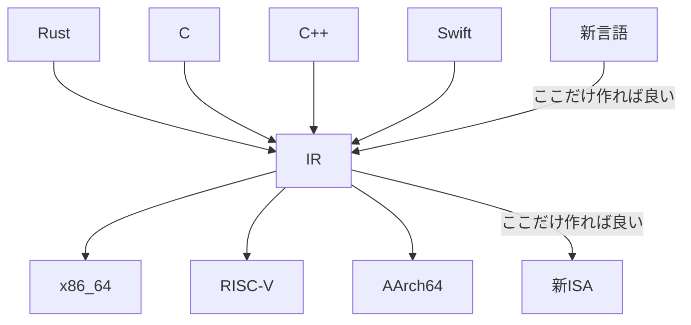
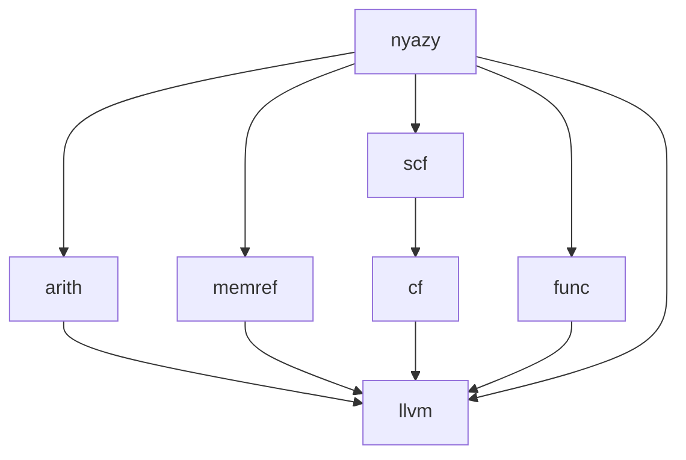
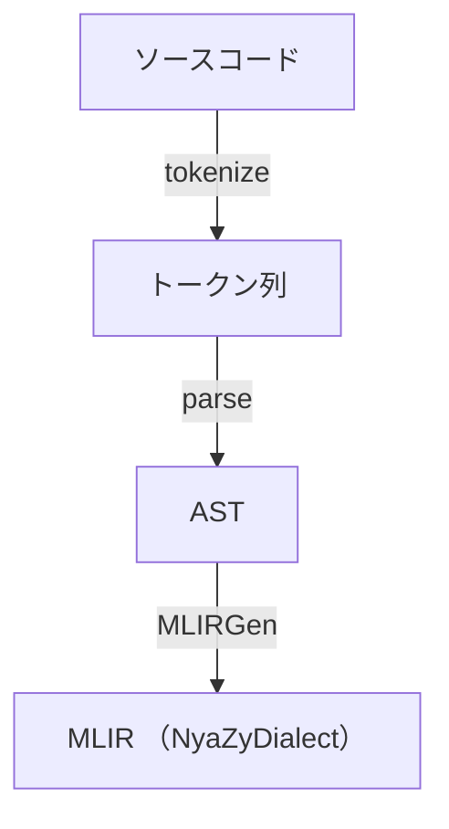
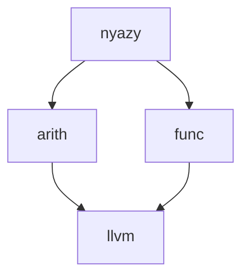

この記事は、[KCS アドベントカレンダー](https://qiita.com/advent-calendar/2024/kcs) 3日目の記事です。

[2日目](https://note.com/bastelcolor/n/n8a99b2eb4c0a)
↑
この記事
↓
[4日目](https://qiita.com/tomo0211goo/items/7fab2f961c1668470d7e)

## この記事の趣旨
この記事では、MLIRというコンパイラフロントエンドを作るのに便利なフレームワークを用いて、LLVMと組み合わせて自作言語を作ってみる方法について解説します。実装は[NyaZy](https://github.com/lemolatoon/NyaZy)という自分が作ったとても機能がコンパクトな言語を参考に書きます。

:::details この記事を書こうと思ったきっかけ
ちょうど2024年度の学園祭（三田祭）では、MLIRで作った自作言語を用いた展示をしました。そこで溜まった知見（？）をせっかくならアドベントカレンダーという形で残しておこうと思って書いています。三田祭では、[NyaZy](https://github.com/lemolatoon/NyaZy)という言語を作りました。
この記事のもう一つの目的としては、他のサークルメンバーにMLIRを布教するという目論見もあります。

[1日目の記事](https://qiita.com/tomo0211goo/items/8aa892cf32e4d8e5fdb3)で三田祭については解説されています。
:::

## コンパイラを作るということ
コンパイラとは、プログラミング言語から、実行したいプロセッサー（ここではCPU）が理解できる命令列に変換するプログラムです。たとえば、C言語のコンパイラといえば[gcc](https://github.com/gcc-mirror/gcc)や[clang](https://github.com/llvm/llvm-project)[^clang-link]、Rust言語のコンパイラといえば、[rustc](https://github.com/rust-lang/rust)のことを言います。[^maybe-frontend] [^compiler-driver]

[^clang-link]: clangはLLVMの巨大モノレポの一つのコンポーネントとしてある。
[^maybe-frontend]: clangもrustcもコンパイラのうち前半の処理部分であるフロントエンドだからコンパイラそのものではないかも？。
[^s-option]: アセンブリを出力するオプション
[^compiler-driver]: 正確には`gcc`や`clang`はコンパイラドライバと呼ばれるもので、コンパイラやアセンブラ、リンカなどの呼び出しを行うラッパーになっています。

たとえば、`clang`で次のプログラムを`-S`オプション[^s-option]でコンパイルすると以下のような結果が得られます。

```c:main.c
#include <stdio.h>
int main() {
    int var = 2;
    printf("Hello World!, %d\n", var);
}
```
```asm:main.s
	.text
	.file	"tmp.c"
	.globl	main                            # -- Begin function main
	.p2align	4, 0x90
	.type	main,@function
main:                                   # @main
	.cfi_startproc
# %bb.0:
	pushq	%rbp
	.cfi_def_cfa_offset 16
	.cfi_offset %rbp, -16
	movq	%rsp, %rbp
	.cfi_def_cfa_register %rbp
	subq	$16, %rsp
	movl	$2, -4(%rbp)
	movl	-4(%rbp), %esi
	leaq	.L.str(%rip), %rdi
	movb	$0, %al
	callq	printf@PLT
	xorl	%eax, %eax
	addq	$16, %rsp
	popq	%rbp
	.cfi_def_cfa %rsp, 8
	retq
.Lfunc_end0:
	.size	main, .Lfunc_end0-main
	.cfi_endproc
                                        # -- End function
	.type	.L.str,@object                  # @.str
	.section	.rodata.str1.1,"aMS",@progbits,1
.L.str:
	.asciz	"Hello World!, %d\n"
	.size	.L.str, 18

	.ident	"Ubuntu clang version 14.0.0-1ubuntu1.1"
	.section	".note.GNU-stack","",@progbits
	.addrsig
	.addrsig_sym printf

```
この出力に含まれる`pushq %rbp`や`addq $16, %rsp`などは、CPUの命令と一対一に対応しています。これを実行ファイルに変換すると、命令を表す01の並びのバイナリーファイルとなります。実行時には、OSが実行形式を理解して命令列をメモリに展開してjumpすることで、実行されます。

このように、コンパイラは言語からプロセッサーの命令への変換を担います。狭義には、プログラム的には、文字列から文字列（アセンブリテキスト）への変換となります。

### コンパイラフロントエンドとコンパイラバックエンド
近年のコンパイラでは、コンパイルの途中に中間言語（IR: Intermediate Represenation）を経由することが普通になっています。プログラミング言語とプロセッサーの命令セット（ISA）の種類はそれぞれたくさんあるので、すべてに対応しようとすると、プログラミング言語の数`N`とISAの数`M`に対して、`N x M`個のコンパイラが必要になってしまいます。ここで、なんらかの中間言語を経由することで、プログラミング言語から中間言語の変換を担当する「コンパイラフロントエンド」と中間言語から命令列への変換を担当する「コンパイラバックエンド」に分離することができます。フロントエンドを`N`個、バックエンドを`M`個追加するだけの手間で、すべての言語とISA間のコンパイラを作成できたことになります。
新しくプログラミング言語を作りたいときは、フロントエンドを１つ作ればすべてのISAに対応でき、新しくISAを作るときには、バックエンドを１つ作ればすべてのプログラミング言語に対応できることになります。



### 中間言語とそのエコシステムとしてのLLVM

[LLVM Project](https://llvm.org/)は、コンパイラとそのツールチェイン周りで再利用可能なコンポーネントをさまざま開発しているプロジェクトです。その中でも`LLVM Core`と呼ばれるライブラリ群があり、その中でLLVM IRという中間言語が定義されています。[LLVM IRの仕様](https://llvm.org/docs/LangRef.html)は厳格に決まっていて、公開されています。中間言語だけでなく、中間言語に対するoptimizerも提供しています。[^optimizer] さらに、LLVM IRを使ったフロントエンドやバックエンドを作りやすくするように便利なclassや関数やデータ構造も提供されています。これらはすべてC++で記述されています。

[^optimizer]: optimizerはコードの動作を変えずにより効率的なコードに変換するようなものです。LLVM IRはどんな言語、ISAのコンパイラでも、経由する中間言語なので、LLVM IRのoptimizerを提供するということは、このすべてのコンパイラが恩恵を受けることになります。

LLVMは広く使われていて、C、C++、Rust、Swift、Haskellなどの言語はLLVMを使って作られています。また、x86_64、AArch64、RISC-V、MIPSなどのISAのバックエンドの実装が存在しています。

## LLVMを使って新しい言語を作るということ

LLVMを使って新しい言語を作りたいときには、フロントエンドを作ることになります。フロントエンドを作るときには、LLVM IRを出力するプログラムを作成することになりますが、LLVM Coreはそれを行うための便利なclassを用意しています。以下は、「Hello Worldを出力するLLVM IR」を出力するプログラムです。

```cpp:main.cpp
#include "llvm/IR/Constants.h"
#include "llvm/IR/IRBuilder.h"
#include "llvm/IR/LLVMContext.h"
#include "llvm/IR/Module.h"
#include "llvm/IR/Verifier.h"
#include <iostream>
#include <memory>
#include <vector>

static std::unique_ptr<llvm::LLVMContext> the_context;
static std::unique_ptr<llvm::Module> the_module;
static std::unique_ptr<llvm::IRBuilder<>> builder;

int main() {
  // Initialize Module
  the_context = std::make_unique<llvm::LLVMContext>();
  the_module = std::make_unique<llvm::Module>("HelloWorldModule", *the_context);

  builder = std::make_unique<llvm::IRBuilder<>>(*the_context);

  // main function

  // declare printf function
  auto printf_type = llvm::FunctionType::get(
      llvm::Type::getInt32Ty(*the_context),
      std::vector<llvm::Type *>{llvm::PointerType::get(*the_context, 0)}, true);
  auto printf_func = llvm::Function::Create(
      printf_type, llvm::Function::ExternalLinkage, "printf", the_module.get());

  // main function
  auto main_function = llvm::Function::Create(
      llvm::FunctionType::get(llvm::Type::getInt32Ty(*the_context),
                              std::vector<llvm::Type *>{}, false),
      llvm::Function::ExternalLinkage, "main", the_module.get());

  auto basic_block2 =
      llvm::BasicBlock::Create(*the_context, "entry", main_function);
  builder->SetInsertPoint(basic_block2);

  auto hello_str = builder->CreateGlobalStringPtr("hello world!\n");
  builder->CreateCall(printf_func, hello_str);
  auto ret_val2 = llvm::ConstantInt::get(*the_context, llvm::APInt(32, 42));
  builder->CreateRet(ret_val2);

  llvm::verifyFunction(*main_function);

  the_module->print(llvm::errs(), nullptr);

  return 0;
}
```
これを実行すると、下のようなLLVM IRが標準エラー出力にprintされます。現段階では意味を分かる必要はありませんが、`llvm::Context`が生成したLLVM IRの状態を、`llvm::Builder`が次に命令を入れる場所の状態を持っていて、それらのclassの関数を呼んだり、それらを引数として渡すことで、LLVM IRを生成していく様子が分かるかと思います。
```llvmir:out.ll
; ModuleID = 'HelloWorldModule'
source_filename = "HelloWorldModule"

@0 = private unnamed_addr constant [14 x i8] c"hello world!\0A\00", align 1

declare i32 @printf(ptr, ...)

define i32 @main() {
entry:
  %0 = call i32 (ptr, ...) @printf(ptr @0)
  ret i32 42
}
```

実際にフロントエンドを作る際は、プログラミング言語のソースコード文字列をパースし、木構造にし、その木構造を下りながらLLVM IRの命令を作ってきます。

## LLVM IRの問題点とMLIR
LLVM IRはISAの違いを吸収しており、素晴らしいですが、LLVM IRは低レベルすぎるという問題点があります。LLVM IRはcallやaddなどの非常にプリミティブな命令列を定義しています。命令一つ一つはかなりCPUの命令と似ている反面、プログラミング言語からその命令に対応させるのは少し大変です。たとえば、C言語のif文やwhile文を変換しようとするとそこまで単純ではないのが分かると思います。LLVM IRには条件に基づくジャンプと、ラベルでしか分岐を表現できません。[^llvmir-branch] 
実際には、ifやwhileなどの制御構造程度なら、各フロントエンドががんばって作ればまだ問題にはならないかもしれません。しかし、近年のモダンな言語では、言語機能が高機能になってきており、LLVM IRの前に、独自にIRを使用するというのが普通となっています。これらの高レイヤIRでは、型解析などの、意味の解析に使われています。せっかくLLVM IR似たような処理を各コンパイラで何回も書かれるのを解決したのに、これでは、再び各コンパイラが、各々似たような機能を開発することになっていまいます。


_各々の言語が各々に IR を持っている様子
[CGO 2020: International Symposium on Code Generation and Optimization](https://docs.google.com/presentation/d/11-VjSNNNJoRhPlLxFgvtb909it1WNdxTnQFipryfAPU/edit#slide=id.g7d334b12e5_0_4)から引用_

[^llvmir-branch]: 一応、select命令なども条件に基づく分岐っぽいことはできますが。

### MLIRとは
そこで登場したのが、[MLIR](https://mlir.llvm.org/)です。MLIRは、「中間言語作成フレームワーク」です。LLVMは唯一の中間言語であるLLVM IRを定めているのに対し、MLIRはユーザーが自由に中間言語を作ることができます。MLIRの特徴としては、さまざまの中間言語が同じMLIRというフレームワークで定義されることによって、共存できるという点です。MLIRは中間言語と中間言語の間の変換を定義できるフレームワークでもあります。
たとえば、自分が作ったNyaZyという言語を例とします。下の図のそれぞれの長方形は、MLIRで定義された中間言語を表しています。MLIRの世界では、中間言語のことを[Dialect](https://mlir.llvm.org/docs/LangRef/#dialects)と呼びます。MLIRでは、ある中間言語から別の中間言語を変換することを繰り返しながら、徐々に目的の言語へと変換していきます。ここではLLVM IRが目的の言語となります。
MLIRでは、LLVM IRをMLIRのフレームワークで記述しなおされた[LLVM dialect](https://mlir.llvm.org/docs/Dialects/LLVM/)が提供されているので、最終的にはそこまで変換することを目指します。その他にも、さまざまな汎用的なdialectが[提供されており](https://mlir.llvm.org/docs/Dialects/)、新たにコンパイラを作りたいときに車輪の再発明をする必要がなくなっています。


```rust:main.nz
print("Say Hello to NyaZy!!");

let i = 10;
let sum = 0;
while (i > 0) {
    sum = sum + i;
    i = i - 1;
}

print("Sum of 10, 9, ..., 1");
print(sum);
0
```
例えば、上のコードはNyaZyという言語のソースコードの例です。これをnyazy dialectに変換すると以下のようになります。
```
module {
  nyazy.func @main() {
    %0 = nyazy.constant "Say Hello to NyaZy!!" : !llvm.ptr
    %1 = nyazy.print(%0 : !llvm.ptr) -> i32
    %2 = nyazy.constant 10 : i64 : i64
    %3 = "nyazy.alloca"() : () -> memref<i64>
    nyazy.store %2, %3 : memref<i64>
    %4 = nyazy.constant 0 : i64 : i64
    %5 = "nyazy.alloca"() : () -> memref<i64>
    nyazy.store %4, %5 : memref<i64>
    nyazy.while{
      %11 = nyazy.load %3 : memref<i64>
      %12 = nyazy.constant 0 : i64 : i64
      %13 = nyazy.cmp gt, %11, %12 : i64 vs i64
      nyazy.condition(%13)
    } do {
      %11 = nyazy.load %5 : memref<i64>
      %12 = nyazy.load %3 : memref<i64>
      %13 = "nyazy.add"(%11, %12) : (i64, i64) -> i64
      nyazy.store %13, %5 : memref<i64>
      %14 = nyazy.load %3 : memref<i64>
      %15 = nyazy.constant 1 : i64 : i64
      %16 = "nyazy.sub"(%14, %15) : (i64, i64) -> i64
      nyazy.store %16, %3 : memref<i64>
      %17 = nyazy.constant 0 : i64 : i64
      nyazy.yield
    }
    %6 = nyazy.constant "Sum of 10, 9, ..., 1" : !llvm.ptr
    %7 = nyazy.print(%6 : !llvm.ptr) -> i32
    %8 = nyazy.load %5 : memref<i64>
    %9 = nyazy.print(%8 : i64) -> i32
    %10 = nyazy.constant 0 : i64 : i64
    "nyazy.return"(%10) : (i64) -> ()
  }
}
```
`nyazy.func`や`nyazy.print`、`nyazy.while`といった文字列は、nyazy dialectに属する命令を表しています。nyazy dialectとは、NyaZy言語のコンパイラを作るために、MLIRのフレームワークを利用して作成した中間言語です。中間言語とはいえ、もとのソースコードとほぼ一対一に対応していることが分かると思います。（そうなるように作りました。）[^var-notice]

[^var-notice]: 変数に関しては宣言が、`nyazy.alloc`、代入または初期化が`nyazy.store`と対応しています。それに、自動的にすべてがmain関数内に記述したことになっています。

この nyazy dialect を、[arith](https://mlir.llvm.org/docs/Dialects/ArithOps/)、[func](https://mlir.llvm.org/docs/Dialects/Func/)、[memref](https://mlir.llvm.org/docs/Dialects/MemRef/)、[scf](https://mlir.llvm.org/docs/Dialects/SCFDialect/) dialectへと部分的に変換したものを以下に示します。
```
module {
  llvm.mlir.global internal constant @global_str_673985980689457910("Sum of 10, 9, ..., 1\00") {addr_space = 0 : i32}
  llvm.mlir.global internal constant @global_str_5399166882843448905("Say Hello to NyaZy!!\00") {addr_space = 0 : i32}
  func.func @main() -> i64 {
    %0 = llvm.mlir.addressof @global_str_5399166882843448905 : !llvm.ptr
    %1 = llvm.mlir.constant(0 : i64) : i64
    %2 = llvm.getelementptr %0[%1, %1] : (!llvm.ptr, i64, i64) -> !llvm.ptr, !llvm.array<21 x i8>
    %3 = nyazy.print(%2 : !llvm.ptr) -> i32
    %c10_i64 = arith.constant 10 : i64
    %alloca = memref.alloca() : memref<i64>
    memref.store %c10_i64, %alloca[] : memref<i64>
    %c0_i64 = arith.constant 0 : i64
    %alloca_0 = memref.alloca() : memref<i64>
    memref.store %c0_i64, %alloca_0[] : memref<i64>
    scf.while : () -> () {
      %10 = memref.load %alloca[] : memref<i64>
      %c0_i64_2 = arith.constant 0 : i64
      %11 = arith.cmpi sgt, %10, %c0_i64_2 : i64
      scf.condition(%11)
    } do {
      %10 = memref.load %alloca_0[] : memref<i64>
      %11 = memref.load %alloca[] : memref<i64>
      %12 = arith.addi %10, %11 : i64
      memref.store %12, %alloca_0[] : memref<i64>
      %13 = memref.load %alloca[] : memref<i64>
      %c1_i64 = arith.constant 1 : i64
      %14 = arith.subi %13, %c1_i64 : i64
      memref.store %14, %alloca[] : memref<i64>
      %c0_i64_2 = arith.constant 0 : i64
      scf.yield
    }
    %4 = llvm.mlir.addressof @global_str_673985980689457910 : !llvm.ptr
    %5 = llvm.mlir.constant(0 : i64) : i64
    %6 = llvm.getelementptr %4[%5, %5] : (!llvm.ptr, i64, i64) -> !llvm.ptr, !llvm.array<21 x i8>
    %7 = nyazy.print(%6 : !llvm.ptr) -> i32
    %8 = memref.load %alloca_0[] : memref<i64>
    %9 = nyazy.print(%8 : i64) -> i32
    %c0_i64_1 = arith.constant 0 : i64
    return %c0_i64_1 : i64
  }
}
```
先述した通り、MLIRでは、複数の中間言語が混ざった状態でも正しいMLIRのコードになります。ここでは、llvm、arith、func、memref、scf dialectの命令がそれぞれ入り混じっています。
NyaZy言語を作る上では、ここまでの変換は自分で記述する必要がありました。しかし、arith、func、memref、scfからllvm dialectへの変換については、すべてコミュニティにより提供されているdialect間の変換になります。これらの変換はすでに実装が存在するので自分で作る必要がありません。最終的には以下のようなllvm dialectのみが残ったMLIRとなります。

:::details　最終的なMLIR
```
module {
  llvm.mlir.global internal constant @global_str_15820483969930773954("%ld\0A\00") {addr_space = 0 : i32}
  llvm.mlir.global internal constant @global_str_6687845508355411829("%s\0A\00") {addr_space = 0 : i32}
  llvm.func @printf(!llvm.ptr, ...) -> i32
  llvm.mlir.global internal constant @global_str_673985980689457910("Sum of 10, 9, ..., 1\00") {addr_space = 0 : i32}
  llvm.mlir.global internal constant @global_str_5399166882843448905("Say Hello to NyaZy!!\00") {addr_space = 0 : i32}
  llvm.func @main() -> i64 {
    %0 = llvm.mlir.addressof @global_str_5399166882843448905 : !llvm.ptr
    %1 = llvm.mlir.constant(0 : i64) : i64
    %2 = llvm.getelementptr %0[%1, %1] : (!llvm.ptr, i64, i64) -> !llvm.ptr, !llvm.array<21 x i8>
    %3 = llvm.mlir.addressof @global_str_6687845508355411829 : !llvm.ptr
    %4 = llvm.mlir.constant(0 : i64) : i64
    %5 = llvm.getelementptr %3[%4, %4] : (!llvm.ptr, i64, i64) -> !llvm.ptr, !llvm.array<4 x i8>
    %6 = llvm.call @printf(%5, %2) vararg(!llvm.func<i32 (ptr, ...)>) : (!llvm.ptr, !llvm.ptr) -> i32
    %7 = llvm.mlir.constant(10 : i64) : i64
    %8 = llvm.mlir.constant(1 : index) : i64
    %9 = llvm.alloca %8 x i64 : (i64) -> !llvm.ptr
    %10 = llvm.mlir.undef : !llvm.struct<(ptr, ptr, i64)>
    %11 = llvm.insertvalue %9, %10[0] : !llvm.struct<(ptr, ptr, i64)> 
    %12 = llvm.insertvalue %9, %11[1] : !llvm.struct<(ptr, ptr, i64)> 
    %13 = llvm.mlir.constant(0 : index) : i64
    %14 = llvm.insertvalue %13, %12[2] : !llvm.struct<(ptr, ptr, i64)> 
    %15 = llvm.extractvalue %14[1] : !llvm.struct<(ptr, ptr, i64)> 
    llvm.store %7, %15 : i64, !llvm.ptr
    %16 = llvm.mlir.constant(0 : i64) : i64
    %17 = llvm.mlir.constant(1 : index) : i64
    %18 = llvm.alloca %17 x i64 : (i64) -> !llvm.ptr
    %19 = llvm.mlir.undef : !llvm.struct<(ptr, ptr, i64)>
    %20 = llvm.insertvalue %18, %19[0] : !llvm.struct<(ptr, ptr, i64)> 
    %21 = llvm.insertvalue %18, %20[1] : !llvm.struct<(ptr, ptr, i64)> 
    %22 = llvm.mlir.constant(0 : index) : i64
    %23 = llvm.insertvalue %22, %21[2] : !llvm.struct<(ptr, ptr, i64)> 
    %24 = llvm.extractvalue %23[1] : !llvm.struct<(ptr, ptr, i64)> 
    llvm.store %16, %24 : i64, !llvm.ptr
    llvm.br ^bb1
  ^bb1:  // 2 preds: ^bb0, ^bb2
    %25 = llvm.extractvalue %14[1] : !llvm.struct<(ptr, ptr, i64)> 
    %26 = llvm.load %25 : !llvm.ptr -> i64
    %27 = llvm.mlir.constant(0 : i64) : i64
    %28 = llvm.icmp "sgt" %26, %27 : i64
    llvm.cond_br %28, ^bb2, ^bb3
  ^bb2:  // pred: ^bb1
    %29 = llvm.extractvalue %23[1] : !llvm.struct<(ptr, ptr, i64)> 
    %30 = llvm.load %29 : !llvm.ptr -> i64
    %31 = llvm.extractvalue %14[1] : !llvm.struct<(ptr, ptr, i64)> 
    %32 = llvm.load %31 : !llvm.ptr -> i64
    %33 = llvm.add %30, %32 : i64
    %34 = llvm.extractvalue %23[1] : !llvm.struct<(ptr, ptr, i64)> 
    llvm.store %33, %34 : i64, !llvm.ptr
    %35 = llvm.extractvalue %14[1] : !llvm.struct<(ptr, ptr, i64)> 
    %36 = llvm.load %35 : !llvm.ptr -> i64
    %37 = llvm.mlir.constant(1 : i64) : i64
    %38 = llvm.sub %36, %37 : i64
    %39 = llvm.extractvalue %14[1] : !llvm.struct<(ptr, ptr, i64)> 
    llvm.store %38, %39 : i64, !llvm.ptr
    %40 = llvm.mlir.constant(0 : i64) : i64
    llvm.br ^bb1
  ^bb3:  // pred: ^bb1
    %41 = llvm.mlir.addressof @global_str_673985980689457910 : !llvm.ptr
    %42 = llvm.mlir.constant(0 : i64) : i64
    %43 = llvm.getelementptr %41[%42, %42] : (!llvm.ptr, i64, i64) -> !llvm.ptr, !llvm.array<21 x i8>
    %44 = llvm.mlir.addressof @global_str_6687845508355411829 : !llvm.ptr
    %45 = llvm.mlir.constant(0 : i64) : i64
    %46 = llvm.getelementptr %44[%45, %45] : (!llvm.ptr, i64, i64) -> !llvm.ptr, !llvm.array<4 x i8>
    %47 = llvm.call @printf(%46, %43) vararg(!llvm.func<i32 (ptr, ...)>) : (!llvm.ptr, !llvm.ptr) -> i32
    %48 = llvm.extractvalue %23[1] : !llvm.struct<(ptr, ptr, i64)> 
    %49 = llvm.load %48 : !llvm.ptr -> i64
    %50 = llvm.mlir.addressof @global_str_15820483969930773954 : !llvm.ptr
    %51 = llvm.mlir.constant(0 : i64) : i64
    %52 = llvm.getelementptr %50[%51, %51] : (!llvm.ptr, i64, i64) -> !llvm.ptr, !llvm.array<5 x i8>
    %53 = llvm.call @printf(%52, %49) vararg(!llvm.func<i32 (ptr, ...)>) : (!llvm.ptr, i64) -> i32
    %54 = llvm.mlir.constant(0 : i64) : i64
    llvm.return %54 : i64
  }
}
```
:::

llvm dialectのみのMLIRを手に入れたら、後は、いくつかの関数を呼ぶことで、`llvm::LLVMContext`を手にいれることができます。これにより、MLIRの言葉で記述されたLLVM IRをLLVMの世界で記述しなおされた格納された`LLVMContext`を入手できたことになります。ここまでが、コンパイラフロントエンドのお仕事です。

以上で見たように、
1. まずは言語をMLIRのフレームワークの上の中間言語（dialect）という形でMLIRの世界に持ち込み
2. それらを標準で定義されたdialectに変換し
3. コミュニティにより実装が提供されているllvm dialectへの変換を適用する

ことで、簡単にコンパイラフロントエンドを実装できます。実質的には1と2のみが自分が実装しなければいけない部分です。

## MLIRを使ってコンパイラフロントエンドを作るチュートリアル
これからは実際にコンパイラフロントエンドを書いてみましょう。チュートリアルは[NyaZyのリポジトリ](https://github.com/lemolatoon/NyaZy)に基づきます。もし動かなかったらこのリポジトリを参照するか、twitterなどでメンションしてください。

### Step1 LLVMをbuildして使えるようにする。
[該当コミット](https://github.com/lemolatoon/NyaZy/tree/428adfb9f123c84473f5795cf00033cb9311d940)
```bash
git checkout 428adfb9f123c84473f5795cf00033cb9311d940
```
まずはLLVMをbuildして動くようにしましょう。
```
.
├── .gitignore
├── .vscode
│   └── settings.json
├── CMakeLists.txt
├── LICENSE
├── README.md
├── bin
├── scripts
│   ├── build.sh
│   ├── configure.sh
│   └── thirdparty.sh
├── src
│   ├── CMakeLists.txt
│   └── main.cpp
├── test
│   └── CMakeLists.txt
└── thirdparty
    └── CMakeLists.txt
```
このようなファイル構造になっています。`thirdparty/build/llvm`以下にllvmがbuildされたファイルたちがinstall[^what-is-install]されるように`thirdparty/CMakeLists.txt`を記述します。

[^what-is-install]: C/C++のプロジェクトでは、よくbuild -> installという手順を踏みます。installされると、そのディレクトリに`AddMLIR.cmake`や`AddLLVM.cmake`のようなファイルができます。これらを、`CMakeLists.txt`から、`find_package(LLVM REQUIRED CONFIG)`のようにすることで、自分のプロジェクトから参照してそのライブラリを使えるようになります。

```cmake:thirdparty/CMakeLists.txt
cmake_minimum_required(VERSION 3.15)
project(nyazy-thirdparty)

include(ExternalProject)

# Set the directory where installed
set(LLVM_PROJECT_INSTALL_DIR ${CMAKE_BINARY_DIR}/llvm/install)


# Specify the LLVM version and Git tag
set(LLVM_VERSION "llvmorg-19.1.2")
set(LLVM_REPO_URL "https://github.com/llvm/llvm-project.git")
set(LLVM_PROJECT_BUILD_DIR ${CMAKE_BINARY_DIR}/llvm-project/build)

# https://stackoverflow.com/questions/45414507/pass-a-list-of-prefix-paths-to-externalproject-add-in-cmake-args
string(REPLACE ";" "|" CMAKE_PREFIX_PATH_ALT_SEP "${CMAKE_PREFIX_PATH}")

# Add LLVM as an external project
ExternalProject_Add(
    llvm_project
    PREFIX ${CMAKE_BINARY_DIR}/llvm
    GIT_REPOSITORY ${LLVM_REPO_URL}
    GIT_TAG ${LLVM_VERSION}
    SOURCE_SUBDIR llvm
    UPDATE_COMMAND ""
    LIST_SEPARATOR |
    CMAKE_ARGS
        -DLLVM_ENABLE_PROJECTS=clang|mlir
        -DLLVM_ENABLE_RUNTIMES=libcxx|libcxxabi|libunwind
        -DLLVM_BUILD_EXAMPLES=ON
        -DLLVM_BUILD_TOOLS=ON
        -DLLVM_TARGETS_TO_BUILD=Native
        -DCMAKE_BUILD_TYPE=Release
        -DLLVM_ENABLE_ASSERTIONS=ON
        -DCMAKE_C_COMPILER=clang
        -DCMAKE_CXX_COMPILER=clang++
        -DLLVM_ENABLE_LLD=ON
        -DLLVM_CCACHE_BUILD=ON
        -DCMAKE_INSTALL_PREFIX=${LLVM_PROJECT_INSTALL_DIR}
        -DLLVM_TOOL_CLANG_BUILD=ON
    BUILD_COMMAND ${CMAKE_COMMAND} --build .
    INSTALL_COMMAND ${CMAKE_COMMAND} --build . --target install
    USES_TERMINAL_BUILD TRUE
)
```
簡単にthirdpartyをbuildするためのスクリプトを書きます。

```bash:scripts/thirdparty.sh
#!/bin/bash

# cd to the script dir
cd $(dirname $0)

# cd to the directory of /thirdparty/build
mkdir -p ../thirdparty/build
cd ../thirdparty/build

# cmake
cmake .. -G Ninja

# build
ninja -j$(nproc)
```

実行してみましょう。
```bash
$ chmod +x scripts/thirdparty.sh
$ ./scripts/thirdparty.sh
-- Configuring done
-- Generating done
-- Build files have been written to: /home/lemolatoon/workspace/compiler/NyaZy/thirdparty/build
[1/4] Performing configure step for 'llvm_project'
（中略）
-- Configuring done
-- Generating done
-- Build files have been written to: /home/lemolatoon/workspace/compiler/NyaZy/thirdparty/build/llvm/src/llvm_project-build
[1/4] Performing build step for 'llvm_project'
[4089/4090] Running the MLIR regression tests
（中略）
[4/4] Completed 'llvm_project'
```
初回は、llvm本体のbuildから始まるため、かなり時間がかかります。成功すれば上のようなログになるでしょう。
次にbuildしたLLVMを使ってみるコードを書きます。まずは、CMakeの設定をします。`CMakeLists.txt`と`src/CMakeLists.txt`に書き込みます。それぞれなんの処理をしているのかはコメントに書きました。
```cmake:CMakeLists.txt
cmake_minimum_required(VERSION 3.15)
project(nyazy LANGUAGES CXX C)

set(CMAKE_CXX_STANDARD 20)

# compile_commands.jsonを出力するように設定
set(CMAKE_EXPORT_COMPILE_COMMANDS ON)

# LLVMとMLIRをbuildしてinstallしたディレクトリを指定
set(LLVM_DIR ${CMAKE_BINARY_DIR}/../thirdparty/build/llvm/install/lib/cmake/llvm)
set(MLIR_DIR ${CMAKE_BINARY_DIR}/../thirdparty/build/llvm/install/lib/cmake/mlir)

# LLVMとMLIRを見つける。`LLVM_DIR`と`MLIR_DIR`変数のディレクトリを探索される。
find_package(LLVM REQUIRED CONFIG)
find_package(MLIR REQUIRED CONFIG)

# mlir related settings -----
# ref: llvm-project/mlir/examples/standalone/CMakeLists.txt
list(APPEND CMAKE_MODULE_PATH "${MLIR_CMAKE_DIR}")
list(APPEND CMAKE_MODULE_PATH "${LLVM_CMAKE_DIR}")

# include scripts
include(TableGen)
include(AddLLVM)
include(AddMLIR)
include(HandleLLVMOptions)

# LLVMとMLIRのヘッダファイルのディレクトリをインクルードディレクトリに含める
include_directories(SYSTEM ${LLVM_INCLUDE_DIRS})
include_directories(SYSTEM ${MLIR_INCLUDE_DIRS})

# リンクするLLVMのライブラリを取ってくるパスを指定する
link_directories(${LLVM_BUILD_LIBRARY_DIR})
# ---------------------------

# 実行ファイルの名前を指定
add_executable(nyacc)
# コンパイルオプションを指定
target_compile_options(nyacc PRIVATE -Wall -Wextra -Werror -fno-rtti)

# Add subdirectories for src
# srcディレクトリを含める
add_subdirectory(src)
```

```cmake:src/CMakeLists.txt
# Locate all the .cpp files in the src directory
# `src`にある、`*.cpp`をすべて含める(1)
file(GLOB_RECURSE SRC_FILES *.cpp)

# リンクすべきMLIRのライブラリの情報を取ってくる
get_property(dialect_libs GLOBAL PROPERTY MLIR_DIALECT_LIBS)
get_property(extension_libs GLOBAL PROPERTY MLIR_EXTENSION_LIBS)

# Create an executable for the main project from the source files
# `src`にある、`*.cpp`をすべて含める(2)
target_sources(nyacc PRIVATE ${SRC_FILES})

# 必要なライブラリをリンクする
# Link with necessary libraries (e.g., LLVM, if needed)
# target_link_libraries(nyacc ${LLVM_LIBS})
target_link_libraries(nyacc
    PRIVATE
    ${dialect_libs}
    ${extension_libs}
    MLIRIR
    MLIRParser
    MLIRPass
    MLIRDialect 
    MLIRTranslateLib
    MLIRSupport
    MLIRTransforms
    MLIRLLVMToLLVMIRTranslation
    MLIRBuiltinToLLVMIRTranslation
)
```

`src/main.cpp`にはとりあえずHello WorldするMLIRを出力するコードを書きます。これは少しむずかしいですが、環境構築が完了しているのかを確かめるのには使えます。
```cpp:src/main.cpp
#include "mlir/Dialect/LLVMIR/LLVMDialect.h"
#include "mlir/Dialect/LLVMIR/LLVMTypes.h"
#include "mlir/IR/BuiltinAttributes.h"
#include "mlir/IR/MLIRContext.h"
#include "mlir/IR/Builders.h"
#include "mlir/IR/BuiltinOps.h"
#include "mlir/IR/PatternMatch.h"
#include "mlir/IR/Verifier.h"
#include "mlir/IR/BuiltinDialect.h"
#include <llvm/Support/raw_ostream.h>
#include <mlir/Target/LLVMIR/Dialect/Builtin/BuiltinToLLVMIRTranslation.h>
#include <mlir/Target/LLVMIR/Dialect/LLVMIR/LLVMToLLVMIRTranslation.h>
#include <mlir/Target/LLVMIR/Export.h>

mlir::LLVM::LLVMFunctionType
  getPrintfType(mlir::MLIRContext *context) {
    auto llvmI32Type = mlir::IntegerType::get(context, 32);
    auto llvmPtrType = mlir::LLVM::LLVMPointerType::get(context);
    auto llvmPrintfType = mlir::LLVM::LLVMFunctionType::get(
        llvmI32Type, llvmPtrType, /*isVarArg=*/true);
    return llvmPrintfType;
}

mlir::FlatSymbolRefAttr getOrInsertPrintf(mlir::ModuleOp module) {
    auto* context = module.getContext();
    const char *printfSymbol = "printf";

    if (module.lookupSymbol<mlir::LLVM::LLVMFuncOp>(printfSymbol)) {
        return mlir::SymbolRefAttr::get(context, printfSymbol);
    }

    auto llvmPrintfType = getPrintfType(context);

    mlir::PatternRewriter rewriter{context};
    mlir::PatternRewriter::InsertionGuard guard(rewriter);
    rewriter.setInsertionPointToStart(module.getBody());
    rewriter.create<mlir::LLVM::LLVMFuncOp>(
        module.getLoc(), printfSymbol, llvmPrintfType);
    
    return mlir::SymbolRefAttr::get(context, printfSymbol);
} 

mlir::Value getOrCreateGlobalString(mlir::Location loc, mlir::OpBuilder &builder, mlir::StringRef name, mlir::StringRef value, mlir::ModuleOp module) {
    mlir::LLVM::GlobalOp global = module.lookupSymbol<mlir::LLVM::GlobalOp>(name);
    if (!global) {
        mlir::OpBuilder::InsertionGuard guard(builder);
        builder.setInsertionPointToStart(module.getBody());
        auto type = mlir::LLVM::LLVMArrayType::get(
            mlir::IntegerType::get(builder.getContext(), 8), value.size()
        );
        global = builder.create<mlir::LLVM::GlobalOp>(
            loc, type, /*isConstant=*/true, mlir::LLVM::Linkage::Internal, name,
            builder.getStringAttr(value), /*alignment=*/0
        );
    }

    // Get the pointer to the first char in the global string.
    mlir::Value globalPtr = builder.create<mlir::LLVM::AddressOfOp>(
        loc, global);
    mlir::Value cst0 = builder.create<mlir::LLVM::ConstantOp>(
        loc, builder.getI64Type(), builder.getIndexAttr(0));
    
    // get element pointer
    auto llvmPtrType = mlir::LLVM::LLVMPointerType::get(builder.getContext());
    auto gep = builder.create<mlir::LLVM::GEPOp>(
        loc, /*resultType=*/llvmPtrType, /*elementType=*/global.getType(), /*basePtr=*/globalPtr,
        mlir::ArrayRef<mlir::Value>({/*base addr=*/cst0, /*index=*/cst0})
    );
    return gep;
}

int main() {
    // Initialize MLIR context
    mlir::MLIRContext context;
    context.getOrLoadDialect<mlir::BuiltinDialect>();
    context.getOrLoadDialect<mlir::LLVM::LLVMDialect>();

    // Create an empty module
    mlir::OpBuilder builder(&context);
    mlir::ModuleOp module = mlir::ModuleOp::create(builder.getUnknownLoc());

    builder.setInsertionPointToStart(module.getBody());
    auto mainOp = builder.create<mlir::LLVM::LLVMFuncOp>(
        builder.getUnknownLoc(), "main",
        mlir::LLVM::LLVMFunctionType::get(builder.getI32Type(), {}, false));
    
    auto entryBlock = mainOp.addEntryBlock(builder);
    builder.setInsertionPointToStart(entryBlock);

    auto printfRef = getOrInsertPrintf(module);
    auto printfType = getPrintfType(&context);
    const auto helloWorldPtrValue = getOrCreateGlobalString(
        builder.getUnknownLoc(), builder, "hello_world", "Hello, World!\n", module);
    builder.create<mlir::LLVM::CallOp>(
        builder.getUnknownLoc(), printfType, printfRef,
        helloWorldPtrValue
    );

    mlir::Value cst0 = builder.create<mlir::LLVM::ConstantOp>(
        builder.getUnknownLoc(), builder.getI32Type(), builder.getIndexAttr(0));
    builder.create<mlir::LLVM::ReturnOp>(builder.getUnknownLoc(), cst0);

    // Verify the module to ensure everything is valid
    if (failed(mlir::verify(module))) {
        llvm::errs() << "Module verification failed.\n";
        return 1;
    }

    llvm::outs() << "Generated MLIR:\n";
    // Print the generated MLIR module
    module.print(llvm::outs());
    llvm::outs() << "\n";

    // Convet the MLIR module to LLVM IR
    mlir::registerBuiltinDialectTranslation(*module.getContext());
    mlir::registerLLVMDialectTranslation(*module.getContext());
    llvm::LLVMContext llvmContext;
    auto llvmModule = mlir::translateModuleToLLVMIR(module, llvmContext);

    if (!llvmModule) {
        llvm::errs() << "Failed to emit LLVM IR\n";
        return 1;
    }
    llvm::outs() << "Generated LLVM IR:\n";
    llvmModule->print(llvm::outs(), nullptr);

    return 0;
}
```
cmakeのbuildには、configureとbuildの二段階からなります。cmakeの設定などをいじった場合のみ、configureからやり直す必要がありますが、基本はbuildのみで大丈夫です。初回はconfigureする必要があります。
```bash
# configure
$ mkdir -p build && cd build && cmake .. -G Ninja
# build
$ ninja -j $(nproc) -C build
```
実行ファイル名は`nyacc`としたので、`build/nyacc`ができているはずです。実行してみると、LLVM IRが出力されると思います。
```bash:実行
$ ./build/nyacc
Generated MLIR:
module {
  llvm.mlir.global internal constant @hello_world("Hello, World!\0A") {addr_space = 0 : i32}
  llvm.func @printf(!llvm.ptr, ...) -> i32
  llvm.func @main() -> i32 {
    %0 = llvm.mlir.addressof @hello_world : !llvm.ptr
    %1 = llvm.mlir.constant(0 : index) : i64
    %2 = llvm.getelementptr %0[%1, %1] : (!llvm.ptr, i64, i64) -> !llvm.ptr, !llvm.array<14 x i8>
    %3 = llvm.call @printf(%2) vararg(!llvm.func<i32 (ptr, ...)>) : (!llvm.ptr) -> i32
    %4 = llvm.mlir.constant(0 : index) : i32
    llvm.return %4 : i32
  }
}
Generated LLVM IR:
; ModuleID = 'LLVMDialectModule'
source_filename = "LLVMDialectModule"

@hello_world = internal constant [14 x i8] c"Hello, World!\0A"

declare i32 @printf(ptr, ...)

define i32 @main() {
  %1 = call i32 (ptr, ...) @printf(ptr @hello_world)
  ret i32 0
}
```
Generated LLVM IR:よりもしたの行の部分をコピーし、`tmp.ll`というファイル名で保存してください。LLVMには、LLVM IRのインタープリターのようなものである`lli`があります。これを使って実行してみましょう。
```bash
# LLVMはbuildしたので、その中にlliも含まれている
$ thirdparty/build/llvm/install/bin/lli tmp.ll
Hello, World!
```

:::details 便利スクリプト `bin`
configureやbuildや実行など、めんどくさい処理をひとまとめにしたスクリプトを用意しました。
まずは、`script/configure.sh`を定義します。
```bash:script/configure.sh
#!/bin/bash

# cd to the script dir
cd $(dirname $0)

# cd to the directory of /thirdparty/build
mkdir -p ../build
cd ../build

# cmake
cmake .. -G Ninja "$@"
```
次に、スクリプトたちを便利に呼び出す`bin`スクリプト（python）を定義します。
```python:bin
#!/usr/bin/env python3

import os
import sys
import subprocess

# cd to the script dir
os.chdir(os.path.dirname(os.path.abspath(__file__)))

llvm_install_dir = "thirdparty/build/llvm/install"
llvm_bin_dir = os.path.join(llvm_install_dir, "bin")
clang_format_path = os.path.join(llvm_bin_dir, "clang-format")
clang_path = os.path.abspath(os.path.join(llvm_bin_dir, "clang"))
lld_path = os.path.abspath(os.path.join(llvm_bin_dir, "lld"))
clang_pp_path = os.path.abspath(os.path.join(llvm_bin_dir, "clang++"))

COMMAND_MAP = {
    "thirdparty": "scripts/thirdparty.sh",
    "configure": f"scripts/configure.sh -DCMAKE_CXX_COMPILER=clang++ -DCMAKE_C_COMPILER=clang",
    "build": f"ninja -j{os.cpu_count()} -C build",
    "nyacc": "build/nyacc",
    "test": "ctest --test-dir build/test --output-on-failure",
    "lli": os.path.join(llvm_bin_dir, "lli"),
    "fmt": f"{clang_format_path} -i **/*.cpp **/*.h",
}

def show_help():
    print("Available commands:")
    for cmd, cmd_path in COMMAND_MAP.items():
        print(f"  {cmd} -> {cmd_path}")

def main():
    if len(sys.argv) < 2:
        print(f"Usage: {sys.argv[0]} <command name> <args>")
        sys.exit(1)

    command_name = sys.argv[1]
    args = sys.argv[2:]

    if command_name == "help":
        show_help()
        sys.exit(0)

    if command_name in COMMAND_MAP:
        command = COMMAND_MAP[command_name]
        try:
            subprocess.run(" ".join([command] + args), check=True, shell=True)
        except subprocess.CalledProcessError as e:
            print(f"Error: Command '{command_name}' failed with exit code {e.returncode}")
            sys.exit(e.returncode)
    elif os.path.exists(os.path.join(llvm_bin_dir, command_name)):
        command = os.path.join(llvm_bin_dir, command_name)
        try:
            subprocess.run([command] + args, check=True)
        except subprocess.CalledProcessError as e:
            print(f"Error: Command '{command_name}' failed with exit code {e.returncode}")
            sys.exit(e.returncode)
    else:
        print(f"Error: Unknown command name '{command_name}'")
        print(f"Use '{sys.argv[0]} help' to see available commands.")
        sys.exit(1)

if __name__ == "__main__":
    main()
```
たとえば、LLVMなどの外部ライブラリをbuildするときは、`./bin thirdparty`、configureしたいときは、`./bin configure`、buildしたいときは、`./bin build`で実行できます。また、buildしたLLVMのバイナリを使いたいときも`./bin`で呼び出せます。例えば、`./bin lli tmp.ll`とすれば、`lli`を使えます。詳細は実装を見たり、`./bin --help`してみてください。ソースコードのフォーマットも`./bin fmt`でできるようになっています。
:::

### Step2 整数をexit codeとしてコンパイルするコンパイラ
[該当コミット](https://github.com/lemolatoon/NyaZy/tree/b034333f78017e386f9c2a9b5931adc4809513e0)
[差分プルリクエスト](https://github.com/lemolatoon/NyaZy/pull/1)
```bash
git checkout b034333f78017e386f9c2a9b5931adc4809513e0
```
step2では、まず「１つの整数をそのプログラムのexit codeとして、終了するようなプログラム」を出力するようなコンパイラを作ります。ここは、[低レイヤを知りたい人のためのCコンパイラ作成入門](https://www.sigbus.info/compilerbook)にインスパイアされています。

たとえば以下のようなプログラムをコンパイルすると、終了コードが42となるプログラムが出力されます。
```nz:main.nz
42
```

ファイル構造は次のように変化しています。
```
.
├── .gitignore
├── .vscode
│   └── settings.json
├── CMakeLists.txt
├── LICENSE
├── README.md
├── bin
├── include
│   ├── CMakeLists.txt
│   ├── ast.h
│   ├── ir
│   │   ├── CMakeLists.txt
│   │   ├── NyaZyDialect.h
│   │   ├── NyaZyDialect.td
│   │   ├── NyaZyOps.h
│   │   ├── NyaZyOps.td
│   │   └── Pass.h
│   ├── lexer.h
│   ├── mlirGen.h
│   └── parser.h
├── scripts
│   ├── build.sh
│   ├── configure.sh
│   └── thirdparty.sh
├── src
│   ├── CMakeLists.txt
│   ├── ast.cpp
│   ├── ir
│   │   ├── CMakeLists.txt
│   │   ├── NyaZyDialect.cpp
│   │   ├── NyaZyOps.cpp
│   │   └── lowerToLLVM.cpp
│   ├── lexer.cpp
│   ├── main.cpp
│   ├── mlirGen.cpp
│   └── parser.cpp
├── test
│   └── CMakeLists.txt
└── thirdparty
    └── CMakeLists.txt
```

#### Lexerをつくる
コンパイルの過程において、ソースコードはまず、単語の並びに変換されます。これを、字句解析（Lexical Analysis）といいます。現在の言語では、１つの数字しか考えないので、かなり単純に作ることができます。単語を表すクラスを`Token`、字句解析をするクラスを`Lexer`という名前で宣言します。
```cpp:include/lexer.h
#pragma once

#include <string_view>
#include <vector>

namespace nyacc {
class Token {
public:
  // tokenの種類を表すenum
  enum class TokenKind {
    NumLit,
    Eof,
  };
  // tokenの種類を文字列に変換する便利関数
  static const char *tokenKindToString(TokenKind kind) {
    switch (kind) {
    case TokenKind::NumLit:
      return "NumLit";
    case TokenKind::Eof:
      return "Eof";
    }
  }
  // コンストラクタ
  Token(TokenKind kind, std::string_view text) : kind_(kind), text_(text) {}
  TokenKind getKind() const { return kind_; }
  std::string_view text() const { return text_; }

  // std::cout << で出力できるようにする。
  friend std::ostream &operator<<(std::ostream &os, const Token &token);

private:
  TokenKind kind_;
  std::string_view text_;
};

class Lexer {
public:
  Lexer(std::string_view input) : input_(input), pos_(0) {}

  std::vector<Token> tokenize();
  std::string_view head();

private:
  std::string_view input_;
  size_t pos_;
};
} // namespace nyacc
```

実装は、`src/lexer.cpp`に書きます。
```cpp:src/lexer.cpp
#include "lexer.h"
#include <cctype>
#include <iostream>

namespace nyacc {

std::ostream &operator<<(std::ostream &os, const Token &token) {
  os << "Token(" << Token::tokenKindToString(token.kind_) << ", " << token.text_
     << ")";
  return os;
}

std::string_view Lexer::head() { return input_.substr(pos_); }
std::vector<Token> Lexer::tokenize() {
  std::vector<Token> tokens;

  // 数字の始まりの位置を記憶しておく。
  const auto start_pos = pos_;
  // 今見ている文字が数字である限り
  while (pos_ < input_.size() && std::isdigit(input_[pos_])) {
    // 最初が0ならそこで終わり
    if (start_pos == pos_ && input_[pos_] == '0') {
      pos_++;
      break;
    }
    pos_++;
  }
  // 数字を表す部分をsubstrで部分文字列として取り出す。
  std::string_view num_lit = input_.substr(start_pos, pos_ - start_pos);
  // class Tokenが作られる
  tokens.emplace_back(Token::TokenKind::NumLit, num_lit);

  return tokens;
}

} // namespace nyacc
```
`Lexer::tokenize`が実際の字句解析のコードです。

`Lexer`が正しく動くか確かめてみましょう。`src/main.cpp`を編集します。
```cpp:src/main.cpp
#include "lexer.h"

int main() {

    nyacc::Lexer lexer("123");
    const auto tokens = lexer.tokenize();
    for (const auto &token : tokens) {
        std::cout << token << "\n";
    }

}

```
付随して、`CMakeLists.txt`でincludeの設定をします。

```cmake:CMakeLists.txt
cmake_minimum_required(VERSION 3.15)
cmake_policy(SET CMP0116 NEW)
project(nyazy LANGUAGES CXX C)

set(CMAKE_CXX_STANDARD 20)

include(ExternalProject)

set(CMAKE_EXPORT_COMPILE_COMMANDS ON)

set(LLVM_DIR ${CMAKE_BINARY_DIR}/../thirdparty/build/llvm/install/lib/cmake/llvm)
set(MLIR_DIR ${CMAKE_BINARY_DIR}/../thirdparty/build/llvm/install/lib/cmake/mlir)

find_package(LLVM REQUIRED CONFIG)
find_package(MLIR REQUIRED CONFIG)

# mlir related settings -----
# ref: llvm-project/mlir/examples/standalone/CMakeLists.txt
list(APPEND CMAKE_MODULE_PATH "${MLIR_CMAKE_DIR}")
list(APPEND CMAKE_MODULE_PATH "${LLVM_CMAKE_DIR}")

# include scripts
include(TableGen)
include(AddLLVM)
include(AddMLIR)
include(HandleLLVMOptions)

include_directories(SYSTEM ${LLVM_INCLUDE_DIRS})
include_directories(SYSTEM ${MLIR_INCLUDE_DIRS})

link_directories(${LLVM_BUILD_LIBRARY_DIR})
# ---------------------------

add_executable(nyacc)
target_compile_options(nyacc PRIVATE -Wall -Wextra -Werror -fno-rtti)


include_directories(include)
# includeディレクトリのCMakeLists.txtを読み込む
add_subdirectory(include)
# includeディレクトリからincludeできるようにする。具体的には、現段階では、lexer.hを読み込めるようにする。
include_directories(${CMAKE_BINARY_DIR}/include)

add_subdirectory(src)
```
```cmake:src/CMakeLists.txt
# Locate all the .cpp files in the src directory
set(SRC_FILES
    main.cpp
# lexer.cppを指定する
    lexer.cpp
)

get_property(dialect_libs GLOBAL PROPERTY MLIR_DIALECT_LIBS)
get_property(extension_libs GLOBAL PROPERTY MLIR_EXTENSION_LIBS)

message(STATUS "nyazy dialect sources: ${nyazy_dialect_sources}")
# Create an executable for the main project from the source files
target_sources(nyacc PRIVATE ${SRC_FILES} ${nyazy_dialect_sources})

# Link with necessary libraries (e.g., LLVM, if needed)
# target_link_libraries(nyacc ${LLVM_LIBS})
target_link_libraries(nyacc
    PRIVATE
    ${dialect_libs}
    ${extension_libs}
    MLIRIR
    MLIRParser
    MLIRPass
    MLIRDialect 
    MLIRTranslateLib
    MLIRSupport
    MLIRTransforms
    MLIRLLVMToLLVMIRTranslation
    MLIRBuiltinToLLVMIRTranslation
)

mlir_check_link_libraries(nyacc)
```
`include/CMakeLists.txt`も足します。
```cmake:include/CMakeLists.txt
# とりあえず空
```

```bash
# binスクリプトについては、Step1の最後で説明している
$ ./bin build
$ ./bin nyacc
Token(NumLit, 123)
```
`Token(NumLit, 123)`のように出れば、正しく`Lexer`が動いていることが分かります。

#### Parserをつくる
次に、コンパイラは`Token`の列を抽象構文木（AST: Abstract Syntax Tree）というものに変換します。この変換をすることをパースすると呼びます。NyaZyではこの処理を`Parser` classが担っています。
まずは、ASTを表現するclassを作成します。今後、プログラミング言語における「式（Expr: Expression）」を表現するために、そのbase classとして`ExprASTNode`を定義します。さらに、数字の定数を表す派生クラスである`NumLitExpr`を定義します。
```cpp:include/ast.h
#pragma once

#include <cstdint>
#include <memory>

namespace nyacc {
// Visitor パターン
// ASTをtraverse（走査）するときに使う。今はとりあえず定義だけ。
class Visitor {
public:
  virtual ~Visitor() = default;
  virtual void visit(const class ModuleAST &node) = 0;
  virtual void visit(const class NumLitExpr &node) = 0;
};

// base class
class ExprASTNode {
public:
  // 派生クラスの種類を表すenumを定義。LLVM-style RTTIのため。
  enum class ExprKind {
    NumLit,
  };
  explicit ExprASTNode(ExprKind kind) : kind_(kind) {}
  virtual ~ExprASTNode() = default;
  // Visitor パターンのために必要な関数
  virtual void accept(class Visitor &v) = 0;
  // 標準出力へ情報をdumpする。
  virtual void dump(int level) const = 0;
  ExprKind getKind() const { return kind_; };

private:
  // 派生クラスの種類を持つ
  ExprKind kind_;
};

class NumLitExpr : public ExprASTNode {
public:
  // kind_は派生クラスの種類でbase classのコンスタント呼び出し。
  NumLitExpr(int64_t value) : ExprASTNode(ExprKind::NumLit), value_(value) {}

  // Visitor パターンのためのボイラープレート
  void accept(Visitor &v) override { v.visit(*this); }
  int64_t getValue() const { return value_; }

  static bool classof(const ExprASTNode *node) {
    return node->getKind() == ExprKind::NumLit;
  }

  void dump(int level) const override;

private:
  int64_t value_;
};

// ソースコード全体を表すclass。現段階では、exit codeを表す定数整数式１つだけを持つ
class ModuleAST {
public:
  ModuleAST(std::unique_ptr<ExprASTNode> expr) : expr_(std::move(expr)) {}
  void accept(Visitor &v) const { v.visit(*this); };
  void dump(int level = 0) const;
  const std::unique_ptr<ExprASTNode> &getExpr() const { return expr_; }

private:
  std::unique_ptr<ExprASTNode> expr_;
};
} // namespace nyacc
```

:::details LLVMにおける実行時型情報
C++には、親クラスから派生クラスへキャストを試みるときに、`dynamic_cast`を使うことで、実行時にその派生クラスであるのかどうかを判定しつつキャストできます。一方で、LLVMでは、デフォルトで実行時型情報（RTTI: Run-Time Type Information）が無効にされています。代わりに、[LLVM-style RTTI](https://llvm.org/docs/HowToSetUpLLVMStyleRTTI.html)を使います。LLVM-style RTTIでは、`static bool classof(const BaseClass *)`を派生クラスへ定義することで、`llvm::dyn_cast<DerivedClass>(base_class_ptr)`として実行時型キャストができるようになります。NyaZyのASTでは、LLVM-style RTTIを採用しています。
:::

標準出力へAST情報をダンプする`void dump(int level)`は、`src/ast.cpp`へ実装を書きます。`level`はネストの深さです。
```cpp:src/ast.cpp
#include "ast.h"
#include <iostream>

namespace nyacc {
void ModuleAST::dump(int level) const {
  std::cout << "ModuleAST\n";
  expr_->dump(level + 1);
}

void NumLitExpr::dump(int level) const {
  std::cout << std::string(level, ' ') << "NumLitExpr(" << value_ << ")\n";
}
} // namespace nyacc
```

`ModuleAST`はプログラムそのものを表すclassです。次に`Token`列から`ModuleAST`に変換する役割を担う`Parser`を実装します。
```cpp:include/parser.h
#pragma once

#include "ast.h"
#include "lexer.h"

namespace nyacc {
class Parser {
public:
  // token列とどこまで次にパースを開始する位置を持つ
  Parser(std::vector<Token> tokens) : tokens_(std::move(tokens)), pos_(0) {}

  // トークン列をパースして、ModuleASTを組み上げる
  ModuleAST parseModule();

private:
  std::unique_ptr<ExprASTNode> parseExpr();
  std::vector<Token> tokens_;
  size_t pos_{0};
};
} // namespace nyacc
```
実装は、`src/parser.cpp`にします。
```cpp:src/parser.cpp
#include "parser.h"
#include "ast.h"
#include <charconv>
#include <iostream>

namespace nyacc {

ModuleAST Parser::parseModule() {
  // 現段階では、プログラムは１つの式からなる
  auto expr = parseExpr();
  return ModuleAST(std::move(expr));
}

std::unique_ptr<ExprASTNode> Parser::parseExpr() {
  // 今のところは、`NumLitExpr`しかない
  const auto &token = tokens_[pos_];
  switch (token.getKind()) {
  case Token::TokenKind::NumLit: {
    // Tokenは`token.text()`でそのトークンを表す`std::string_view`が得られる。
    // これを整数に変換する。
    int64_t result = 0;
    auto [ptr, ec] = std::from_chars(
        token.text().data(), token.text().data() + token.text().size(), result);

    if (ec == std::errc()) {
      // Tokenを１つ消費したので、`pos_`をインクリメント
      pos_++;
      // `NumLitExpr`を返す
      return std::make_unique<NumLitExpr>(result);
    } else {
      std::cerr << "Unexpected token: " << token << "\n";
      std::abort();
    }
  }
  case Token::TokenKind::Eof:
    std::cerr << "Unexpected token: " << token << "\n";
    std::abort();
    break;
  }
}

} // namespace nyacc
```
ここまでで、トークン列をパースしてASTを組み上げるところはできたはずです。試しにbuildしてみましょう。`src/CMakeLists.txt`にファイルを追記します。
```cmake:src/CMakeLists.txt
...
# Locate all the .cpp files in the src directory
set(SRC_FILES
    main.cpp
    lexer.cpp
    # 新たにsrc以下に追加してファイルを足す
    ast.cpp
    parser.cpp
)
...
```
正しくパースができているか確かめるために、`src/main.cpp`も編集します。
```cpp:src/main.cpp
#include "mlir/Dialect/LLVMIR/LLVMDialect.h"
#include "mlir/Dialect/LLVMIR/LLVMTypes.h"
#include "mlir/IR/Builders.h"
#include "mlir/IR/BuiltinAttributes.h"
#include "mlir/IR/BuiltinDialect.h"
#include "mlir/IR/BuiltinOps.h"
#include "mlir/IR/MLIRContext.h"
#include "mlir/IR/PatternMatch.h"
#include "mlir/IR/Verifier.h"
#include <iostream>
#include <llvm/Support/TargetSelect.h>
#include <llvm/Support/raw_ostream.h>
#include <mlir/Dialect/Arith/IR/Arith.h>
#include <mlir/Dialect/Func/IR/FuncOps.h>
#include <mlir/Pass/Pass.h>
#include <mlir/Pass/PassManager.h>
#include <mlir/Pass/PassRegistry.h>
#include <mlir/Target/LLVMIR/Dialect/Builtin/BuiltinToLLVMIRTranslation.h>
#include <mlir/Target/LLVMIR/Dialect/LLVMIR/LLVMToLLVMIRTranslation.h>
#include <mlir/Target/LLVMIR/Export.h>

#include "ast.h"
#include "lexer.h"
#include "parser.h"

int main() {
  std::string src = R"(
123
)";
  llvm::outs() << "Source code:\n";
  llvm::outs() << src;
  nyacc::Lexer lexer("123");
  llvm::outs() << "Tokens:\n";
  const auto tokens = lexer.tokenize();
  for (const auto &token : tokens) {
    std::cout << token << "\n";
  }
  nyacc::Parser parser{tokens};
  auto moduleAst = parser.parseModule();
  llvm::outs() << "AST:\n";
  moduleAst.dump();

  return 0;
}
```
実行してみましょう。`AST:`の下に、ASTがdumpされる様子が確認できたら成功です！
```bash
$ ./bin build
$ ./bin nyacc
Source code:

123
Tokens:
Token(NumLit, 123)
AST:
ModuleAST
 NumLitExpr(123)
```
---
がんばってパーサーを作ったわけですが、まだMLIRの世界へは踏み入れていません。ここからはいよいよASTをMLIRの世界の中間言語に変換し、MLIRの基盤の上に乗っていきます。

#### MLIRのDialectを記述する
ASTからMLIRのDialect（中間言語）に変換するとき、まずはASTと一対一に対応するようなDialectを設計してそこから始めるのが鉄板です。[^dialect-design-yt]

MLIRでは、Dialectに限らずすべてC++で記述*される*必要があります。だからといってすべてを自分で１から書く必要はありません。[Operation Definition Specification(ODS)](https://mlir.llvm.org/docs/DefiningDialects/Operations/)というC++を生成するためのDSLを使うことができます。ODSを使うことで、ボイラープレートを書くのを避けることができます。基本的はTableGenを使うほうが良いと思いますし、C++ですべてを記述するには、MLIR自体の設計を理解する必要があると思います。（自分はあまり理解していません。）[^table-gen]

[^dialect-design-yt]: https://youtu.be/hIt6J1_E21c?si=goNbwW-2lEIvHY7t&t=801 Input Dialectと呼ばれている。他にも、この動画はDialectを設計する上で役に立つので暇な時間に見てみるのはオススメです。
[^table-gen]: ODSは[TableGen](https://llvm.org/docs/TableGen/index.html)というLLVMのDSLを作るためのツール？によってできています。

ODSを用いて、現在のASTと対応する`NyaZyDialect`を作成します。`NyaZyDialect`では、`nyazy.func`、`nyazy.return`、`nyazy.constant`を定義することにします。
```td:include/ir/NyaZyDialect.td
#ifndef NYAZY_DIALECT
#define NYAZY_DIALECT

include "mlir/IR/OpBase.td"

//===----------------------------------------------------------------------===//
// NyaZy dialect definition.
//===----------------------------------------------------------------------===//

def NyaZyDialect : Dialect {
    let name = "nyazy";
    let summary = "NyaZy language dialect.";
    let description = [{
        This dialect is NyaZy language dialect aimed to one to one mapping to the NyaZy language AST.
    }];
    let cppNamespace = "nyacc";
}

//===----------------------------------------------------------------------===//
// Base NyaZy operation definition.
//===----------------------------------------------------------------------===//

class NyaZyOp<string mnemonic, list<Trait> traits = []> :
        Op<NyaZyDialect, mnemonic, traits>;

#endif // NYAZY_DIALECT
```

```td:include/ir/NyaZyOps.td
#ifndef NYAZY_OPS
#define NYAZY_OPS

include "NyaZyDialect.td"
include "mlir/Interfaces/InferTypeOpInterface.td"
include "mlir/IR/OpAsmInterface.td"
include "mlir/Interfaces/InferIntRangeInterface.td"
include "mlir/Interfaces/SideEffectInterfaces.td"
include "mlir/IR/BuiltinAttributeInterfaces.td"
include "mlir/Interfaces/CallInterfaces.td"
include "mlir/Interfaces/FunctionInterfaces.td"
include "mlir/IR/SymbolInterfaces.td"

// Almost taken from `arith.constant`
def ConstantOp : NyaZyOp<"constant", 
    [Pure,
     AllTypesMatch<["value", "result"]>,
     ]> {
    let summary = "integer or floating point constant operation";
    let description = [{
        Constant operation turns a literal into an SSA value. The data is attached
        to the operation as an attribute.

        TODO: Example:

        ```mlir
        %0 = "nyazy.constant" 2 : i32
        // Equivalent generic form
        %1 = "nyazy.constant"() {value = 42 : i32} : () -> i32
        ```
    }];

    let arguments = (ins TypedAttrInterface:$value);
    let results = (outs /*SignlessIntegerOrFloatLike*/AnyType:$result);

    let assemblyFormat = "attr-dict $value";
}

def FuncOp : NyaZyOp<"func", [
    FunctionOpInterface,
    IsolatedFromAbove,
]> {
    let summary = "function operation";
    let description = [{
        The "nyazy.func" operation represents a function in the NyaZy language.
        Currently the main function is implicitly defined in the module.
    }];

    let arguments = (ins
        SymbolNameAttr:$sym_name,
        TypeAttrOf<FunctionType>:$function_type,
        OptionalAttr<DictArrayAttr>:$arg_attrs,
        OptionalAttr<DictArrayAttr>:$res_attrs
    );
    let regions = (region AnyRegion:$body);

    let builders = [
        OpBuilder<(ins
            "mlir::StringRef":$name, "mlir::FunctionType":$type,
            CArg<"mlir::ArrayRef<mlir::NamedAttribute>", "{}">:$attrs
        )>
    ];

    let extraClassDeclaration = [{
        //===------------------------------------------------------------------===//
        // FunctionOpInterface Methods
        //===------------------------------------------------------------------===//

        /// Returns the argument types of this function.
        mlir::ArrayRef<mlir::Type> getArgumentTypes() { return getFunctionType().getInputs(); }

        /// Returns the result types of this function.
        mlir::ArrayRef<mlir::Type> getResultTypes() { return getFunctionType().getResults(); }

        mlir::Region *getCallableRegion() { return &getBody(); }
    }];

    let hasCustomAssemblyFormat = 1;
    let skipDefaultBuilders = 1;
}

def ReturnOp : NyaZyOp<"return", 
    [Terminator]> {
    let summary = "return operation";
    let description = [{
        Return operation terminates the program with a given status code.
        This operation is temporary added to this dialect to support the `exiting with the expression result as status code`.
    }];

    let arguments = (ins AnyType:$operand);
    let results = (outs);
}

#endif // NYAZY_OPS
```
`NyaZyDialect.td`では、まずDialect自体の定義をしています。`NyaZyOps`というので、`NyaZyDialect`の命令のベースクラスを定義しています。このあたりは、定型句だと思います。
`NyaZyOps.td`では、各命令を定義しています。仕様としては、[ODSのドキュメント](https://mlir.llvm.org/docs/DefiningDialects/Operations/)を参照する必要がありますが、ここでも簡単に解説します。

- `NaZyOp<"constant", [Pure, AllTypesMatch<"value", "result">]>`の、始めの文字列は命令の名前です。その後のリスト部分は、その命令が持つ性質を表しています。たとえば、`Pure`は副作用のない純粋な命令です。ドキュメントの[Operation traits and constraints](https://mlir.llvm.org/docs/DefiningDialects/Operations/#operation-traits-and-constraints)で説明されています。
- `summary`、`description`はそれぞれ命令のドキュメントになっています。プログラムの動作には関係ありませんが、他の人にその命令はどのような動作で、どのような意味を持つのかを伝えるという点で重要です。[^mlir-op-semantics] 重要と言っておきながら、`NyaZy`では個人開発なので割とサボっています。
- `arguments`は、その命令が取る引数を表しています。引数は`operand`か`attribute`か`property`のいずれかを取ることができます。`operand`が命令が取る値で実行時に決まる値であり、`attribute`と`property`はコンパイル時に決まる値だという認識があればとりあえずは大丈夫です。詳しくは、[Operation arguments](https://mlir.llvm.org/docs/DefiningDialects/Operations/#operation-arguments)を読んでください。
`nyazy.constant`は簡単に言えば定数を実行時の値に変換するようなものです。`attribute`として整数を保持しておき、それを生成します。
- `results`はその命令が産出する実行時の値です。`nyazy.constant`では、`AnyType`としてしまっていますが、より詳しく型を指定することもできます。
- `assemblyFormat`では、MLIRを文字列表現にserializeしたときの表示のされ方を決めることができます。`let hasCustomAssemblyFormat = 1;`として、C++側でそれを記述することもできます。
- `builders`では、そのクラスをコンストラクトするメソッドである`build`のオーバーロードの宣言を増やすことができます。実装はC++で提供する必要があります。
- `extraClassDeclaration`では、他に足したい便利メンバ関数などを増やすことができます。クラスの宣言のところに足されるので、実装はC++側ですることもできますし、短い実装ならODSに記述してしまうこともできます。[^build-at-extraClassDecl]
- `nyazy.func`では、`let regions`というものを記述しています。ここでは、その命令に属する[Region](https://mlir.llvm.org/docs/LangRef/#regions)を指定できます。`Region`は、[Block](https://mlir.llvm.org/docs/LangRef/#blocks)の列で、`Block`は`Operation`（命令）の列です。`nyazy.func`は、NyaZyにおける関数を定義する命令で、`nyazy.func`はその関数の中身として`Region`を持っています。これにより、ある命令が、複数の命令を内部的に持つということができます。その`Region`がどのような意味を持つのかは命令ごとに違いますが、`nyazy.func`の場合は、関数が呼ばれたときに実行される命令列となるわけです。他の例としては、[scf.for](https://mlir.llvm.org/docs/Dialects/SCFDialect/#scffor-scfforop)という`for`文を表す命令があったりして、この場合は`for`文の内側の命令列を表していることになったりします。これも１例に過ぎません。

このODSはわりと受け入れがたいと思いますが、とりあえずはそういうものなんだと受け入れる他ないです。生成されたC++を見たり、他のODSの記述例を参考にすることでなんとか自分でも記述することができます。`nyazy.constant`は[arith.constant](https://mlir.llvm.org/docs/Dialects/ArithOps/#arithconstant-arithconstantop)の、`nyazy.func`、`nyazy.return`は[func.func](https://mlir.llvm.org/docs/Dialects/Func/#funcfunc-funcfuncop)、[func.return](https://mlir.llvm.org/docs/Dialects/Func/#funcreturn-funcreturnop)のODSをほぼそのまま持ってきています。

[^mlir-op-semantics]: MLIRでは命令を定義しただけでは、その命令の型を定義しただけで振る舞いはドキュメント以外には現れません。その命令を別の命令に変換して初めてその命令の振る舞いがコード上に間接的に現れます。これはドキュメントで規定する振る舞いと一致すべきですし、ドキュメントが１次情報で仕様となるべきです。
[^build-at-extraClassDecl]: 原理的には、ここに`build`メソッドを記述することもできると思います。

次にこれらをC++から使うための設定をしていきます。まずは、ODSからC++を使うための部分を記述します。そのためにCMakeの設定ファイルを編集します。
1. 実行ファイルとその他の部分を`nyacc`、MLIR関係のライブラリの部分を`NyaZyDialect`という名前にすることにします。
2. `mlir_tablegen`と`add_public_tablegen_target`を使って`ODS`をC++に変換するようにします。

これらを達成するため、`CMakeLists.txt`と`include/CMakeLists.txt`、`include/ir/CMakeLists.txt`を編集します。`mlir_tablegen`は`include/ir/CMakeLists.txt`に記述するためです。またこれから、`src/ir/NyaZyDialect.cpp`、`src/ir/NyaZyOps.cpp`も作成するため、そのファイルたちをコンパイル対象に含めるため、`src/CMakeLists.txt`を編集し、`src/ir/CMakeLists.txt`も新規作成します。

```cmake:CMakeLists.txt
...

add_executable(nyacc)
# NyaZyDialectという名前のlibraryを作るようにする
add_library(NyaZyDialect)
target_compile_options(nyacc PRIVATE -Wall -Wextra -Werror -fno-rtti)
# NyaZyDialectというをコンパイルするときのコンパイルオプションを記述
target_compile_options(NyaZyDialect PRIVATE -Wall -Wextra -Werror -fno-rtti)


include_directories(include)
add_subdirectory(include)
include_directories(${CMAKE_BINARY_DIR}/include)

# ODSを変換したC++を`add_dependencies`で依存関係に追加
add_dependencies(nyacc MLIRNyaZyOpsIncGen)
add_dependencies(nyacc MLIRNyaZyDialectIncGen)

add_subdirectory(src)
...
```
```cmake:include/CMakeLists.txt
# include/ir/CMakeLists.txtを追加するため
add_subdirectory(ir)
```
`mlir_tablegen`の`-gen-dialect-decls`の引数については、[mlir-tblgen](https://mlir.llvm.org/docs/DefiningDialects/Operations/#run-mlir-tblgen-to-see-the-generated-content)の引数に対応している。`./bin mlir-tblgen --help`か` thirdparty/build/llvm/install/bin/mlir-tblgen --help`でhelpを見れる。
```cmake:include/ir/CMakeLists.txt
# 1. LLVM_TARGET_DEFINITIONSで.tdファイルのパスを指定
# 2. mlir_tablegenで変換する。buildディレクトリにおいて、このCMakeLists.txtのパスに対応する場所に生成される。
# 3. add_public_tablegen_targetで生成されたC++のライブラリに名前をつけられる。`add_dependencies`でこれをリンクできる。
message(STATUS "Configuring MLIR TableGen for NyaZyDialect")
set(LLVM_TARGET_DEFINITIONS NyaZyDialect.td)
mlir_tablegen(NyaZyDialect.h.inc -gen-dialect-decls)
mlir_tablegen(NyaZyDialect.cpp.inc -gen-dialect-defs)
add_public_tablegen_target(MLIRNyaZyDialectIncGen)

message(STATUS "Configuring MLIR TableGen for NyaZyOps")
set(LLVM_TARGET_DEFINITIONS NyaZyOps.td)
mlir_tablegen(NyaZyOps.h.inc -gen-op-decls)
mlir_tablegen(NyaZyOps.cpp.inc -gen-op-defs)
add_public_tablegen_target(MLIRNyaZyOpsIncGen)
```
```cmake:src/CMakeLists.txt
# src/ir/CMakeLists.txtを読み取るようにする
add_subdirectory(ir)

# Locate all the .cpp files in the src directory
set(SRC_FILES
    main.cpp
    lexer.cpp
    ast.cpp
    parser.cpp
)

get_property(dialect_libs GLOBAL PROPERTY MLIR_DIALECT_LIBS)
get_property(extension_libs GLOBAL PROPERTY MLIR_EXTENSION_LIBS)

message(STATUS "nyazy dialect sources: ${nyazy_dialect_sources}")
# Create an executable for the main project from the source files
target_sources(nyacc PRIVATE ${SRC_FILES} ${nyazy_dialect_sources})

# Link with necessary libraries (e.g., LLVM, if needed)
# target_link_libraries(nyacc ${LLVM_LIBS})
target_link_libraries(nyacc
    PRIVATE
    NyaZyDialect
    ${dialect_libs}
    ${extension_libs}
    MLIRIR
    MLIRParser
    MLIRPass
    MLIRDialect 
    MLIRTranslateLib
    MLIRSupport
    MLIRTransforms
    MLIRLLVMToLLVMIRTranslation
    MLIRBuiltinToLLVMIRTranslation
)

mlir_check_link_libraries(nyacc)
```
```cmake:src/ir/CMakeLists.txt
# NyaZyDialectライブラリのソースコードとして、NyaZyDialect.cppとNyaZyOps.cppを足す。
target_sources(NyaZyDialect PRIVATE
    NyaZyDialect.cpp
    NyaZyOps.cpp
)

target_link_libraries(NyaZyDialect
    MLIRIR
    MLIRSupport
    MLIRDialect
)
```
ODSから生成されたC++を利用するために、`include/ir/NyaZyDialect.h`、`include/ir/NyaZyOps.h`、`src/ir/NyaZyDialect.cpp`、`src/ir/NyaZyOps.cpp`を作成する。`NyaZyDialect.h`、`NyaZyOps.h`では、それぞれ`NyaZyDialect.td`と`NyaZyOps.td`から生成されたクラスや関数の宣言をincludeし、ラッパーとします。`NyaZyDialect.cpp`と`NyaZyOps.cpp`では、宣言したメンバ関数の実装部分などを書きます。
```cpp:include/ir/NyaZyDialect.h
#pragma once

// NyaZyDialect.h.incで必要になる宣言は自分でincludeする必要がある
#include "mlir/Bytecode/BytecodeOpInterface.h"
#include "mlir/IR/Dialect.h"

// -gen-dialect-declsで生成されたファイル
#include "ir/NyaZyDialect.h.inc"
```
```cpp:include/ir/NyaZyOps.h
#pragma once

// NyaZyOps.h.incで使われているclassなどを事前にinclude
#include "mlir/IR/BuiltinTypes.h"
#include "mlir/IR/Dialect.h"
#include "mlir/IR/OpDefinition.h"
#include "mlir/Interfaces/InferTypeOpInterface.h"
#include "mlir/Interfaces/SideEffectInterfaces.h"
#include "mlir/Bytecode/BytecodeOpInterface.h"

#include "mlir/IR/Dialect.h"
#include "mlir/IR/OpDefinition.h"
#include "mlir/IR/OpImplementation.h"
#include "mlir/Interfaces/CastInterfaces.h"
#include "mlir/Interfaces/ControlFlowInterfaces.h"
#include "mlir/Interfaces/InferIntRangeInterface.h"
#include "mlir/Interfaces/InferTypeOpInterface.h"
#include "mlir/Interfaces/SideEffectInterfaces.h"
#include "mlir/Interfaces/VectorInterfaces.h"
#include "mlir/IR/Attributes.h"
#include "llvm/ADT/StringExtras.h"

#include "mlir/Bytecode/BytecodeOpInterface.h"
#include "mlir/IR/BuiltinTypes.h"
#include "mlir/IR/Dialect.h"
#include "mlir/IR/SymbolTable.h"
#include "mlir/Interfaces/CallInterfaces.h"
#include "mlir/Interfaces/CastInterfaces.h"
#include "mlir/Interfaces/FunctionInterfaces.h"
#include "mlir/Interfaces/SideEffectInterfaces.h"

// NyaZyOps.h.incをincludeするときに警告が出るので、それを一旦ignoreする
#pragma GCC diagnostic push
#pragma GCC diagnostic ignored "-Wall"
#pragma GCC diagnostic ignored "-Wextra"

#define GET_OP_CLASSES
#include "ir/NyaZyOps.h.inc"

// ignore解除
#pragma GCC diagnostic pop
```
```cpp:src/ir/NyaZYDialect.cpp
#include "ir/NyaZyDialect.h"
#include "ir/NyaZyOps.h"
#include <mlir/IR/OpDefinition.h>

#pragma GCC diagnostic push
#pragma GCC diagnostic ignored "-Wall"
#pragma GCC diagnostic ignored "-Wextra"

// NyaZyDialectの実装の部分を取り込む
#include "ir/NyaZyDialect.cpp.inc"
// NyaZyのOperationのうち、実装の部分を取り込む
#define GET_OP_CLASSES
#include "ir/NyaZyOps.cpp.inc"

#pragma GCC diagnostic pop

namespace nyacc {

// Dialectのinitializeメンバ関数は実装を与える必要がある
void NyaZyDialect::initialize() {
// NyaZyOps.cpp.incをGET_OP_LISTをdefineした状態でincludeすると、Operationの型がリストで得られる。
// addOperationのgenericsの部分にそのまま渡せる
    addOperations<
#define GET_OP_LIST
#include "ir/NyaZyOps.cpp.inc"
    >();
}

} // nyacc
```
`src/ir/NyaZyOps.cpp`には、`NyaZyOps.td`で定義してNyaZyDialectのOperationに必要な実装を与えます。`FuncOp::build`は、`NyaZyOps.td`において、`builders`で追加したメンバ関数のオーバーロードに実装を与えています。
`FuncOp::parse`と`FuncOp::print`は、`hasCustomAssemblyFormat`を`1`にしたために実装を追加する必要があるメンバ関数です。ほぼすべてを`func.func`から取ってきているので、解説は省略しますが、MLIRのソースコードとして表示するときに、関数っぽく表示するためのprint方法とparse方法を規定しています。
```cpp:src/ir/NyaZyOps.cpp
#include "ir/NyaZyOps.h"
#include "mlir/IR/Attributes.h"
#include "mlir/IR/BuiltinAttributes.h"
#include "mlir/Interfaces/FunctionInterfaces.h"
#include "mlir/Interfaces/CallInterfaces.h"
#include "mlir/Interfaces/FunctionImplementation.h"
#include "mlir/IR/DialectImplementation.h"

namespace nyacc {

void FuncOp::build(mlir::OpBuilder &builder, mlir::OperationState &state,
                   llvm::StringRef name, mlir::FunctionType type,
                   llvm::ArrayRef<mlir::NamedAttribute> attrs) {
  // FunctionOpInterface provides a convenient `build` method that will populate
  // the state of our FuncOp, and create an entry block.
  buildWithEntryBlock(builder, state, name, type, attrs, type.getInputs());
}

mlir::ParseResult FuncOp::parse(mlir::OpAsmParser &parser,
                                mlir::OperationState &result) {
  // Dispatch to the FunctionOpInterface provided utility method that parses the
  // function operation.
  auto buildFuncType =
      [](mlir::Builder &builder, llvm::ArrayRef<mlir::Type> argTypes,
         llvm::ArrayRef<mlir::Type> results,
         mlir::function_interface_impl::VariadicFlag,
         std::string &) { return builder.getFunctionType(argTypes, results); };

  return mlir::function_interface_impl::parseFunctionOp(
      parser, result, /*allowVariadic=*/false,
      getFunctionTypeAttrName(result.name), buildFuncType,
      getArgAttrsAttrName(result.name), getResAttrsAttrName(result.name));
}

void FuncOp::print(mlir::OpAsmPrinter &p) {
  // Dispatch to the FunctionOpInterface provided utility method that prints the
  // function operation.
  mlir::function_interface_impl::printFunctionOp(
      p, *this, /*isVariadic=*/false, getFunctionTypeAttrName(),
      getArgAttrsAttrName(), getResAttrsAttrName());
}

}
```
ここまでで長々とNyaZyDialectとその命令たちを定義してきましたが、ここまでで使えるようになったはずです！

#### ASTからMLIRの世界へ変換する
ここまでがんばってNyaZyDialectを定義してきたのは、ASTからMLIRへ変換するときの入口となるDialect、すなわちASTと一対一に対応するようなDialectを定義するためです。ここまでで準備できているのでいよいよその変換部分を作成します。その前にASTを定義している`include/ast.h`を再掲します。
```cpp:include/ast.h
#pragma once

#include <cstdint>
#include <memory>

namespace nyacc {
class Visitor {
public:
  virtual ~Visitor() = default;
  virtual void visit(const class ModuleAST &node) = 0;
  virtual void visit(const class NumLitExpr &node) = 0;
};

class ExprASTNode {
public:
  enum class ExprKind {
    NumLit,
  };
  explicit ExprASTNode(ExprKind kind) : kind_(kind) {}
  virtual ~ExprASTNode() = default;
  virtual void accept(class Visitor &v) = 0;
  virtual void dump(int level) const = 0;
  ExprKind getKind() const { return kind_; };

private:
  ExprKind kind_;
};

class NumLitExpr : public ExprASTNode {
public:
  NumLitExpr(int64_t value) : ExprASTNode(ExprKind::NumLit), value_(value) {}

  void accept(Visitor &v) override { v.visit(*this); }
  int64_t getValue() const { return value_; }

  static bool classof(const ExprASTNode *node) {
    return node->getKind() == ExprKind::NumLit;
  }

  void dump(int level) const override;

private:
  int64_t value_;
};

class ModuleAST {
public:
  ModuleAST(std::unique_ptr<ExprASTNode> expr) : expr_(std::move(expr)) {}
  void accept(Visitor &v) const { v.visit(*this); };
  void dump(int level = 0) const;
  const std::unique_ptr<ExprASTNode> &getExpr() const { return expr_; }

private:
  std::unique_ptr<ExprASTNode> expr_;
};
} // namespace nyacc
```
ここでは、MLIRへは[Visitorパターン](https://ja.wikipedia.org/wiki/Visitor_%E3%83%91%E3%82%BF%E3%83%BC%E3%83%B3)を使います。ある`ExprASTNode&`があったときに、その派生クラスに応じた処理を実行したいとします。これを叶えるのが、Visitorパターンです。まず、そのインスタンスの`ExprASTNode::accept(Visitor &)`を実行します。するとこれは純粋仮想関数なので、各派生クラスで`override`された`accept`が呼ばれることになります。各クラスでは以下のように`override`されています。
```cpp
  void accept(Visitor &v) const { v.visit(*this); };
```
`*this`の型は派生クラスが`AExpr`であれば`AExpr&`になるし、`BExpr`であれば`BExpr&`、`NumLitExpr`ならば`NumLitExpr&`となります。`Visitor`には、処理する可能性のある型`T`に対して、`void visit(T&)`というオーバーロードを宣言し、その型に応じた実装を提供しておきます。こうすることで、`Visitor`の各`visit`の実装が、そのノード固有の処理となります。
今回は、`AST`を`ModuleAST`から`accept`をし始め、`MLIR`を生成するような`MLIRGenVisitor`を`Visitor`を継承する形で定義します。
ここはMLIR生成の肝となるので少し詳細に説明します。
1. `MLIRGenVisitor::MLIRGenVisitor`（コンストラクタ）

`mlir::MLIRContext`を受け取ってコンストラクトします。`mlir::MLIRContext`は現在生成中のMLIRの状態を保持しているクラスです。これを用いてクラス変数である`mlir::OpBuilder builder_`を初期化しています。`mlir::OpBuilder`はMLIRの命令を作っていくときに使うクラスで、作った命令を挿入すべき位置を内部で保持しています。`mlir::OpBiulder::create<nyacc::ReturnOp>(...)`などとすると、`nyacc::ReturnOp::build`が呼ばれて、命令が作られ、`MLIRContext`に`mlir::OpBuilder`を通して記録されることとなります。
`mlir::ModuleOp module_`は追加していくMLIRの一番の親となるものです。これは`builder_`を用いて作り、初期化しています。ソースコードのロケーション情報は保持していないので、とりあえず、`builder_.getUnknownLoc()`を使って不明なロケーションとしています。
`std::optional<mlir::Value> value_`は、直前に作った命令を保持することにしています。`std::optional<T>`は、`T`の値が存在するかしないかという情報を持つことができるようなクラスです。Rustの`Option`のようなものです。`mlir::Value`はmlirにおいて、作成した命令を表すクラスです。`builder_.create`で作成した命令は、`mlir::Value`型の変数に代入できます。まだなんの命令も作成していないので、`std::nullopt`として初期化しています。
コンストラクタ内では、`setInsertionPointToStart`を使って、`ModuleOp`内の`Body`の中に以後命令を挿入していくように設定しています。

2. `void visit(const nyacc::ModuleAST &moduleAst)`

これは、`ModuleAST`への処理を記述します。具体的には、`ModuleAST`はAST全体のルートなので、この`visit`を起点にASTを走査していきます。
NyaZyでは、いまのところmain関数は暗黙的に定義され、１つの式を持ち、その式の評価値がexit codeとなるということにしています。main関数からのreturnによる戻り値はexit codeになるので、式を評価してそれをreturnすることにします。main関数になる`nyacc::FuncOp`を作ったら、その中に命令を入れてくように`setInsertionPoint`を呼びます。
`moduleAST.getExpr()->accept`で唯一の式を走査します。今のところは確定で`void visit(const nyacc::NumLitExpr &numLit)`を間接的に呼ぶことになります。`ExprASTNode`に対するaccept、すなわちvisitは、`value_`にその式を評価する命令の最後の値を入れておくことにしているので、
`value_.value()`で取り出し、それを引数として`nyacc::ReturnOp`を作っています。

3. `void visit(const nyacc::NumLitExpr &numLit)`

整数定数を、`nyacc::ConstantOp`を使って`mlir::Value`にしています。式に対するvisitなので、その評価した値を`value_`に代入しています。

4. `mlir::OwningOpRef<mlir::ModuleOp> MLIRGen::gen(mlir::MLIRContext &context, const ModuleAST &moduleAst)`

`mlir::OwningOpRef`は`std::unique_ptr`みたいなやつです。これは、`MLIRGenVisitor`を使うときのpublicなAPIになっています。

```cpp:src/mlirGen.cpp
#include "mlirGen.h"
#include "ast.h"
#include "ir/NyaZyDialect.h"
#include "ir/NyaZyOps.h"
#include "mlir/IR/Builders.h"
#include "mlir/IR/BuiltinOps.h"
#include "mlir/IR/MLIRContext.h"
#include <mlir/Dialect/Func/IR/FuncOps.h>

namespace {

class MLIRGenVisitor : public nyacc::Visitor {
public:
  MLIRGenVisitor(mlir::MLIRContext &context)
      : builder_(&context),
        module_(mlir::ModuleOp::create(builder_.getUnknownLoc())),
        value_(std::nullopt) {
    builder_.setInsertionPointToStart(module_.getBody());
  }

  mlir::OwningOpRef<mlir::ModuleOp> takeModule() { return std::move(module_); }

  void visit(const nyacc::ModuleAST &moduleAst) override {
    auto mainOp = builder_.create<nyacc::FuncOp>(
        builder_.getUnknownLoc(), "main", builder_.getFunctionType({}, {}));

    builder_.setInsertionPointToStart(&mainOp.front());
    moduleAst.getExpr()->accept(*this);
    builder_.create<nyacc::ReturnOp>(builder_.getUnknownLoc(), value_.value());
  }

  void visit(const nyacc::NumLitExpr &numLit) override {
    value_ = builder_.create<nyacc::ConstantOp>(
        builder_.getUnknownLoc(),
        builder_.getI64IntegerAttr(numLit.getValue()));
  }

private:
  mlir::OpBuilder builder_;
  mlir::ModuleOp module_;
  std::optional<mlir::Value> value_;
};

} // namespace

namespace nyacc {

mlir::OwningOpRef<mlir::ModuleOp> MLIRGen::gen(mlir::MLIRContext &context,
                                               const ModuleAST &moduleAst) {
  MLIRGenVisitor visitor{context};
  moduleAst.accept(visitor);
  return visitor.takeModule();
}

} // namespace nyacc
```

:::details `builder_.create`を使いこなすコツ

これはコードの解説ではないですが、`builder_.create<Op>`の引数の候補は普通のLSPの補完ではでてこないので、`Op::build`がどんなオーバーロードになっているのかを把握する必要があります。`build/compile_commands.json`をclangdなどに読み込んであげれば定義ジャンプが効くはずなので、`Op`にカーソルをあわせて定義ジャンプすることで、ODSによって生成されたC++ファイルにジャンプするはずです。そこで`Op::build`の宣言を探し、それを参考に`builder_.create<Op>`を呼ぶようにするとうまくいくことが多いです。C++のエラーは難解なので、エラーになったときは冷静にどの呼び出しでエラーになっているのかを探りましょう。
:::

これで以下のような流れまで実装できたはずです。


それでは実際に`src/main.cpp`に`MLIRGen`の部分を足して試してみましょう。
```cpp:src/main.cpp
#include "mlir/Dialect/LLVMIR/LLVMDialect.h"
#include "mlir/Dialect/LLVMIR/LLVMTypes.h"
#include "mlir/IR/Builders.h"
#include "mlir/IR/BuiltinAttributes.h"
#include "mlir/IR/BuiltinDialect.h"
#include "mlir/IR/BuiltinOps.h"
#include "mlir/IR/MLIRContext.h"
#include "mlir/IR/PatternMatch.h"
#include "mlir/IR/Verifier.h"
#include <iostream>
#include <llvm/Support/TargetSelect.h>
#include <llvm/Support/raw_ostream.h>
#include <mlir/Dialect/Arith/IR/Arith.h>
#include <mlir/Dialect/Func/IR/FuncOps.h>
#include <mlir/Pass/Pass.h>
#include <mlir/Pass/PassManager.h>
#include <mlir/Pass/PassRegistry.h>
#include <mlir/Target/LLVMIR/Dialect/Builtin/BuiltinToLLVMIRTranslation.h>
#include <mlir/Target/LLVMIR/Dialect/LLVMIR/LLVMToLLVMIRTranslation.h>
#include <mlir/Target/LLVMIR/Export.h>

#include "ast.h"
#include "lexer.h"
#include "mlirGen.h"
#include "parser.h"

#include "ir/NyaZyDialect.h"
#include "ir/NyaZyOps.h"
#include "ir/Pass.h"

int main() {
  std::string src = R"(
123
)";
  llvm::outs() << "Source code:\n";
  llvm::outs() << src;
  nyacc::Lexer lexer("123");
  llvm::outs() << "Tokens:\n";
  const auto tokens = lexer.tokenize();
  for (const auto &token : tokens) {
    std::cout << token << "\n";
  }
  nyacc::Parser parser{tokens};
  auto moduleAst = parser.parseModule();
  llvm::outs() << "AST:\n";
  moduleAst.dump();

  mlir::MLIRContext context;
  // NyaZyDialectをcontextにload、使うDialectは事前にロードする必要がある。今のところはNyaZyDialectだけ。
  context.getOrLoadDialect<nyacc::NyaZyDialect>();
  // 先ほど実装したMLIRGenVisitorを使うためのpublic API
  auto module = nyacc::MLIRGen::gen(context, moduleAst);
  llvm::outs() << "MLIR:\n";
  // MLIRの命令は`dump`を呼ぶとデバッグ出力が見れる。
  module->dump();

  if (mlir::failed(mlir::verify(*module))) {
    llvm::errs() << "Module verification failed.\n";
    return 1;
  }

  return 0;
}

```
それでは実行してみます。うまくいけば以下のような、MLIRが見られるはずです。
```bash
$ ./bin build
$ ./bin nyacc
...
MLIR:
module {
  nyazy.func @main() {
    %0 = nyazy.constant 123 : i64
    "nyazy.return"(%0) : (i64) -> ()
  }
}
```

#### NyaZyDialectからLLVM Dialectへと変換する
ようやくMLIRのフレームワークに沿ってソースコードを表現することができました。ここからはMLIRの便利な機能をフルに活用していくことができます。目標は、これをLLVM IRをMLIRのフレームワークで記述したLLVM Dialectへと変換することです。
NyaZyDialectからLLVM Dialectへの変換戦略を再掲します。

整数のexit codeを表現するだけならば、`nyazy.func`、`nyazy.return`、`nyazy.constant`のみを表現できれば良いので、次のようにシンプルになります。

`nyazy.func`は、[func.func](https://mlir.llvm.org/docs/Dialects/Func/#funcfunc-funcfuncop)に、`nyazy.return`は[func.return](https://mlir.llvm.org/docs/Dialects/Func/#funcreturn-funcreturnop)にマッピングし、`nyazy.constant`は[arith.constant](https://mlir.llvm.org/docs/Dialects/ArithOps/#arithconstant-arithconstantop)にマッピングします。
`src/ir/lowerToLLVM.cpp`にこの変換を書いていきます。

1. `nyazy.return`と`nyazy.constant`の変換

ある命令に対して一律に変換を試みるときは、`mlir::OpConversionPattern`を継承して、`matchAndRewrite`を使うことで実現できます。第１引数にもとの命令、第３引数に`mlir::ConversionPatternRewriter`というものを受け取ります。`rewriter`を使うと、`mlir::Builder`と同じように、`rewriter.create`で命令を追加できます。また、`rewriter.erase`とすると、下の命令を消すことができるし、`rewriter.replaceOp`を使うと、置き換えることもできます。
`nyazy.return`と`nyazy.constant`は、`func.return`と`arith.constant`を完全に真似したため、それぞれのオペランドを維持しながら命令をすり替えても意味的にも型的にも大丈夫です。
`class ConstantOpLowering`では、`rewriter.replaceOp`を使っています。古い命令（`nyazy.constant`）と新しく`rewriter.create`で作った命令（`arith.constant`）を入れ替えます。`constantOp`のロケーション情報と、オペランドを、`rewriter.create`時にわたすことで、すり替えることができます。もとの命令は自動的に削除されます。
`class ReturnOpLowering`では、`rewriter.replaceOpWithNewOp`を使っています。この関数を使うと、`create`と`replaceOp`を同時済ますことができます。

2. `nyazy.func`から`func.func`への変換
```cpp:src/ir/lowerToLLVM.cpp
#include "ir/NyaZyDialect.h"
#include "mlir/Transforms/DialectConversion.h"
#include "mlir/Conversion/ArithToLLVM/ArithToLLVM.h"
#include "mlir/Conversion/LLVMCommon/TypeConverter.h"
#include "mlir/Dialect/Arith/IR/Arith.h"
#include "ir/NyaZyOps.h"
#include <iostream>
#include <llvm/Support/raw_ostream.h>
#include <mlir/Conversion/FuncToLLVM/ConvertFuncToLLVM.h>
#include <mlir/Dialect/LLVMIR/LLVMDialect.h>
#include <mlir/Dialect/LLVMIR/LLVMTypes.h>
#include <mlir/IR/Builders.h>
#include <mlir/IR/BuiltinAttributes.h>
#include <mlir/IR/Operation.h>
#include <mlir/IR/PatternMatch.h>
#include <mlir/Support/LLVM.h>
#include <mlir/Support/TypeID.h>
#include "mlir/IR/BuiltinDialect.h"
#include "mlir/Pass/Pass.h"
#include "mlir/Dialect/Func/IR/FuncOps.h"
#include "ir/Pass.h"

namespace {

class ConstantOpLowering : public mlir::OpConversionPattern<nyacc::ConstantOp> {
public:
    explicit ConstantOpLowering(mlir::MLIRContext *context)
        : OpConversionPattern(context) {}
    
    mlir::LogicalResult matchAndRewrite(nyacc::ConstantOp op, OpAdaptor adaptor [[maybe_unused]],
                  mlir::ConversionPatternRewriter &rewriter) const override {
        auto constantOp = mlir::cast<nyacc::ConstantOp>(op);
        rewriter.replaceOp(op, rewriter.create<mlir::arith::ConstantOp>(
            op->getLoc(), constantOp.getValue()
        ));

        return mlir::success();
    }
};

class ReturnOpLowering : public mlir::OpRewritePattern<nyacc::ReturnOp> {
public:
    explicit ReturnOpLowering(mlir::MLIRContext *context)
        : OpRewritePattern(context) {}
    
    mlir::LogicalResult matchAndRewrite(nyacc::ReturnOp op, mlir::PatternRewriter &rewriter) const final {
        rewriter.replaceOpWithNewOp<mlir::func::ReturnOp>(op, op->getOperands());

        return mlir::success();
    }
};

struct FuncOpLowering : public mlir::OpConversionPattern<nyacc::FuncOp> {
  using OpConversionPattern<nyacc::FuncOp>::OpConversionPattern;

  mlir::LogicalResult
  matchAndRewrite(nyacc::FuncOp op, OpAdaptor adaptor [[maybe_unused]],
                  mlir::ConversionPatternRewriter &rewriter) const final {
    // We only lower the main function as we expect that all other functions
    // have been inlined.
    if (op.getName() != "main")
      return mlir::failure();

    // Verify that the given main has no inputs and results.
    if (op.getNumArguments() || op.getFunctionType().getNumResults()) {
      return rewriter.notifyMatchFailure(op, [](mlir::Diagnostic &diag) {
        diag << "expected 'main' to have 0 inputs and 0 results";
      });
    }

    auto mainFuncType = mlir::FunctionType::get(rewriter.getContext(), {}, {rewriter.getI64Type()});

    // Create a new non-toy function, with the same region.
    auto func = rewriter.create<mlir::func::FuncOp>(op.getLoc(), op.getName(),
                                                    mainFuncType);
    rewriter.inlineRegionBefore(op.getRegion(), func.getBody(), func.end());
    rewriter.eraseOp(op);

    return mlir::success();
  }
};

class NyaZyToLLVMPass : public mlir::PassWrapper<NyaZyToLLVMPass, mlir::OperationPass<mlir::ModuleOp>> {
public:
    MLIR_DEFINE_EXPLICIT_INTERNAL_INLINE_TYPE_ID(NyaZyToLLVMPass)
    void getDependentDialects(mlir::DialectRegistry &registry) const override {
        registry.insert<nyacc::NyaZyDialect, mlir::func::FuncDialect, mlir::arith::ArithDialect>();
    }
private:
    void runOnOperation() final;
};

}

void NyaZyToLLVMPass::runOnOperation() {
    mlir::ConversionTarget target(getContext());
    target.addLegalDialect<mlir::BuiltinDialect, mlir::LLVM::LLVMDialect>();
    target.addIllegalDialect<nyacc::NyaZyDialect>();

    mlir::RewritePatternSet patterns(&getContext());
    // nyazy -> arith + func
    patterns.add<ConstantOpLowering, FuncOpLowering, ReturnOpLowering>(&getContext());

    // * -> llvm
    mlir::LLVMTypeConverter typeConverter(&getContext());
    mlir::arith::populateArithToLLVMConversionPatterns(typeConverter,patterns);
    mlir::populateFuncToLLVMConversionPatterns(typeConverter, patterns);

    if (failed(applyFullConversion(getOperation(), target, std::move(patterns)))) {
        signalPassFailure();
    }
}

std::unique_ptr<mlir::Pass> nyacc::createNyaZyToLLVMPass() {
    return std::make_unique<NyaZyToLLVMPass>();
}
```

:::details MLIRの関数たちを使いこなすコツ
MLIRやLLVMを使いこなす上で個人的に重要だと感じているのは、IDEやVSCodeの設定をしっかりして補完を効かせるようにするということです。補完の設定をちゃんとしておくことで、とりあえず知らないクラスに対しても`.`を売って候補の関数名と引数の型などを見てなんとなくどんなことができるのかを予想することができます。もちろん、クラスのドキュメントなど（[例](https://mlir.llvm.org/doxygen/classmlir_1_1PatternRewriter.html)）は公開されていますが、エディタ上で見えたほうが圧倒的に便利です。`auto`の型なども`inlayHints`で表示させておく便利です。


*補完が出ている様子*
:::