この記事は、[KCS アドベントカレンダー](https://qiita.com/advent-calendar/2024/kcs) 3日目の記事です。

[2日目](https://note.com/bastelcolor/n/n8a99b2eb4c0a)
↑
この記事
↓
[4日目](https://qiita.com/tomo0211goo/items/7fab2f961c1668470d7e)

## この記事の趣旨
この記事では、MLIRというコンパイラフロントエンドを作るのに便利なフレームワークを用いて、LLVMと組み合わせて自作言語を作ってみる方法について解説します。実装は[NyaZy](https://github.com/lemolatoon/NyaZy)という自分が作ったとても機能がコンパクトな言語を参考に書きます。

:::details この記事を書こうと思ったきっかけ
ちょうど2024年度の学園祭（三田祭）では、MLIRで作った自作言語を用いた展示をしました。そこで溜まった知見（？）をせっかくならアドベントカレンダーという形で残しておこうと思って書いています。三田祭では、[NyaZy](https://github.com/lemolatoon/NyaZy)という言語を作りました。
この記事のもう一つの目的としては、他のサークルメンバーにMLIRを布教するという目論見もあります。

[1日目の記事](https://qiita.com/tomo0211goo/items/8aa892cf32e4d8e5fdb3)で三田祭については解説されています。
:::

## コンパイラを作るということ
コンパイラとは、プログラミング言語から、実行したいプロセッサー（ここではCPU）が理解できる命令列に変換するプログラムです。たとえば、C言語のコンパイラといえば[gcc](https://github.com/gcc-mirror/gcc)や[clang](https://github.com/llvm/llvm-project)[^clang-link]、Rust言語のコンパイラといえば、[rustc](https://github.com/rust-lang/rust)のことを言います。[^maybe-frontend] [^compiler-driver]

[^clang-link]: clangはLLVMの巨大モノレポの一つのコンポーネントとしてある。
[^maybe-frontend]: clangもrustcもコンパイラのうち前半の処理部分であるフロントエンドだからコンパイラそのものではないかも？。
[^s-option]: アセンブリを出力するオプション
[^compiler-driver]: 正確には`gcc`や`clang`はコンパイラドライバと呼ばれるもので、コンパイラやアセンブラ、リンカなどの呼び出しを行うラッパーになっています。

たとえば、`clang`で次のプログラムを`-S`オプション[^s-option]でコンパイルすると以下のような結果が得られます。

```c:main.c
#include <stdio.h>
int main() {
    int var = 2;
    printf("Hello World!, %d\n", var);
}
```
```asm:main.s
	.text
	.file	"tmp.c"
	.globl	main                            # -- Begin function main
	.p2align	4, 0x90
	.type	main,@function
main:                                   # @main
	.cfi_startproc
# %bb.0:
	pushq	%rbp
	.cfi_def_cfa_offset 16
	.cfi_offset %rbp, -16
	movq	%rsp, %rbp
	.cfi_def_cfa_register %rbp
	subq	$16, %rsp
	movl	$2, -4(%rbp)
	movl	-4(%rbp), %esi
	leaq	.L.str(%rip), %rdi
	movb	$0, %al
	callq	printf@PLT
	xorl	%eax, %eax
	addq	$16, %rsp
	popq	%rbp
	.cfi_def_cfa %rsp, 8
	retq
.Lfunc_end0:
	.size	main, .Lfunc_end0-main
	.cfi_endproc
                                        # -- End function
	.type	.L.str,@object                  # @.str
	.section	.rodata.str1.1,"aMS",@progbits,1
.L.str:
	.asciz	"Hello World!, %d\n"
	.size	.L.str, 18

	.ident	"Ubuntu clang version 14.0.0-1ubuntu1.1"
	.section	".note.GNU-stack","",@progbits
	.addrsig
	.addrsig_sym printf

```
この出力に含まれる`pushq %rbp`や`addq $16, %rsp`などは、CPUの命令と一対一に対応しています。これを実行ファイルに変換すると、命令を表す01の並びのバイナリーファイルとなります。実行時には、OSが実行形式を理解して命令列をメモリに展開してjumpすることで、実行されます。

このように、コンパイラは言語からプロセッサーの命令への変換を担います。狭義には、プログラム的には、文字列から文字列（アセンブリテキスト）への変換となります。

### コンパイラフロントエンドとコンパイラバックエンド
近年のコンパイラでは、コンパイルの途中に中間言語（IR: Intermediate Represenation）を経由することが普通になっています。プログラミング言語とプロセッサーの命令セット（ISA）の種類はそれぞれたくさんあるので、すべてに対応しようとすると、プログラミング言語の数`N`とISAの数`M`に対して、`N x M`個のコンパイラが必要になってしまいます。ここで、なんらかの中間言語を経由することで、プログラミング言語から中間言語の変換を担当する「コンパイラフロントエンド」と中間言語から命令列への変換を担当する「コンパイラバックエンド」に分離することができます。フロントエンドを`N`個、バックエンドを`M`個追加するだけの手間で、すべての言語とISA間のコンパイラを作成できたことになります。
新しくプログラミング言語を作りたいときは、フロントエンドを１つ作ればすべてのISAに対応でき、新しくISAを作るときには、バックエンドを１つ作ればすべてのプログラミング言語に対応できることになります。

```mermaid
graph TD;
    A[Rust] --> L[IR]
	B[C] --> L[IR]
	C[C++] --> L[IR]
	D[Swift] --> L[IR]
	H[新言語] --> |ここだけ作れば良い| L[IR]
	L[IR] --> E[x86_64]
	L[IR] --> F[RISC-V]
	L[IR] --> G[AArch64]
	L[IR] --> |ここだけ作れば良い| I[新ISA]
```



### 中間言語とそのエコシステムとしてのLLVM

[LLVM Project](https://llvm.org/)は、コンパイラとそのツールチェイン周りで再利用可能なコンポーネントをさまざま開発しているプロジェクトです。その中でも`LLVM Core`と呼ばれるライブラリ群があり、その中でLLVM IRという中間言語が定義されています。[LLVM IRの仕様](https://llvm.org/docs/LangRef.html)は厳格に決まっていて、公開されています。中間言語だけでなく、中間言語に対するoptimizerも提供しています。[^optimizer] さらに、LLVM IRを使ったフロントエンドやバックエンドを作りやすくするように便利なclassや関数やデータ構造も提供されています。これらはすべてC++で記述されています。

[^optimizer]: optimizerはコードの動作を変えずにより効率的なコードに変換するようなものです。LLVM IRはどんな言語、ISAのコンパイラでも、経由する中間言語なので、LLVM IRのoptimizerを提供するということは、このすべてのコンパイラが恩恵を受けることになります。

LLVMは広く使われていて、C、C++、Rust、Swift、Haskellなどの言語はLLVMを使って作られています。また、x86_64、AArch64、RISC-V、MIPSなどのISAのバックエンドの実装が存在しています。

## LLVMを使って新しい言語を作るということ

LLVMを使って新しい言語を作りたいときには、フロントエンドを作ることになります。フロントエンドを作るときには、LLVM IRを出力するプログラムを作成することになりますが、LLVM Coreはそれを行うための便利なclassを用意しています。以下は、「Hello Worldを出力するLLVM IR」を出力するプログラムです。

```cpp:main.cpp
#include "llvm/IR/Constants.h"
#include "llvm/IR/IRBuilder.h"
#include "llvm/IR/LLVMContext.h"
#include "llvm/IR/Module.h"
#include "llvm/IR/Verifier.h"
#include <iostream>
#include <memory>
#include <vector>

static std::unique_ptr<llvm::LLVMContext> the_context;
static std::unique_ptr<llvm::Module> the_module;
static std::unique_ptr<llvm::IRBuilder<>> builder;

int main() {
  // Initialize Module
  the_context = std::make_unique<llvm::LLVMContext>();
  the_module = std::make_unique<llvm::Module>("HelloWorldModule", *the_context);

  builder = std::make_unique<llvm::IRBuilder<>>(*the_context);

  // main function

  // declare printf function
  auto printf_type = llvm::FunctionType::get(
      llvm::Type::getInt32Ty(*the_context),
      std::vector<llvm::Type *>{llvm::PointerType::get(*the_context, 0)}, true);
  auto printf_func = llvm::Function::Create(
      printf_type, llvm::Function::ExternalLinkage, "printf", the_module.get());

  // main function
  auto main_function = llvm::Function::Create(
      llvm::FunctionType::get(llvm::Type::getInt32Ty(*the_context),
                              std::vector<llvm::Type *>{}, false),
      llvm::Function::ExternalLinkage, "main", the_module.get());

  auto basic_block2 =
      llvm::BasicBlock::Create(*the_context, "entry", main_function);
  builder->SetInsertPoint(basic_block2);

  auto hello_str = builder->CreateGlobalStringPtr("hello world!\n");
  builder->CreateCall(printf_func, hello_str);
  auto ret_val2 = llvm::ConstantInt::get(*the_context, llvm::APInt(32, 42));
  builder->CreateRet(ret_val2);

  llvm::verifyFunction(*main_function);

  the_module->print(llvm::errs(), nullptr);

  return 0;
}
```
これを実行すると、下のようなLLVM IRが標準エラー出力にprintされます。現段階では意味を分かる必要はありませんが、`llvm::Context`が生成したLLVM IRの状態を、`llvm::Builder`が次に命令を入れる場所の状態を持っていて、それらのclassの関数を呼んだり、それらを引数として渡すことで、LLVM IRを生成していく様子が分かるかと思います。
```llvmir:out.ll
; ModuleID = 'HelloWorldModule'
source_filename = "HelloWorldModule"

@0 = private unnamed_addr constant [14 x i8] c"hello world!\0A\00", align 1

declare i32 @printf(ptr, ...)

define i32 @main() {
entry:
  %0 = call i32 (ptr, ...) @printf(ptr @0)
  ret i32 42
}
```

実際にフロントエンドを作る際は、プログラミング言語のソースコード文字列をパースし、木構造にし、その木構造を下りながらLLVM IRの命令を作ってきます。

## LLVM IRの問題点とMLIR
LLVM IRはISAの違いを吸収しており、素晴らしいですが、LLVM IRは低レベルすぎるという問題点があります。LLVM IRはcallやaddなどの非常にプリミティブな命令列を定義しています。命令一つ一つはかなりCPUの命令と似ている反転、プログラミング言語からその命令に対応させるのは少し大変です。たとえば、C言語のif文やwhile文を変換しようとするとそこまで単純ではないのが分かると思います。LLVM IRには条件に基づくジャンプと、ラベルでしか分岐を表現できません。[^llvmir-branch] 
実際には、ifやwhileなどの制御構造程度なら、各フロントエンドががんばって作ればまだ問題にはならないかもしれません。しかし、近年のモダンな言語では、言語機能が高機能になってきており、LLVM IRの前に、独自にIRを使用するというのが普通となっています。これらの高レイヤIRでは、型解析などの、意味の解析に使われています。せっかくLLVM IR似たような処理を各コンパイラで何回も書かれるのを解決したのに、これでは、再び各コンパイラが、各々似たような機能を開発することになっていまいます。


_各々の言語が各々に IR を持っている様子
[CGO 2020: International Symposium on Code Generation and Optimization](https://docs.google.com/presentation/d/11-VjSNNNJoRhPlLxFgvtb909it1WNdxTnQFipryfAPU/edit#slide=id.g7d334b12e5_0_4)から引用_

[^llvmir-branch]: 一応、select命令なども条件に基づく分岐っぽいことはできますが。

### MLIRとは
そこで登場したのが、[MLIR](https://mlir.llvm.org/)です。MLIRは、「中間言語作成フレームワーク」です。LLVMは唯一の中間言語であるLLVM IRを定めているのに対し、MLIRはユーザーが自由に中間言語を作ることができます。MLIRの特徴としては、さまざまの中間言語が同じMLIRというフレームワークで定義されることによって、共存できるという点です。MLIRは中間言語と中間言語の間の変換を定義できるフレームワークでもあります。
たとえば、自分が作ったNyaZyという言語を例とします。下の図のそれぞれの長方形は、MLIRで定義された中間言語を表しています。MLIRの世界では、中間言語のことを[Dialect](https://mlir.llvm.org/docs/LangRef/#dialects)と呼びます。MLIRでは、ある中間言語から別の中間言語を変換することを繰り返しながら、徐々に目的の言語へと変換していきます。ここではLLVM IRが目的の言語となります。
MLIRでは、LLVM IRをMLIRのフレームワークで記述しなおされた[LLVM dialect](https://mlir.llvm.org/docs/Dialects/LLVM/)が提供されているので、最終的にはそこまで変換することを目指します。その他にも、さまざまな汎用的なdialectが[提供されており](https://mlir.llvm.org/docs/Dialects/)、新たにコンパイラを作りたいときに車輪の再発明をする必要がなくなっています。


```rust:main.nz
print("Say Hello to NyaZy!!");

let i = 10;
let sum = 0;
while (i > 0) {
    sum = sum + i;
    i = i - 1;
}

print("Sum of 10, 9, ..., 1");
print(sum);
0
```
例えば、上のコードはNyaZyという言語のソースコードの例です。これをnyazy dialectに変換すると以下のようになります。
```
module {
  nyazy.func @main() {
    %0 = nyazy.constant "Say Hello to NyaZy!!" : !llvm.ptr
    %1 = nyazy.print(%0 : !llvm.ptr) -> i32
    %2 = nyazy.constant 10 : i64 : i64
    %3 = "nyazy.alloca"() : () -> memref<i64>
    nyazy.store %2, %3 : memref<i64>
    %4 = nyazy.constant 0 : i64 : i64
    %5 = "nyazy.alloca"() : () -> memref<i64>
    nyazy.store %4, %5 : memref<i64>
    nyazy.while{
      %11 = nyazy.load %3 : memref<i64>
      %12 = nyazy.constant 0 : i64 : i64
      %13 = nyazy.cmp gt, %11, %12 : i64 vs i64
      nyazy.condition(%13)
    } do {
      %11 = nyazy.load %5 : memref<i64>
      %12 = nyazy.load %3 : memref<i64>
      %13 = "nyazy.add"(%11, %12) : (i64, i64) -> i64
      nyazy.store %13, %5 : memref<i64>
      %14 = nyazy.load %3 : memref<i64>
      %15 = nyazy.constant 1 : i64 : i64
      %16 = "nyazy.sub"(%14, %15) : (i64, i64) -> i64
      nyazy.store %16, %3 : memref<i64>
      %17 = nyazy.constant 0 : i64 : i64
      nyazy.yield
    }
    %6 = nyazy.constant "Sum of 10, 9, ..., 1" : !llvm.ptr
    %7 = nyazy.print(%6 : !llvm.ptr) -> i32
    %8 = nyazy.load %5 : memref<i64>
    %9 = nyazy.print(%8 : i64) -> i32
    %10 = nyazy.constant 0 : i64 : i64
    "nyazy.return"(%10) : (i64) -> ()
  }
}
```
`nyazy.func`や`nyazy.print`、`nyazy.while`といった文字列は、nyazy dialectに属する命令を表しています。nyazy dialectとは、NyaZy言語のコンパイラを作るために、MLIRのフレームワークを利用して作成した中間言語です。中間言語とはいえ、もとのソースコードとほぼ一対一に対応していることが分かると思います。（そうなるように作りました。）[^var-notice]

[^var-notice]: 変数に関しては宣言が、`nyazy.alloc`、代入または初期化が`nyazy.store`と対応しています。それに、自動的にすべてがmain関数内に記述したことになっています。

この nyazy dialect を、[arith](https://mlir.llvm.org/docs/Dialects/ArithOps/)、[func](https://mlir.llvm.org/docs/Dialects/Func/)、[memref](https://mlir.llvm.org/docs/Dialects/MemRef/)、[scf](https://mlir.llvm.org/docs/Dialects/SCFDialect/) dialectへと部分的に変換したものを以下に示します。
```
module {
  llvm.mlir.global internal constant @global_str_673985980689457910("Sum of 10, 9, ..., 1\00") {addr_space = 0 : i32}
  llvm.mlir.global internal constant @global_str_5399166882843448905("Say Hello to NyaZy!!\00") {addr_space = 0 : i32}
  func.func @main() -> i64 {
    %0 = llvm.mlir.addressof @global_str_5399166882843448905 : !llvm.ptr
    %1 = llvm.mlir.constant(0 : i64) : i64
    %2 = llvm.getelementptr %0[%1, %1] : (!llvm.ptr, i64, i64) -> !llvm.ptr, !llvm.array<21 x i8>
    %3 = nyazy.print(%2 : !llvm.ptr) -> i32
    %c10_i64 = arith.constant 10 : i64
    %alloca = memref.alloca() : memref<i64>
    memref.store %c10_i64, %alloca[] : memref<i64>
    %c0_i64 = arith.constant 0 : i64
    %alloca_0 = memref.alloca() : memref<i64>
    memref.store %c0_i64, %alloca_0[] : memref<i64>
    scf.while : () -> () {
      %10 = memref.load %alloca[] : memref<i64>
      %c0_i64_2 = arith.constant 0 : i64
      %11 = arith.cmpi sgt, %10, %c0_i64_2 : i64
      scf.condition(%11)
    } do {
      %10 = memref.load %alloca_0[] : memref<i64>
      %11 = memref.load %alloca[] : memref<i64>
      %12 = arith.addi %10, %11 : i64
      memref.store %12, %alloca_0[] : memref<i64>
      %13 = memref.load %alloca[] : memref<i64>
      %c1_i64 = arith.constant 1 : i64
      %14 = arith.subi %13, %c1_i64 : i64
      memref.store %14, %alloca[] : memref<i64>
      %c0_i64_2 = arith.constant 0 : i64
      scf.yield
    }
    %4 = llvm.mlir.addressof @global_str_673985980689457910 : !llvm.ptr
    %5 = llvm.mlir.constant(0 : i64) : i64
    %6 = llvm.getelementptr %4[%5, %5] : (!llvm.ptr, i64, i64) -> !llvm.ptr, !llvm.array<21 x i8>
    %7 = nyazy.print(%6 : !llvm.ptr) -> i32
    %8 = memref.load %alloca_0[] : memref<i64>
    %9 = nyazy.print(%8 : i64) -> i32
    %c0_i64_1 = arith.constant 0 : i64
    return %c0_i64_1 : i64
  }
}
```
先述した通り、MLIRでは、複数の中間言語が混ざった状態でも正しいMLIRのコードになります。ここでは、llvm、arith、func、memref、scf dialectの命令がそれぞれ入り混じっています。
NyaZy言語を作る上では、ここまでの変換は自分で記述する必要がありました。しかし、arith、func、memref、scfからllvm dialectへの変換については、すべてコミュニティにより提供されているdialect間の変換になります。これらの変換はすでに実装が存在するので自分で作る必要がありません。最終的には以下のようなllvm dialectのみが残ったMLIRとなります。

:::details　最終的なMLIR
```
module {
  llvm.mlir.global internal constant @global_str_15820483969930773954("%ld\0A\00") {addr_space = 0 : i32}
  llvm.mlir.global internal constant @global_str_6687845508355411829("%s\0A\00") {addr_space = 0 : i32}
  llvm.func @printf(!llvm.ptr, ...) -> i32
  llvm.mlir.global internal constant @global_str_673985980689457910("Sum of 10, 9, ..., 1\00") {addr_space = 0 : i32}
  llvm.mlir.global internal constant @global_str_5399166882843448905("Say Hello to NyaZy!!\00") {addr_space = 0 : i32}
  llvm.func @main() -> i64 {
    %0 = llvm.mlir.addressof @global_str_5399166882843448905 : !llvm.ptr
    %1 = llvm.mlir.constant(0 : i64) : i64
    %2 = llvm.getelementptr %0[%1, %1] : (!llvm.ptr, i64, i64) -> !llvm.ptr, !llvm.array<21 x i8>
    %3 = llvm.mlir.addressof @global_str_6687845508355411829 : !llvm.ptr
    %4 = llvm.mlir.constant(0 : i64) : i64
    %5 = llvm.getelementptr %3[%4, %4] : (!llvm.ptr, i64, i64) -> !llvm.ptr, !llvm.array<4 x i8>
    %6 = llvm.call @printf(%5, %2) vararg(!llvm.func<i32 (ptr, ...)>) : (!llvm.ptr, !llvm.ptr) -> i32
    %7 = llvm.mlir.constant(10 : i64) : i64
    %8 = llvm.mlir.constant(1 : index) : i64
    %9 = llvm.alloca %8 x i64 : (i64) -> !llvm.ptr
    %10 = llvm.mlir.undef : !llvm.struct<(ptr, ptr, i64)>
    %11 = llvm.insertvalue %9, %10[0] : !llvm.struct<(ptr, ptr, i64)> 
    %12 = llvm.insertvalue %9, %11[1] : !llvm.struct<(ptr, ptr, i64)> 
    %13 = llvm.mlir.constant(0 : index) : i64
    %14 = llvm.insertvalue %13, %12[2] : !llvm.struct<(ptr, ptr, i64)> 
    %15 = llvm.extractvalue %14[1] : !llvm.struct<(ptr, ptr, i64)> 
    llvm.store %7, %15 : i64, !llvm.ptr
    %16 = llvm.mlir.constant(0 : i64) : i64
    %17 = llvm.mlir.constant(1 : index) : i64
    %18 = llvm.alloca %17 x i64 : (i64) -> !llvm.ptr
    %19 = llvm.mlir.undef : !llvm.struct<(ptr, ptr, i64)>
    %20 = llvm.insertvalue %18, %19[0] : !llvm.struct<(ptr, ptr, i64)> 
    %21 = llvm.insertvalue %18, %20[1] : !llvm.struct<(ptr, ptr, i64)> 
    %22 = llvm.mlir.constant(0 : index) : i64
    %23 = llvm.insertvalue %22, %21[2] : !llvm.struct<(ptr, ptr, i64)> 
    %24 = llvm.extractvalue %23[1] : !llvm.struct<(ptr, ptr, i64)> 
    llvm.store %16, %24 : i64, !llvm.ptr
    llvm.br ^bb1
  ^bb1:  // 2 preds: ^bb0, ^bb2
    %25 = llvm.extractvalue %14[1] : !llvm.struct<(ptr, ptr, i64)> 
    %26 = llvm.load %25 : !llvm.ptr -> i64
    %27 = llvm.mlir.constant(0 : i64) : i64
    %28 = llvm.icmp "sgt" %26, %27 : i64
    llvm.cond_br %28, ^bb2, ^bb3
  ^bb2:  // pred: ^bb1
    %29 = llvm.extractvalue %23[1] : !llvm.struct<(ptr, ptr, i64)> 
    %30 = llvm.load %29 : !llvm.ptr -> i64
    %31 = llvm.extractvalue %14[1] : !llvm.struct<(ptr, ptr, i64)> 
    %32 = llvm.load %31 : !llvm.ptr -> i64
    %33 = llvm.add %30, %32 : i64
    %34 = llvm.extractvalue %23[1] : !llvm.struct<(ptr, ptr, i64)> 
    llvm.store %33, %34 : i64, !llvm.ptr
    %35 = llvm.extractvalue %14[1] : !llvm.struct<(ptr, ptr, i64)> 
    %36 = llvm.load %35 : !llvm.ptr -> i64
    %37 = llvm.mlir.constant(1 : i64) : i64
    %38 = llvm.sub %36, %37 : i64
    %39 = llvm.extractvalue %14[1] : !llvm.struct<(ptr, ptr, i64)> 
    llvm.store %38, %39 : i64, !llvm.ptr
    %40 = llvm.mlir.constant(0 : i64) : i64
    llvm.br ^bb1
  ^bb3:  // pred: ^bb1
    %41 = llvm.mlir.addressof @global_str_673985980689457910 : !llvm.ptr
    %42 = llvm.mlir.constant(0 : i64) : i64
    %43 = llvm.getelementptr %41[%42, %42] : (!llvm.ptr, i64, i64) -> !llvm.ptr, !llvm.array<21 x i8>
    %44 = llvm.mlir.addressof @global_str_6687845508355411829 : !llvm.ptr
    %45 = llvm.mlir.constant(0 : i64) : i64
    %46 = llvm.getelementptr %44[%45, %45] : (!llvm.ptr, i64, i64) -> !llvm.ptr, !llvm.array<4 x i8>
    %47 = llvm.call @printf(%46, %43) vararg(!llvm.func<i32 (ptr, ...)>) : (!llvm.ptr, !llvm.ptr) -> i32
    %48 = llvm.extractvalue %23[1] : !llvm.struct<(ptr, ptr, i64)> 
    %49 = llvm.load %48 : !llvm.ptr -> i64
    %50 = llvm.mlir.addressof @global_str_15820483969930773954 : !llvm.ptr
    %51 = llvm.mlir.constant(0 : i64) : i64
    %52 = llvm.getelementptr %50[%51, %51] : (!llvm.ptr, i64, i64) -> !llvm.ptr, !llvm.array<5 x i8>
    %53 = llvm.call @printf(%52, %49) vararg(!llvm.func<i32 (ptr, ...)>) : (!llvm.ptr, i64) -> i32
    %54 = llvm.mlir.constant(0 : i64) : i64
    llvm.return %54 : i64
  }
}
```
:::

llvm dialectのみのMLIRを手に入れたら、後は、いくつかの関数を呼ぶことで、`llvm::LLVMContext`を手にいれることができます。これにより、MLIRの言葉で記述されたLLVM IRをLLVMの世界で記述しなおされた格納された`LLVMContext`を入手できたことになります。ここまでが、コンパイラフロントエンドのお仕事です。

以上で見たように、
1. まずは言語をMLIRのフレームワークの上の中間言語（dialect）という形でMLIRの世界に持ち込み
2. それらを標準で定義されたdialectに変換し
3. コミュニティにより実装が提供されているllvm dialectへの変換を適用する

ことで、簡単にコンパイラフロントエンドを実装できます。実質的には1と2のみが自分が実装しなければいけない部分です。

## MLIRを使ってコンパイラフロントエンドを作るチュートリアル
これからは実際にコンパイラフロントエンドを書いてみましょう。チュートリアルは[NyaZyのリポジトリ](https://github.com/lemolatoon/NyaZy)に基づきます。もし動かなかったらこのリポジトリを参照するか、twitterなどでメンションしてください。

### Step1 LLVMをbuildして使えるようにする。
[該当コミット](https://github.com/lemolatoon/NyaZy/tree/428adfb9f123c84473f5795cf00033cb9311d940)
```bash
git checkout 428adfb9f123c84473f5795cf00033cb9311d940
```
まずはLLVMをbuildして動くようにしましょう。
```
.
├── .gitignore
├── .vscode
│   └── settings.json
├── CMakeLists.txt
├── LICENSE
├── README.md
├── bin
├── scripts
│   ├── build.sh
│   ├── configure.sh
│   └── thirdparty.sh
├── src
│   ├── CMakeLists.txt
│   └── main.cpp
├── test
│   └── CMakeLists.txt
└── thirdparty
    └── CMakeLists.txt
```
このようなファイル構造になっています。`thirdparty/build/llvm`以下にllvmがbuildされたファイルたちがinstall[^what-is-install]されるように`thirdparty/CMakeLists.txt`を記述します。

[^what-is-install]: C/C++のプロジェクトでは、よくbuild -> installという手順を踏みます。installされると、そのディレクトリに`AddMLIR.cmake`や`AddLLVM.cmake`のようなファイルができます。これらを、`CMakeLists.txt`から、`find_package(LLVM REQUIRED CONFIG)`のようにすることで、自分のプロジェクトから参照してそのライブラリを使えるようになります。

```cmake:thirdparty/CMakeLists.txt
cmake_minimum_required(VERSION 3.15)
project(nyazy-thirdparty)

include(ExternalProject)

# Set the directory where installed
set(LLVM_PROJECT_INSTALL_DIR ${CMAKE_BINARY_DIR}/llvm/install)


# Specify the LLVM version and Git tag
set(LLVM_VERSION "llvmorg-19.1.2")
set(LLVM_REPO_URL "https://github.com/llvm/llvm-project.git")
set(LLVM_PROJECT_BUILD_DIR ${CMAKE_BINARY_DIR}/llvm-project/build)

# https://stackoverflow.com/questions/45414507/pass-a-list-of-prefix-paths-to-externalproject-add-in-cmake-args
string(REPLACE ";" "|" CMAKE_PREFIX_PATH_ALT_SEP "${CMAKE_PREFIX_PATH}")

# Add LLVM as an external project
ExternalProject_Add(
    llvm_project
    PREFIX ${CMAKE_BINARY_DIR}/llvm
    GIT_REPOSITORY ${LLVM_REPO_URL}
    GIT_TAG ${LLVM_VERSION}
    SOURCE_SUBDIR llvm
    UPDATE_COMMAND ""
    LIST_SEPARATOR |
    CMAKE_ARGS
        -DLLVM_ENABLE_PROJECTS=clang|mlir
        -DLLVM_ENABLE_RUNTIMES=libcxx|libcxxabi|libunwind
        -DLLVM_BUILD_EXAMPLES=ON
        -DLLVM_BUILD_TOOLS=ON
        -DLLVM_TARGETS_TO_BUILD=Native
        -DCMAKE_BUILD_TYPE=Release
        -DLLVM_ENABLE_ASSERTIONS=ON
        -DCMAKE_C_COMPILER=clang
        -DCMAKE_CXX_COMPILER=clang++
        -DLLVM_ENABLE_LLD=ON
        -DLLVM_CCACHE_BUILD=ON
        -DCMAKE_INSTALL_PREFIX=${LLVM_PROJECT_INSTALL_DIR}
        -DLLVM_TOOL_CLANG_BUILD=ON
    BUILD_COMMAND ${CMAKE_COMMAND} --build .
    INSTALL_COMMAND ${CMAKE_COMMAND} --build . --target install
    USES_TERMINAL_BUILD TRUE
)
```
簡単にthirdpartyをbuildするためのスクリプトを書きます。

```bash:scripts/thirdparty.sh
#!/bin/bash

# cd to the script dir
cd $(dirname $0)

# cd to the directory of /thirdparty/build
mkdir -p ../thirdparty/build
cd ../thirdparty/build

# cmake
cmake .. -G Ninja

# build
ninja -j$(nproc)
```

実行してみましょう。
```bash
$ chmod +x scripts/thirdparty.sh
$ ./scripts/thirdparty.sh
-- Configuring done
-- Generating done
-- Build files have been written to: /home/lemolatoon/workspace/compiler/NyaZy/thirdparty/build
[1/4] Performing configure step for 'llvm_project'
（中略）
-- Configuring done
-- Generating done
-- Build files have been written to: /home/lemolatoon/workspace/compiler/NyaZy/thirdparty/build/llvm/src/llvm_project-build
[1/4] Performing build step for 'llvm_project'
[4089/4090] Running the MLIR regression tests
（中略）
[4/4] Completed 'llvm_project'
```
初回は、llvm本体のbuildから始まるため、かなり時間がかかります。成功すれば上のようなログになるでしょう。
次にbuildしたLLVMを使ってみるコードを書きます。まずは、CMakeの設定をします。`CMakeLists.txt`と`src/CMakeLists.txt`に書き込みます。それぞれなんの処理をしているのかはコメントに書きました。
```cmake:CMakeLists.txt
cmake_minimum_required(VERSION 3.15)
project(nyazy LANGUAGES CXX C)

set(CMAKE_CXX_STANDARD 20)

# compile_commands.jsonを出力するように設定
set(CMAKE_EXPORT_COMPILE_COMMANDS ON)

# LLVMとMLIRをbuildしてinstallしたディレクトリを指定
set(LLVM_DIR ${CMAKE_BINARY_DIR}/../thirdparty/build/llvm/install/lib/cmake/llvm)
set(MLIR_DIR ${CMAKE_BINARY_DIR}/../thirdparty/build/llvm/install/lib/cmake/mlir)

# LLVMとMLIRを見つける。`LLVM_DIR`と`MLIR_DIR`変数のディレクトリを探索される。
find_package(LLVM REQUIRED CONFIG)
find_package(MLIR REQUIRED CONFIG)

# mlir related settings -----
# ref: llvm-project/mlir/examples/standalone/CMakeLists.txt
list(APPEND CMAKE_MODULE_PATH "${MLIR_CMAKE_DIR}")
list(APPEND CMAKE_MODULE_PATH "${LLVM_CMAKE_DIR}")

# include scripts
include(TableGen)
include(AddLLVM)
include(AddMLIR)
include(HandleLLVMOptions)

# LLVMとMLIRのヘッダファイルのディレクトリをインクルードディレクトリに含める
include_directories(SYSTEM ${LLVM_INCLUDE_DIRS})
include_directories(SYSTEM ${MLIR_INCLUDE_DIRS})

# リンクするLLVMのライブラリを取ってくるパスを指定する
link_directories(${LLVM_BUILD_LIBRARY_DIR})
# ---------------------------

# 実行ファイルの名前を指定
add_executable(nyacc)
# コンパイルオプションを指定
target_compile_options(nyacc PRIVATE -Wall -Wextra -Werror -fno-rtti)

# Add subdirectories for src
# srcディレクトリを含める
add_subdirectory(src)
```

```cmake:src/CMakeLists.txt
# Locate all the .cpp files in the src directory
# `src`にある、`*.cpp`をすべて含める(1)
file(GLOB_RECURSE SRC_FILES *.cpp)

# リンクすべきMLIRのライブラリの情報を取ってくる
get_property(dialect_libs GLOBAL PROPERTY MLIR_DIALECT_LIBS)
get_property(extension_libs GLOBAL PROPERTY MLIR_EXTENSION_LIBS)

# Create an executable for the main project from the source files
# `src`にある、`*.cpp`をすべて含める(2)
target_sources(nyacc PRIVATE ${SRC_FILES})

# 必要なライブラリをリンクする
# Link with necessary libraries (e.g., LLVM, if needed)
# target_link_libraries(nyacc ${LLVM_LIBS})
target_link_libraries(nyacc
    PRIVATE
    ${dialect_libs}
    ${extension_libs}
    MLIRIR
    MLIRParser
    MLIRPass
    MLIRDialect 
    MLIRTranslateLib
    MLIRSupport
    MLIRTransforms
    MLIRLLVMToLLVMIRTranslation
    MLIRBuiltinToLLVMIRTranslation
)
```

`src/main.cpp`にはとりあえずHello WorldするMLIRを出力するコードを書きます。これは少しむずかしいですが、環境構築が完了しているのかを確かめるのには使えます。
```cpp:src/main.cpp
#include "mlir/Dialect/LLVMIR/LLVMDialect.h"
#include "mlir/Dialect/LLVMIR/LLVMTypes.h"
#include "mlir/IR/BuiltinAttributes.h"
#include "mlir/IR/MLIRContext.h"
#include "mlir/IR/Builders.h"
#include "mlir/IR/BuiltinOps.h"
#include "mlir/IR/PatternMatch.h"
#include "mlir/IR/Verifier.h"
#include "mlir/IR/BuiltinDialect.h"
#include <llvm/Support/raw_ostream.h>
#include <mlir/Target/LLVMIR/Dialect/Builtin/BuiltinToLLVMIRTranslation.h>
#include <mlir/Target/LLVMIR/Dialect/LLVMIR/LLVMToLLVMIRTranslation.h>
#include <mlir/Target/LLVMIR/Export.h>

mlir::LLVM::LLVMFunctionType
  getPrintfType(mlir::MLIRContext *context) {
    auto llvmI32Type = mlir::IntegerType::get(context, 32);
    auto llvmPtrType = mlir::LLVM::LLVMPointerType::get(context);
    auto llvmPrintfType = mlir::LLVM::LLVMFunctionType::get(
        llvmI32Type, llvmPtrType, /*isVarArg=*/true);
    return llvmPrintfType;
}

mlir::FlatSymbolRefAttr getOrInsertPrintf(mlir::ModuleOp module) {
    auto* context = module.getContext();
    const char *printfSymbol = "printf";

    if (module.lookupSymbol<mlir::LLVM::LLVMFuncOp>(printfSymbol)) {
        return mlir::SymbolRefAttr::get(context, printfSymbol);
    }

    auto llvmPrintfType = getPrintfType(context);

    mlir::PatternRewriter rewriter{context};
    mlir::PatternRewriter::InsertionGuard guard(rewriter);
    rewriter.setInsertionPointToStart(module.getBody());
    rewriter.create<mlir::LLVM::LLVMFuncOp>(
        module.getLoc(), printfSymbol, llvmPrintfType);
    
    return mlir::SymbolRefAttr::get(context, printfSymbol);
} 

mlir::Value getOrCreateGlobalString(mlir::Location loc, mlir::OpBuilder &builder, mlir::StringRef name, mlir::StringRef value, mlir::ModuleOp module) {
    mlir::LLVM::GlobalOp global = module.lookupSymbol<mlir::LLVM::GlobalOp>(name);
    if (!global) {
        mlir::OpBuilder::InsertionGuard guard(builder);
        builder.setInsertionPointToStart(module.getBody());
        auto type = mlir::LLVM::LLVMArrayType::get(
            mlir::IntegerType::get(builder.getContext(), 8), value.size()
        );
        global = builder.create<mlir::LLVM::GlobalOp>(
            loc, type, /*isConstant=*/true, mlir::LLVM::Linkage::Internal, name,
            builder.getStringAttr(value), /*alignment=*/0
        );
    }

    // Get the pointer to the first char in the global string.
    mlir::Value globalPtr = builder.create<mlir::LLVM::AddressOfOp>(
        loc, global);
    mlir::Value cst0 = builder.create<mlir::LLVM::ConstantOp>(
        loc, builder.getI64Type(), builder.getIndexAttr(0));
    
    // get element pointer
    auto llvmPtrType = mlir::LLVM::LLVMPointerType::get(builder.getContext());
    auto gep = builder.create<mlir::LLVM::GEPOp>(
        loc, /*resultType=*/llvmPtrType, /*elementType=*/global.getType(), /*basePtr=*/globalPtr,
        mlir::ArrayRef<mlir::Value>({/*base addr=*/cst0, /*index=*/cst0})
    );
    return gep;
}

int main() {
    // Initialize MLIR context
    mlir::MLIRContext context;
    context.getOrLoadDialect<mlir::BuiltinDialect>();
    context.getOrLoadDialect<mlir::LLVM::LLVMDialect>();

    // Create an empty module
    mlir::OpBuilder builder(&context);
    mlir::ModuleOp module = mlir::ModuleOp::create(builder.getUnknownLoc());

    builder.setInsertionPointToStart(module.getBody());
    auto mainOp = builder.create<mlir::LLVM::LLVMFuncOp>(
        builder.getUnknownLoc(), "main",
        mlir::LLVM::LLVMFunctionType::get(builder.getI32Type(), {}, false));
    
    auto entryBlock = mainOp.addEntryBlock(builder);
    builder.setInsertionPointToStart(entryBlock);

    auto printfRef = getOrInsertPrintf(module);
    auto printfType = getPrintfType(&context);
    const auto helloWorldPtrValue = getOrCreateGlobalString(
        builder.getUnknownLoc(), builder, "hello_world", "Hello, World!\n", module);
    builder.create<mlir::LLVM::CallOp>(
        builder.getUnknownLoc(), printfType, printfRef,
        helloWorldPtrValue
    );

    mlir::Value cst0 = builder.create<mlir::LLVM::ConstantOp>(
        builder.getUnknownLoc(), builder.getI32Type(), builder.getIndexAttr(0));
    builder.create<mlir::LLVM::ReturnOp>(builder.getUnknownLoc(), cst0);

    // Verify the module to ensure everything is valid
    if (failed(mlir::verify(module))) {
        llvm::errs() << "Module verification failed.\n";
        return 1;
    }

    llvm::outs() << "Generated MLIR:\n";
    // Print the generated MLIR module
    module.print(llvm::outs());
    llvm::outs() << "\n";

    // Convet the MLIR module to LLVM IR
    mlir::registerBuiltinDialectTranslation(*module.getContext());
    mlir::registerLLVMDialectTranslation(*module.getContext());
    llvm::LLVMContext llvmContext;
    auto llvmModule = mlir::translateModuleToLLVMIR(module, llvmContext);

    if (!llvmModule) {
        llvm::errs() << "Failed to emit LLVM IR\n";
        return 1;
    }
    llvm::outs() << "Generated LLVM IR:\n";
    llvmModule->print(llvm::outs(), nullptr);

    return 0;
}
```
cmakeのbuildには、configureとbuildの二段階からなります。cmakeの設定などをいじった場合のみ、configureからやり直す必要がありますが、基本はbuildのみで大丈夫です。初回はconfigureする必要があります。
```bash
# configure
$ mkdir -p build && cd build && cmake .. -G Ninja
# build
$ ninja -j $(nproc) -C build
```
実行ファイル名は`nyacc`としたので、`build/nyacc`ができているはずです。実行してみると、LLVM IRが出力されると思います。
```bash:実行
$ ./build/nyacc
Generated MLIR:
module {
  llvm.mlir.global internal constant @hello_world("Hello, World!\0A") {addr_space = 0 : i32}
  llvm.func @printf(!llvm.ptr, ...) -> i32
  llvm.func @main() -> i32 {
    %0 = llvm.mlir.addressof @hello_world : !llvm.ptr
    %1 = llvm.mlir.constant(0 : index) : i64
    %2 = llvm.getelementptr %0[%1, %1] : (!llvm.ptr, i64, i64) -> !llvm.ptr, !llvm.array<14 x i8>
    %3 = llvm.call @printf(%2) vararg(!llvm.func<i32 (ptr, ...)>) : (!llvm.ptr) -> i32
    %4 = llvm.mlir.constant(0 : index) : i32
    llvm.return %4 : i32
  }
}
Generated LLVM IR:
; ModuleID = 'LLVMDialectModule'
source_filename = "LLVMDialectModule"

@hello_world = internal constant [14 x i8] c"Hello, World!\0A"

declare i32 @printf(ptr, ...)

define i32 @main() {
  %1 = call i32 (ptr, ...) @printf(ptr @hello_world)
  ret i32 0
}
```
Generated LLVM IR:よりもしたの行の部分をコピーし、`tmp.ll`というファイル名で保存してください。LLVMには、LLVM IRのインタープリターのようなものである`lli`があります。これを使って実行してみましょう。
```bash
# LLVMはbuildしたので、その中にlliも含まれている
$ thirdparty/build/llvm/install/bin/lli tmp.ll
Hello, World!
```

:::details 便利スクリプト `bin`
configureやbuildや実行など、めんどくさい処理をひとまとめにしたスクリプトを用意しました。
まずは、`script/configure.sh`を定義します。
```bash:script/configure.sh
#!/bin/bash

# cd to the script dir
cd $(dirname $0)

# cd to the directory of /thirdparty/build
mkdir -p ../build
cd ../build

# cmake
cmake .. -G Ninja "$@"
```
次に、スクリプトたちを便利に呼び出す`bin`スクリプト（python）を定義します。
```python:bin
#!/usr/bin/env python3

import os
import sys
import subprocess

# cd to the script dir
os.chdir(os.path.dirname(os.path.abspath(__file__)))

llvm_install_dir = "thirdparty/build/llvm/install"
llvm_bin_dir = os.path.join(llvm_install_dir, "bin")
clang_format_path = os.path.join(llvm_bin_dir, "clang-format")
clang_path = os.path.abspath(os.path.join(llvm_bin_dir, "clang"))
lld_path = os.path.abspath(os.path.join(llvm_bin_dir, "lld"))
clang_pp_path = os.path.abspath(os.path.join(llvm_bin_dir, "clang++"))

COMMAND_MAP = {
    "thirdparty": "scripts/thirdparty.sh",
    "configure": f"scripts/configure.sh -DCMAKE_CXX_COMPILER=clang++ -DCMAKE_C_COMPILER=clang",
    "build": f"ninja -j{os.cpu_count()} -C build",
    "nyacc": "build/nyacc",
    "test": "ctest --test-dir build/test --output-on-failure",
    "lli": os.path.join(llvm_bin_dir, "lli"),
    "fmt": f"{clang_format_path} -i **/*.cpp **/*.h",
}

def show_help():
    print("Available commands:")
    for cmd, cmd_path in COMMAND_MAP.items():
        print(f"  {cmd} -> {cmd_path}")

def main():
    if len(sys.argv) < 2:
        print(f"Usage: {sys.argv[0]} <command name> <args>")
        sys.exit(1)

    command_name = sys.argv[1]
    args = sys.argv[2:]

    if command_name == "help":
        show_help()
        sys.exit(0)

    if command_name in COMMAND_MAP:
        command = COMMAND_MAP[command_name]
        try:
            subprocess.run(" ".join([command] + args), check=True, shell=True)
        except subprocess.CalledProcessError as e:
            print(f"Error: Command '{command_name}' failed with exit code {e.returncode}")
            sys.exit(e.returncode)
    elif os.path.exists(os.path.join(llvm_bin_dir, command_name)):
        command = os.path.join(llvm_bin_dir, command_name)
        try:
            subprocess.run([command] + args, check=True)
        except subprocess.CalledProcessError as e:
            print(f"Error: Command '{command_name}' failed with exit code {e.returncode}")
            sys.exit(e.returncode)
    else:
        print(f"Error: Unknown command name '{command_name}'")
        print(f"Use '{sys.argv[0]} help' to see available commands.")
        sys.exit(1)

if __name__ == "__main__":
    main()
```
たとえば、LLVMなどの外部ライブラリをbuildするときは、`./bin thirdparty`、configureしたいときは、`./bin configure`、buildしたいときは、`./bin build`で実行できます。また、buildしたLLVMのバイナリを使いたいときも`./bin`で呼び出せます。例えば、`./bin lli tmp.ll`とすれば、`lli`を使えます。詳細は実装を見たり、`./bin --help`してみてください。ソースコードのフォーマットも`./bin fmt`でできるようになっています。
:::

### Step2 整数をexit codeとしてコンパイルするコンパイラ
[該当コミット](https://github.com/lemolatoon/NyaZy/tree/b034333f78017e386f9c2a9b5931adc4809513e0)
[差分プルリクエスト](https://github.com/lemolatoon/NyaZy/pull/1)
```bash
git checkout b034333f78017e386f9c2a9b5931adc4809513e0
```
step2では、まず「１つの整数をそのプログラムのexit codeとして、終了するようなプログラム」を出力するようなコンパイラを作ります。ここは、[低レイヤを知りたい人のためのCコンパイラ作成入門](https://www.sigbus.info/compilerbook)にインスパイアされています。

たとえば以下のようなプログラムをコンパイルすると、終了コードが42となるプログラムが出力されます。
```nz:main.nz
42
```

ファイル構造は次のように変化しています。
```
.
├── .gitignore
├── .vscode
│   └── settings.json
├── CMakeLists.txt
├── LICENSE
├── README.md
├── bin
├── include
│   ├── CMakeLists.txt
│   ├── ast.h
│   ├── ir
│   │   ├── CMakeLists.txt
│   │   ├── NyaZyDialect.h
│   │   ├── NyaZyDialect.td
│   │   ├── NyaZyOps.h
│   │   ├── NyaZyOps.td
│   │   └── Pass.h
│   ├── lexer.h
│   ├── mlirGen.h
│   └── parser.h
├── scripts
│   ├── build.sh
│   ├── configure.sh
│   └── thirdparty.sh
├── src
│   ├── CMakeLists.txt
│   ├── ast.cpp
│   ├── ir
│   │   ├── CMakeLists.txt
│   │   ├── NyaZyDialect.cpp
│   │   ├── NyaZyOps.cpp
│   │   └── lowerToLLVM.cpp
│   ├── lexer.cpp
│   ├── main.cpp
│   ├── mlirGen.cpp
│   └── parser.cpp
├── test
│   └── CMakeLists.txt
└── thirdparty
    └── CMakeLists.txt
```

まずは、ソースコードをMLIRのフレームワークに載せる部分までを作ります。ソースコードはまず、単語の並びに変換されます。これを、字句解析（Lexical Analysis）といいます。現在の言語では、１つの数字しか考えないので、かなり単純に作ることができます。単語を表すクラスを`Token`、字句解析をするクラスを`Lexer`という名前で宣言します。
```cpp:include/lexer.h
#pragma once

#include <string_view>
#include <vector>

namespace nyacc {
class Token {
public:
  // tokenの種類を表すenum
  enum class TokenKind {
    NumLit,
    Eof,
  };
  // tokenの種類を文字列に変換する便利関数
  static const char *tokenKindToString(TokenKind kind) {
    switch (kind) {
    case TokenKind::NumLit:
      return "NumLit";
    case TokenKind::Eof:
      return "Eof";
    }
  }
  // コンストラクタ
  Token(TokenKind kind, std::string_view text) : kind_(kind), text_(text) {}
  TokenKind getKind() const { return kind_; }
  std::string_view text() const { return text_; }

  // std::cout << で出力できるようにする。
  friend std::ostream &operator<<(std::ostream &os, const Token &token);

private:
  TokenKind kind_;
  std::string_view text_;
};

class Lexer {
public:
  Lexer(std::string_view input) : input_(input), pos_(0) {}

  std::vector<Token> tokenize();
  std::string_view head();

private:
  std::string_view input_;
  size_t pos_;
};
} // namespace nyacc
```

実装は、`src/lexer.cpp`に書きます。
```cpp:src/lexer.cpp
#include "lexer.h"
#include <cctype>
#include <iostream>

namespace nyacc {

std::ostream &operator<<(std::ostream &os, const Token &token) {
  os << "Token(" << Token::tokenKindToString(token.kind_) << ", " << token.text_
     << ")";
  return os;
}

std::string_view Lexer::head() { return input_.substr(pos_); }
std::vector<Token> Lexer::tokenize() {
  std::vector<Token> tokens;

  // 数字の始まりの位置を記憶しておく。
  const auto start_pos = pos_;
  // 今見ている文字が数字である限り
  while (pos_ < input_.size() && std::isdigit(input_[pos_])) {
    // 最初が0ならそこで終わり
    if (start_pos == pos_ && input_[pos_] == '0') {
      pos_++;
      break;
    }
    pos_++;
  }
  // 数字を表す部分をsubstrで部分文字列として取り出す。
  std::string_view num_lit = input_.substr(start_pos, pos_ - start_pos);
  // class Tokenが作られる
  tokens.emplace_back(Token::TokenKind::NumLit, num_lit);

  return tokens;
}

} // namespace nyacc
```
`Lexer::tokenize`が実際の字句解析のコードです。

`Lexer`が正しく動くか確かめてみましょう。`src/main.cpp`を編集します。
```cpp:src/main.cpp
#include "lexer.h"

int main() {

    nyacc::Lexer lexer("123");
    const auto tokens = lexer.tokenize();
    for (const auto &token : tokens) {
        std::cout << token << "\n";
    }

}

```
付随して、`CMakeLists.txt`でincludeの設定をします。

```cmake:CMakeLists.txt
cmake_minimum_required(VERSION 3.15)
cmake_policy(SET CMP0116 NEW)
project(nyazy LANGUAGES CXX C)

set(CMAKE_CXX_STANDARD 20)

include(ExternalProject)

set(CMAKE_EXPORT_COMPILE_COMMANDS ON)

set(LLVM_DIR ${CMAKE_BINARY_DIR}/../thirdparty/build/llvm/install/lib/cmake/llvm)
set(MLIR_DIR ${CMAKE_BINARY_DIR}/../thirdparty/build/llvm/install/lib/cmake/mlir)

find_package(LLVM REQUIRED CONFIG)
find_package(MLIR REQUIRED CONFIG)

# mlir related settings -----
# ref: llvm-project/mlir/examples/standalone/CMakeLists.txt
list(APPEND CMAKE_MODULE_PATH "${MLIR_CMAKE_DIR}")
list(APPEND CMAKE_MODULE_PATH "${LLVM_CMAKE_DIR}")

# include scripts
include(TableGen)
include(AddLLVM)
include(AddMLIR)
include(HandleLLVMOptions)

include_directories(SYSTEM ${LLVM_INCLUDE_DIRS})
include_directories(SYSTEM ${MLIR_INCLUDE_DIRS})

link_directories(${LLVM_BUILD_LIBRARY_DIR})
# ---------------------------

add_executable(nyacc)
add_library(NyaZyDialect)
target_compile_options(nyacc PRIVATE -Wall -Wextra -Werror -fno-rtti)
target_compile_options(NyaZyDialect PRIVATE -Wall -Wextra -Werror -fno-rtti)


include_directories(include)
# includeディレクトリのCMakeLists.txtを読み込む
add_subdirectory(include)
# includeディレクトリからincludeできるようにする。具体的には、現段階では、lexer.hを読み込めるようにする。
include_directories(${CMAKE_BINARY_DIR}/include)

add_dependencies(nyacc MLIRNyaZyOpsIncGen)
add_dependencies(nyacc MLIRNyaZyDialectIncGen)

add_subdirectory(src)
```
```cmake:src/CMakeLists.txt
# Locate all the .cpp files in the src directory
set(SRC_FILES
    main.cpp
# lexer.cppを指定する
    lexer.cpp
)

get_property(dialect_libs GLOBAL PROPERTY MLIR_DIALECT_LIBS)
get_property(extension_libs GLOBAL PROPERTY MLIR_EXTENSION_LIBS)

message(STATUS "nyazy dialect sources: ${nyazy_dialect_sources}")
# Create an executable for the main project from the source files
target_sources(nyacc PRIVATE ${SRC_FILES} ${nyazy_dialect_sources})

# Link with necessary libraries (e.g., LLVM, if needed)
# target_link_libraries(nyacc ${LLVM_LIBS})
target_link_libraries(nyacc
    PRIVATE
    NyaZyDialect
    ${dialect_libs}
    ${extension_libs}
    MLIRIR
    MLIRParser
    MLIRPass
    MLIRDialect 
    MLIRTranslateLib
    MLIRSupport
    MLIRTransforms
    MLIRLLVMToLLVMIRTranslation
    MLIRBuiltinToLLVMIRTranslation
)

mlir_check_link_libraries(nyacc)
```
`include/CMakeLists.txt`も足します。
```cmake:include/CMakeLists.txt
# とりあえず空
```

```bash
# binスクリプトについては、Step1の最後で説明している
$ ./bin build
$ ./bin nyacc
Token(NumLit, 123)
```
`Token(NumLit, 123)`のように出れば、正しく`Lexer`が動いていることが分かります。

次に、コンパイラは`Token`の列を抽象構文木（Abstract Syntax Tree）というものに変換します。この変換をすることをパースすると呼びます。NyaZyではこの処理を`Parser` classが担っています。