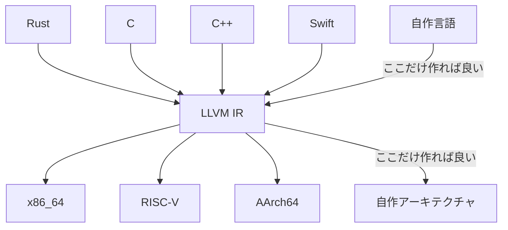
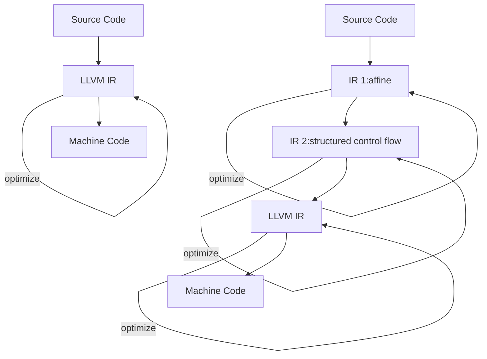
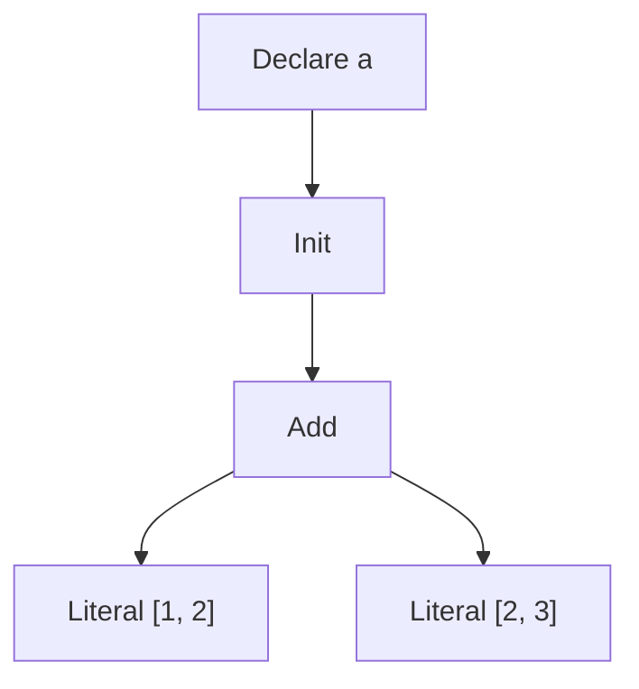
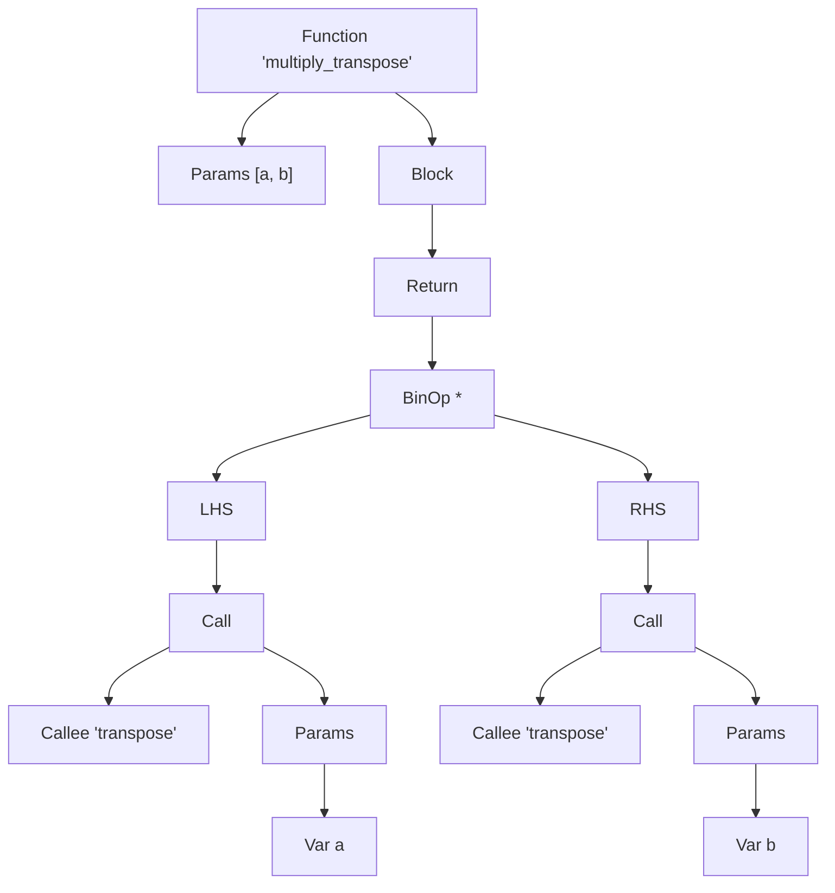
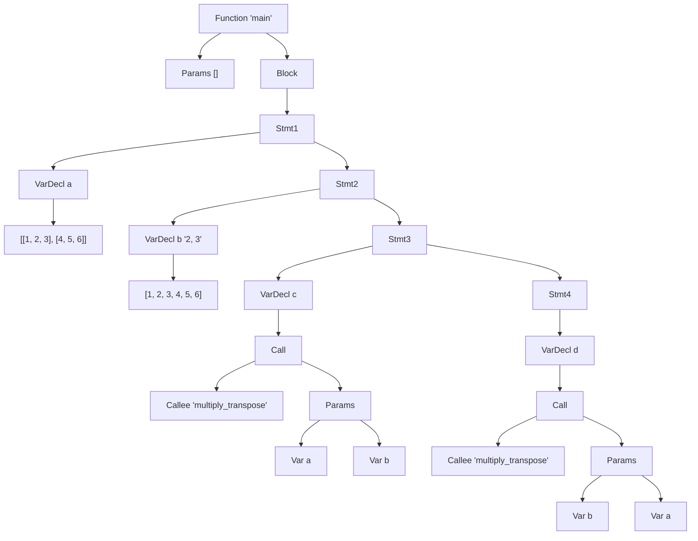
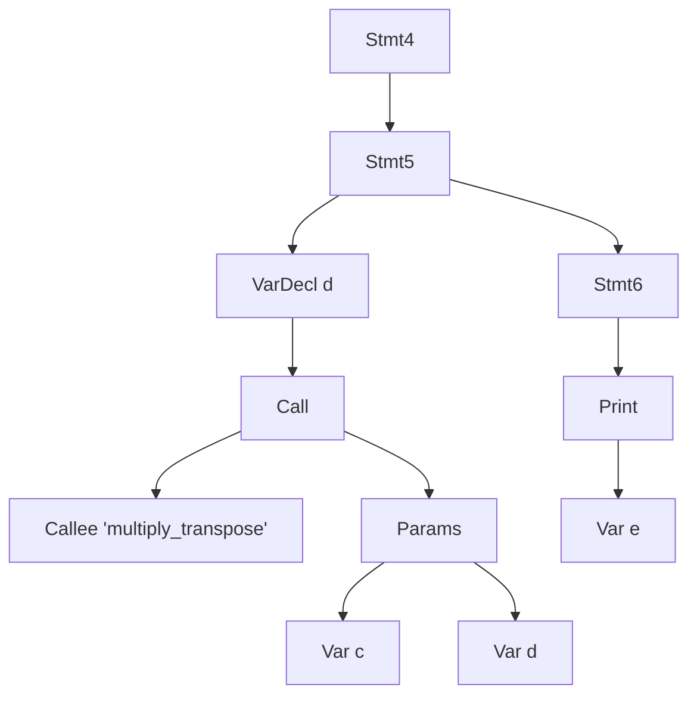
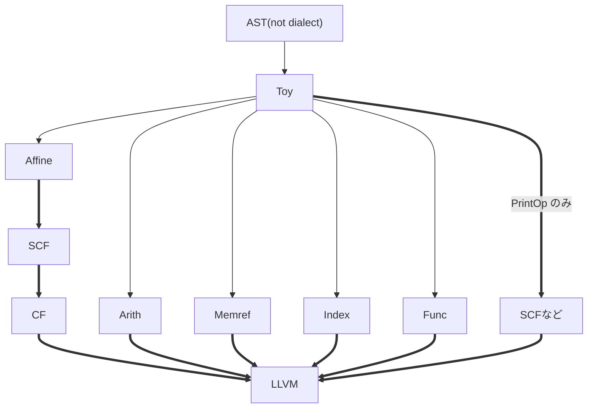
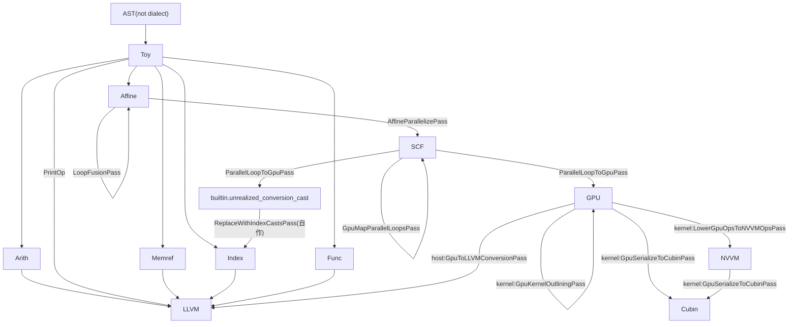

この記事は、KCS アドベントカレンダー 23 日目の記事です。

22 日目・24 日目

## GPU 上で走る自作言語のコンパイラ

こんにちは、lemolatoon です。
最近は、夏に自作 OS ゼミでセキュキャンに参加したりして、また低レイヤへの気持ちを高めたりしていました。

自作 OS も一段落ついた頃、[MLIR](https://mlir.llvm.org/)というものを知り、何やら面白そうだぞということで色々調べて手を動かしたりしていたのですが、ある程度 MLIR の利点を生かしたいい感じのものができつつあるので紹介したいと思います。

まず最初に自作言語を作る手順を、LLVM IR に変換するところまで説明します。
その後、GPU 上で走らせる部分について書きます。

実装は、すべて以下のリポジトリにあります。LLVM IR への変換は少なくとも`ch6`ブランチに、GPU 上で走らせる部分の実装は`lower-to-gpu`ブランチにあります。執筆時点では、`master`には取り込んでません。

https://github.com/lemolatoon/toy-shakyo

## MLIR ってなに？

まずは、[MLIR](https://mlir.llvm.org/)がなんなのかについてここに書きたいと思います。
MLIR は、Multi-Level Intermediate Representation の略で、コンパイラを作るときに、簡単に中間表現を定義したり、中間表現間の変換や、最適化を実装することができるフレームワークのようなものです。

### LLVM との関連

これまでに、コンパイラのための基盤といえば、誰もが[LLVM](https://llvm.org/)を挙げていたし、今も挙げられると思います。LLVM は、LLVM IR という唯一の中間表現を定義することで、コンパイラ作成時の負荷を軽減するようなものでした。
例えば、新たなプログラミング言語を使いたいときには、その言語のソースコードから LLVM IR までの変換さえ実装すれば、LLVM IR から、x86 や risc-v などの各機械語への変換は、LLVM の既存の資産を使うことができます。
逆に、まったく新しいアーキテクチャのプロセッサーを作ったときには、LLVM IR からそのプロセッサーへの機械語への変換さえ実装すれば、LLVM IR を経由するすべての言語(C/C++や Swift、Rust など)をその新しいプロセッサーで使うことができます。



**高レベル IR**
LLVM は非常に便利なのですが、LLVM IR は機械語のレベルに近い中間表現で、型やライフタイムの解析といった LLVM IR では表現できない高いレベルの情報は、各言語が各々の中間表現を持っていることが多くなってきました。

```llvm:LLVM IRの例
45:                                               ; preds = %42
  %46 = extractvalue { ptr, ptr, i64, [1 x i64], [1 x i64] } %6, 1
  %47 = getelementptr double, ptr %46, i64 %43
  %48 = load double, ptr %47, align 8
  %49 = call i32 (ptr, ...) @printf(ptr @formatSpecifier, double %48)
  %50 = add i64 %43, 1
  br label %42
```

このような LLVM IR よりも高い中間表現や、その実装は各言語間で共有されることはなく、同じような内容の実装が複数の言語で、複数実装され、知見が共有されないということが起こっていました。
また、GPU などの現在使われている CPU とは大きく異なるプロセッサーでは、LLVM IR ではうまく表現できないこともあります。


_各々の言語が各々に IR を持っている様子
[CGO 2020: International Symposium on Code Generation and Optimization](https://docs.google.com/presentation/d/11-VjSNNNJoRhPlLxFgvtb909it1WNdxTnQFipryfAPU/edit#slide=id.g7d334b12e5_0_4)から引用_

そこで、LLVM IR に限らず、自由に中間表現が定義でき、中間表現同士を混在させたり、他の言語で用いた中間表現を流用したりできるようにしたコンパイラ基盤が MLIR です。

**最適化**
最適化に関しても、LLVM IR のレベルまで落としてからでは、元のソースコードからは、意味が失われてしまうことがあります。
例えば、行列の掛け算をする演算子がある言語に定義されているとします。それを LLVM IR まで落としてしまうと、足し算と掛け算と比較演算、ブランチ命令などの低レベルの命令まで落ちてしまいます。LLVM IR 単体でも最適化はできますが、限界があります。

MLIR ならば、複数の中間表現をたどりながら、その中間表現の意味に合わせた最適化を順次適用していくことができます。



## MLIR で自作言語を作る

ここまでで、MLIR では複数の中間表現を定義できてうれしいという話をしました。
MLIR では、それぞれの中間表現のことを Dialect と呼びます。また、MLIR では標準ライブラリ的な立ち位置で、いくつかの Dialect が既に定義されています。^[標準 Dialect の一覧 https://mlir.llvm.org/docs/Dialects/]
すでに定義された Dialect を行き来することで、最終的に機械語へと落としていきます。

### Toy Tutorial

今回自作言語のチュートリアルとして、[Toy Tutorial](https://mlir.llvm.org/docs/Tutorials/Toy/)を参考にしました。
このチュートリアルは、MLIR 公式のもので、以下に示すような Toy 言語を作るようなものになっています。

```toy:sample.toy
# Toy言語において、すべての値はTensor。

# ユーザ定義関数。Tensorのshapeはgenericになる。
def multiply_transpose(a, b) {
  # 組み込み関数transpose。Tensorを転置する。
  return transpose(a) * transpose(b);
}

def main() {
  # 変数`a`をshape <2, 3> で定義。リテラルで初期化。
  var a = [[1, 2, 3], [4, 5, 6]];
  # 変数宣言時にshapeを指定することで自動でreshapeする。
  var b<2, 3> = [1, 2, 3, 4, 5, 6];

  # この呼び出しで、`multiply_transpose`は <2, 3> で特殊化される。
  # 戻り値の型は、<3, 2> と推論され、変数 `c` を初期化する。
  var c = multiply_transpose(a, b);

  # 二回目の <2, 3> で特殊化された`multiply_transpose`の呼び出し。
  var d = multiply_transpose(b, a);

  # <2, 3> ではなく、<3, 2> に対する`multiply_transpose`の呼び出し。
  # 一つ前とは、別の特殊化を引き起こす。
  var e = multiply_transpose(c, d);

  # 組み込み関数`print`
  print(e);
}
```

### parser を書く

自作言語を作るときには、まずパーサーを書きましょう。
パーサーとは、ただの文字列である自作言語のソースコードを、データ構造として、組み上げるものです。
ソースコードは再帰的な構造になっていることが多いので、組み上げるデータ構造は、専ら木構造です。

例えば、次のようなソースコードならば、次のような AST^[Abstract Syntax Tree, 抽象構文木, ソースコードを表すデータ構造のこと]に変換されます。

```
var a = [1, 2] + [2, 3];
```



:::details `sample.toy` の AST







途中、小さくなってしまうため、`Stmt4`を分割した。
:::

### AST をそのまま表現する中間表現を定義する。

ここからいよいよ MLIR の出番です。LLVM IR を使った自作言語の開発ならば、ここで頑張って LLVM IR に変換するのですが、MLIR の場合は、ゆっくりと少しずつ意味を機械語に近づけていきます。
そのため、まずは AST をそのまま表す中間表現を定義し、それに変換することで、MLIR の枠組みに載せるのが定石です。^[https://youtu.be/hIt6J1_E21c?si=OzAXn8ZipUTdGy4f&t=799, Input Dialects と呼ぶらしい。]
今回は、Toy 言語のために、`Toy Dialect`という中間表現を定義しました。
命令は、`ConstantOp`, `AddOp`, `FuncOp`, `ReturnOp`, `PrintOp`, `GeneralCallOp`, `MulOp`, `ReshapeOp`, `TransposeOp`, `CastOp`の１０つです。
Toy 言語のできることを考えると、Toy 言語を自然に表すセットだと思います。

`sample.toy`を`Toy Dialect`を使って表現すると次のような IR になります。

```mlir:sample1.mlir
module {
  toy.func private @multiply_transpose(%arg0: tensor<*xf64>, %arg1: tensor<*xf64>) -> tensor<*xf64> {
    %0 = toy.transpose(%arg0 : tensor<*xf64>) to tensor<*xf64>
    %1 = toy.transpose(%arg1 : tensor<*xf64>) to tensor<*xf64>
    %2 = "toy.mul"(%0, %1) : (tensor<*xf64>, tensor<*xf64>) -> tensor<*xf64>
    toy.return %2 : tensor<*xf64>
  }
  toy.func @main() {
    %0 = "toy.constant"() {value = dense<[[1.000000e+00, 2.000000e+00, 3.000000e+00], [4.000000e+00, 5.000000e+00, 6.000000e+00]]> : tensor<2x3xf64>} : () -> tensor<2x3xf64>
    %1 = "toy.constant"() {value = dense<[1.000000e+00, 2.000000e+00, 3.000000e+00, 4.000000e+00, 5.000000e+00, 6.000000e+00]> : tensor<6xf64>} : () -> tensor<6xf64>
    %2 = toy.reshape(%1 : tensor<6xf64>) to tensor<2x3xf64>
    %3 = toy.generic_call @multiply_transpose(%0, %2) : (tensor<2x3xf64>, tensor<2x3xf64>) -> tensor<*xf64>
    %4 = toy.generic_call @multiply_transpose(%2, %0) : (tensor<2x3xf64>, tensor<2x3xf64>) -> tensor<*xf64>
    %5 = toy.generic_call @multiply_transpose(%3, %4) : (tensor<*xf64>, tensor<*xf64>) -> tensor<*xf64>
    toy.print %5 : tensor<*xf64>
    toy.return
  }
}
```

値に`tensor`という型がついていますが、これは MLIR が標準で備えている型です^[実は、この型は、'tensor' Dialect という別の中間表現で定義された型です。'tensor' Dialect が標準で備わっているので、`tensor`型も最初から使えるわけです。https://mlir.llvm.org/docs/Dialects/TensorOps/]。また、`dense`も Tensor のリテラルを表すときに使うものです。^[これは[Attribute](https://mlir.llvm.org/docs/DefiningDialects/AttributesAndTypes/#attributes)というもので、命令にコンパイル時に決まる値をもたせることができます。`dense`はそのうち標準で定義されている[DenseElementsAttr](https://mlir.llvm.org/doxygen/classmlir_1_1DenseElementsAttr.html)です。]

ここで特徴的なのは、`toy.constant`による値には、`tensor`の shape が定まっていますが、演算した結果はすべて、`tensor<*xf64>`となっていて、shape が不定になっています。これは当然で、型推論をまだ実装していないので、`UnrankedTensorType`として扱っています。^[`tensor`型は、`RankedTensorType`か`UnrankedTensorType`のどちらかである。[参考](https://mlir.llvm.org/doxygen/classmlir_1_1TensorType.html#details)]

### インライン化

ここから、`Toy Dialect`を少しずつ LLVM IR に近づけていきます。まずは、shape に対して generic になってしまっているユーザー定義関数をどうにかします。

戦略としてはこうです。

1. すべてのユーザー定義関数をインライン化し、`main`関数に処理をすべて押し込む。
2. もともと`toy.constant`以外は`UnrankedTensorType`なので、型推論することで、特殊化したことになる。

MLIR において「インライン化」という処理は、よく行われる処理なので簡単にできる仕組みが整っています。

- `GenericCallOp`に`CallOpInterface`を実装する。
  - callee を返す`mlir::CallInterfaceCallable getCallableForCallee()`
  - 関数呼び出しの引数の値を返す`mlir::Operation::operand_range getArgOperands()`
- `FuncOp`に`CallableOpInterface`を実装する。
  - 関数の body を表す部分を返す`mlir::Region *getCallableRegion()`
  - 戻り値の型を表す`mlir::ArrayRef<mlir::Type> getCallableResults()`
- `mlir::DialectInlinerInterface`を継承した、`struct ToyInlinerInterface`を定義
  - インライン化してよいかを表す`bool isLegalToInline(...)`を定義
  - 関数の terminator^[https://mlir.llvm.org/docs/Traits/#terminator, Region(関数で言うところの Block)は、Terminator という性質を持つ命令で終わっている必要がある。関数の場合は、`toy.return`がこれにあたる。]をどう取り扱うかを決める`void handleTerminator(...)`
  - 関数の引数の型のミスマッチが起きたときにどう型変換するかを決める`mlir::Operation *materializeCallConversion(...)`

このような抽象的な関数たちを実装することでなんと、インライン化を達成することができます。(MLIR さまさまですね)
インライン化のように、MLIR から MLIR への変換はパス^[https://mlir.llvm.org/docs/PassManagement/]と呼ばれるものによって行われます。

```cpp
pm.addPass(mlir::createInlinerPass());
```

`mlir::createInlinerPass`のように、MLIR が標準で持っているパスがたくさんあります。

:::details sample1.mlir をインライン化した結果:sample2.mlir

```toy:sample2.mlir
module {
  toy.func @main() {
    %0 = "toy.constant"() {value = dense<[[1.000000e+00, 2.000000e+00, 3.000000e+00], [4.000000e+00, 5.000000e+00, 6.000000e+00]]> : tensor<2x3xf64>} : () -> tensor<2x3xf64>
    %1 = "toy.constant"() {value = dense<[[1.000000e+00, 2.000000e+00, 3.000000e+00], [4.000000e+00, 5.000000e+00, 6.000000e+00]]> : tensor<2x3xf64>} : () -> tensor<2x3xf64>
    %2 = toy.cast %0 : tensor<2x3xf64> to tensor<*xf64>
    %3 = toy.cast %1 : tensor<2x3xf64> to tensor<*xf64>
    %4 = toy.transpose(%2 : tensor<*xf64>) to tensor<*xf64>
    %5 = toy.transpose(%3 : tensor<*xf64>) to tensor<*xf64>
    %6 = "toy.mul"(%4, %5) : (tensor<*xf64>, tensor<*xf64>) -> tensor<*xf64>
    %7 = toy.cast %1 : tensor<2x3xf64> to tensor<*xf64>
    %8 = toy.cast %0 : tensor<2x3xf64> to tensor<*xf64>
    %9 = toy.transpose(%7 : tensor<*xf64>) to tensor<*xf64>
    %10 = toy.transpose(%8 : tensor<*xf64>) to tensor<*xf64>
    %11 = "toy.mul"(%9, %10) : (tensor<*xf64>, tensor<*xf64>) -> tensor<*xf64>
    %12 = toy.transpose(%6 : tensor<*xf64>) to tensor<*xf64>
    %13 = toy.transpose(%11 : tensor<*xf64>) to tensor<*xf64>
    %14 = "toy.mul"(%12, %13) : (tensor<*xf64>, tensor<*xf64>) -> tensor<*xf64>
    toy.print %14 : tensor<*xf64>
    toy.return
  }
}
```

:::

### shape 推論

`sample2.toy`のようにインライン化が完了すると、shape 推論に取り掛かることができます。MLIR の命令は SSA^[static single-assignment, 1 度しか代入されないということ] value を結果として持ちます。なので、「ある命令の引数の shape が分かっているときに、結果の引数 shape がどうなるか」、さえ決めてしまえば、`toy.constant`から順番に shape を連鎖して推論していくことができるはずです。

ここでは、パスを自分で定義することによって、順番に推論していくことにします。

戦略は以下の通りです。

1. `mlir::OpInterface`を継承した`ShapeInterface`を定義し、そのメソッドとして`inferShapes`を定義する。
2. `AddOp`, `MulOp`, `TransposeOp`, `CastOp`^[インライン化の関数呼び出し部分の`tensor<2x3xf64>`などの具体的な型から`tensor<*xf64>`という`UnrankedTensorType`に変換するの使っている。]に`ShapeInterface`を実装する。
3. `mlir::PassWrapper`を継承した`ShapeInferencePass`を定義し、引数の shape が確定したものから推論していき、すべて推論し終わるまでループで推論する。

具体的なコードは省略しますが、このようにパスという枠組みで定義してあげれば、インライン化と同じように適用できます。

```cpp
optPM.addPass(toy::createShapeInferencePass());
```

:::details 余談: CanonicalizerPass と CSEPass

`CanonicalizerPass`と`CSEPass`は MLIR 標準で用意されたパスです。

1. CanonicalizerPass
   各命令には、`canonicalizer`というものを定義することができます。これを用いるとその命令固有の最適化をかけることができます。
   例えば、`TransopseOp`には、`TransposeTransposeOptPattern`という書き換えパターンを定義し、これを`canonicalizer`に登録しています。^[ここでは、[Table-driven Declarative Rewrite Rule(DRR)](https://mlir.llvm.org/docs/DeclarativeRewrites/)による記述]

```td
// Transpose(Transpose(x)) -> x
def TransposeTransposeOptPattern : Pat<(TransposeOp(TransposeOp $arg)),
	(replaceWithValue $arg)>;
```

これにより、以下のような最適化が走るようになります。

```toy:transpose_transpose.toy
def main(a) {
	return transpose(transpose(a));
}
```

```mlir:transpose_transpose.mlir
module {
  toy.func @main(%arg0: tensor<*xf64>) -> tensor<*xf64> {
    toy.return %arg0 : tensor<*xf64>
  }
}
```

本来ならば、`TransposeOp`が２回適用されるところが、消去されています。
このような命令特有の最適化を`canonicalizer`で定義することができます。

2. CSEPass
   CSE は common sub expression elimination のことで、同じ計算を２回している部分を１つにまとめてくれます。[参考](https://mlir.llvm.org/doxygen/namespacemlir.html#a14895da9723acd9c7f910c2694ff9f65)

:::

### Affine Dialect への lowering

lowering とは、ある Dialect(中間表現)から、異なる Dialect へ変換することを指します。^[[参考](https://mlir.llvm.org/docs/Tutorials/Toy/Ch-5/)]より機械語へ近い、低いレイヤへと落ちていくため、lowering です。（少なくとも筆者はそう思っている。）

Affine Dialect は MLIR の標準 Dialect(中間表現)の１つです。^[https://mlir.llvm.org/docs/Dialects/Affine/]
Affine Dialect は affine 変換を抽象化した命令達を提供する Dialect です。しかし、ここでは`affine.for`というループを用いるために Affine Dialect へ変換しています。SCF Dialect^[structured control flow を表す[Dialect](https://mlir.llvm.org/docs/Dialects/SCFDialect/)。より一般的な for や if, while などの制御構文を表現できる。]に lowring する手もありますが、Affine Dialect のほうが制約が強く、特殊な for 文を表現しているため、より強い最適化が期待できます。

`tensor`型は`memref`型^[['memref' Dialect](https://mlir.llvm.org/docs/Dialects/MemRef/)で定義される型]へと変換します。この型は、具体的なメモリ領域を表現する型です。`memref.alloc`でメモリ確保し、`memref.dealloc`で解放する必要があります。
また、具体的な足し算や掛け算などの演算は、`arith.addf`、`arith.mulf`で行います。これらの命令は Arith Dialect^[https://mlir.llvm.org/docs/Dialects/ArithOps/]という一般的な算術演算を表す Dialect です。

この Toy Dialect から Affine Dialect たちへの lowering は次の戦略で行います。

1. この lowering を表す`ToyToAffineLoweringPass`というパスを定義したい。
2. このパスでは、`PrintOp`を除くすべての Toy Dialect の命令を変換したい。そこで、パスの中でそのことを明示する。^[変換して、無くしたいものを Illegal と呼び、残っていても良いものを Legal と呼んでいる。]

```cpp
// 変換先のDialectはLegalにする。
target.addLegalDialect<mlir::AffineDialect, mlir::BuiltinDialect,
						mlir::arith::ArithDialect, mlir::func::FuncDialect,
						mlir::memref::MemRefDialect>();

// Toy DialectはすべてIllegal！
target.addIllegalDialect<toy::ToyDialect>();
// operandがTensorTypeではなくなっている(=operandはlowering済みの)PrintOpを除いて
target.addDynamicallyLegalOp<toy::PrintOp>([](toy::PrintOp op) {
return llvm::none_of(op->getOperandTypes(), [](mlir::Type type) {
	return llvm::isa<mlir::TensorType>(type);
});
});
```

3. 各 Toy Dialect の命令ごとにどう変換するのかを定義する。例えば、`MulOp`や、`AddOp`は下のように定義する。^[`lowerOpToLoops`は自分で定義したヘルパー関数で、その中身で、`affine.for`が生成される。]

:::details `MulOp`, `AddOp`の変換(lowering)の定義

```cpp
template <typename BinaryOp, typename LoweredBinaryOp>
struct BinaryOpLowering : public mlir::ConversionPattern {
  BinaryOpLowering(mlir::MLIRContext *ctx)
      : mlir::ConversionPattern(BinaryOp::getOperationName(), 1, ctx) {}

  mlir::LogicalResult
  matchAndRewrite(mlir::Operation *op, mlir::ArrayRef<mlir::Value> operands,
                  mlir::ConversionPatternRewriter &rewriter) const final {
    auto loc = op->getLoc();
    lowerOpToLoops(
        op, operands, rewriter,
        [loc](mlir::OpBuilder &builder, mlir::ValueRange memRefOperands,
              mlir::ValueRange loopIvs) {
          // https://mlir.llvm.org/docs/DefiningDialects/Operations/#operand-adaptors
          // Generate an adaptor for the remapped operands of the
          // BinaryOp. This allows for using the nice named accessors
          // that are generated by the ODS.
          typename BinaryOp::Adaptor binaryAdaptor(memRefOperands);

          // Generate loads for the element of 'lhs' and 'rhs' at the
          // inner loop.
          auto loadedLhs = builder.create<mlir::AffineLoadOp>(
              loc, binaryAdaptor.getLhs(), loopIvs);

          auto loadedRhs = builder.create<mlir::AffineLoadOp>(
              loc, binaryAdaptor.getRhs(), loopIvs);

          // Create the binary operation performed on the loaded
          // values.
          return builder.create<LoweredBinaryOp>(loc, loadedLhs, loadedRhs);
        });

    return mlir::success();
  }
};
```

:::

4. `ToyToAffineLoweringPass`で、各演算の lowering を適用する。

このようにして、`ToyToAffineLoweringPass`というパスが定義できたので、これまでのインライン化や shape 推論と同様に適用できます。

```cpp
pm.addPass(toy::createLowerToAffinePass());
```

:::details sample2.mlir に ToyToAffineLoweringPass を適用した MLIR:sample3.mlir

```toy:sample3.mlir
module {
  func.func @main() {
    %cst = arith.constant 6.000000e+00 : f64
    %cst_0 = arith.constant 5.000000e+00 : f64
    %cst_1 = arith.constant 4.000000e+00 : f64
    %cst_2 = arith.constant 3.000000e+00 : f64
    %cst_3 = arith.constant 2.000000e+00 : f64
    %cst_4 = arith.constant 1.000000e+00 : f64
    %alloc = memref.alloc() : memref<2x3xf64>
    %alloc_5 = memref.alloc() : memref<2x3xf64>
    %alloc_6 = memref.alloc() : memref<3x2xf64>
    %alloc_7 = memref.alloc() : memref<3x2xf64>
    %alloc_8 = memref.alloc() : memref<2x3xf64>
    affine.store %cst_4, %alloc_8[0, 0] : memref<2x3xf64>
    affine.store %cst_3, %alloc_8[0, 1] : memref<2x3xf64>
    affine.store %cst_2, %alloc_8[0, 2] : memref<2x3xf64>
    affine.store %cst_1, %alloc_8[1, 0] : memref<2x3xf64>
    affine.store %cst_0, %alloc_8[1, 1] : memref<2x3xf64>
    affine.store %cst, %alloc_8[1, 2] : memref<2x3xf64>
    affine.for %arg0 = 0 to 3 {
      affine.for %arg1 = 0 to 2 {
        %0 = affine.load %alloc_8[%arg1, %arg0] : memref<2x3xf64>
        affine.store %0, %alloc_7[%arg0, %arg1] : memref<3x2xf64>
      }
    }
    affine.for %arg0 = 0 to 3 {
      affine.for %arg1 = 0 to 2 {
        %0 = affine.load %alloc_7[%arg0, %arg1] : memref<3x2xf64>
        %1 = arith.mulf %0, %0 : f64
        affine.store %1, %alloc_6[%arg0, %arg1] : memref<3x2xf64>
      }
    }
    affine.for %arg0 = 0 to 2 {
      affine.for %arg1 = 0 to 3 {
        %0 = affine.load %alloc_6[%arg1, %arg0] : memref<3x2xf64>
        affine.store %0, %alloc_5[%arg0, %arg1] : memref<2x3xf64>
      }
    }
    affine.for %arg0 = 0 to 2 {
      affine.for %arg1 = 0 to 3 {
        %0 = affine.load %alloc_5[%arg0, %arg1] : memref<2x3xf64>
        %1 = arith.mulf %0, %0 : f64
        affine.store %1, %alloc[%arg0, %arg1] : memref<2x3xf64>
      }
    }
    toy.print %alloc : memref<2x3xf64>
    memref.dealloc %alloc_8 : memref<2x3xf64>
    memref.dealloc %alloc_7 : memref<3x2xf64>
    memref.dealloc %alloc_6 : memref<3x2xf64>
    memref.dealloc %alloc_5 : memref<2x3xf64>
    memref.dealloc %alloc : memref<2x3xf64>
    return
  }
}
```

:::

さらに、Affine Dialect には、すでに最適化のためのパスが実装されているので、それ適用することで、何の労力もかけず最適化できます。

```cpp
optPM.addPass(mlir::createLoopFusionPass());
optPM.addPass(mlir::createAffineScalarReplacementPass());
```

:::details sample3.mlir に Affine Dialect の最適化パスを適用した MLIR:sample4.mlir

```toy:sample4.mlir
module {
  func.func @main() {
    %cst = arith.constant 6.000000e+00 : f64
    %cst_0 = arith.constant 5.000000e+00 : f64
    %cst_1 = arith.constant 4.000000e+00 : f64
    %cst_2 = arith.constant 3.000000e+00 : f64
    %cst_3 = arith.constant 2.000000e+00 : f64
    %cst_4 = arith.constant 1.000000e+00 : f64
    %alloc = memref.alloc() : memref<2x3xf64>
    %alloc_5 = memref.alloc() : memref<2x3xf64>
    affine.store %cst_4, %alloc_5[0, 0] : memref<2x3xf64>
    affine.store %cst_3, %alloc_5[0, 1] : memref<2x3xf64>
    affine.store %cst_2, %alloc_5[0, 2] : memref<2x3xf64>
    affine.store %cst_1, %alloc_5[1, 0] : memref<2x3xf64>
    affine.store %cst_0, %alloc_5[1, 1] : memref<2x3xf64>
    affine.store %cst, %alloc_5[1, 2] : memref<2x3xf64>
    affine.for %arg0 = 0 to 2 {
      affine.for %arg1 = 0 to 3 {
        %0 = affine.load %alloc_5[%arg0, %arg1] : memref<2x3xf64>
        %1 = arith.mulf %0, %0 : f64
        %2 = arith.mulf %1, %1 : f64
        affine.store %2, %alloc[%arg0, %arg1] : memref<2x3xf64>
      }
    }
    toy.print %alloc : memref<2x3xf64>
    memref.dealloc %alloc_5 : memref<2x3xf64>
    memref.dealloc %alloc : memref<2x3xf64>
    return
  }
}
```

:::

複数あった`affine.for`が一つにまとまり、かなりスッキリしました。

### LLVM Dialect への lowering

最後に、LLVM IR まで lowering します。MLIR には、LLVM IR を表すための 'llvm' Dialect^[https://mlir.llvm.org/docs/Dialects/LLVM/]が存在します。このような最終的なターゲットとなるような Dialect のことを Output Dialects と呼ぶようです。^[[この動画のこの部分](https://youtu.be/hIt6J1_E21c?si=3OETX62vxNE92M1R&t=1383)で説明されている。]

ここでの戦略を図に表します。^[[Index Dialect](https://mlir.llvm.org/docs/Dialects/IndexOps/)は、`affine.for`のループの下限や上限を表すのに用いている。]



この図において、太字で表す部分を`ToyToLLVMLoweringPass`というパスとして定義することにします。一見大変そうですが、Memref Dialect から LLVM Dialect といった、MLIR 標準の Dialect 間の変換は既にコミュニティによって実装されています。
よって、自分たちで実装しなければならないのは、Toy Dialect から LLVM Dialect への変換、特に`PrintOp`から LLVM Dialect への変換のみになります。

LLVM Dialect への変換とは言っても、一気に LLVM Dialect まで lowering する必要はありません。「LLVM Dialect への変換が実装されている Dialect」へ変換すれば良いことになります。

Tensor の stdio への出力にはループが必要ですが、LLVM 流のラベルを付けたりしてループをするのは大変なので、ループを抽象化した、`scf.for`などの命令がある SCF Dialect^[https://mlir.llvm.org/docs/Dialects/SCFDialect/]などを経由します。

詳細な実装については書きませんが、これによって、Toy 言語を LLVM Dialect のみで表すことができたことになります。
:::details sample4.mlir に `ToyToLLVMLoweringPass` を適用した MLIR(かなり長い):sample5.mlir

```toy:sample5.mlir
module {
  llvm.func @free(!llvm.ptr<i8>)
  llvm.mlir.global internal constant @newLine("\0A\00") {addr_space = 0 : i32}
  llvm.mlir.global internal constant @formatSpecifier("%f \00") {addr_space = 0 : i32}
  llvm.func @printf(!llvm.ptr, ...) -> i32
  llvm.func @malloc(i64) -> !llvm.ptr<i8>
  llvm.func @main() {
    %0 = llvm.mlir.constant(6.000000e+00 : f64) : f64
    %1 = llvm.mlir.constant(5.000000e+00 : f64) : f64
    %2 = llvm.mlir.constant(4.000000e+00 : f64) : f64
    %3 = llvm.mlir.constant(3.000000e+00 : f64) : f64
    %4 = llvm.mlir.constant(2.000000e+00 : f64) : f64
    %5 = llvm.mlir.constant(1.000000e+00 : f64) : f64
    %6 = llvm.mlir.constant(2 : index) : i64
    %7 = llvm.mlir.constant(3 : index) : i64
    %8 = llvm.mlir.constant(1 : index) : i64
    %9 = llvm.mlir.constant(6 : index) : i64
    %10 = llvm.mlir.null : !llvm.ptr<f64>
    %11 = llvm.getelementptr %10[%9] : (!llvm.ptr<f64>, i64) -> !llvm.ptr<f64>
    %12 = llvm.ptrtoint %11 : !llvm.ptr<f64> to i64
    %13 = llvm.call @malloc(%12) : (i64) -> !llvm.ptr<i8>
    %14 = llvm.bitcast %13 : !llvm.ptr<i8> to !llvm.ptr<f64>
    %15 = llvm.mlir.undef : !llvm.struct<(ptr<f64>, ptr<f64>, i64, array<2 x i64>, array<2 x i64>)>
    %16 = llvm.insertvalue %14, %15[0] : !llvm.struct<(ptr<f64>, ptr<f64>, i64, array<2 x i64>, array<2 x i64>)>
    %17 = llvm.insertvalue %14, %16[1] : !llvm.struct<(ptr<f64>, ptr<f64>, i64, array<2 x i64>, array<2 x i64>)>
    %18 = llvm.mlir.constant(0 : index) : i64
    %19 = llvm.insertvalue %18, %17[2] : !llvm.struct<(ptr<f64>, ptr<f64>, i64, array<2 x i64>, array<2 x i64>)>
    %20 = llvm.insertvalue %6, %19[3, 0] : !llvm.struct<(ptr<f64>, ptr<f64>, i64, array<2 x i64>, array<2 x i64>)>
    %21 = llvm.insertvalue %7, %20[3, 1] : !llvm.struct<(ptr<f64>, ptr<f64>, i64, array<2 x i64>, array<2 x i64>)>
    %22 = llvm.insertvalue %7, %21[4, 0] : !llvm.struct<(ptr<f64>, ptr<f64>, i64, array<2 x i64>, array<2 x i64>)>
    %23 = llvm.insertvalue %8, %22[4, 1] : !llvm.struct<(ptr<f64>, ptr<f64>, i64, array<2 x i64>, array<2 x i64>)>
    %24 = llvm.mlir.constant(2 : index) : i64
    %25 = llvm.mlir.constant(3 : index) : i64
    %26 = llvm.mlir.constant(1 : index) : i64
    %27 = llvm.mlir.constant(6 : index) : i64
    %28 = llvm.mlir.null : !llvm.ptr<f64>
    %29 = llvm.getelementptr %28[%27] : (!llvm.ptr<f64>, i64) -> !llvm.ptr<f64>
    %30 = llvm.ptrtoint %29 : !llvm.ptr<f64> to i64
    %31 = llvm.call @malloc(%30) : (i64) -> !llvm.ptr<i8>
    %32 = llvm.bitcast %31 : !llvm.ptr<i8> to !llvm.ptr<f64>
    %33 = llvm.mlir.undef : !llvm.struct<(ptr<f64>, ptr<f64>, i64, array<2 x i64>, array<2 x i64>)>
    %34 = llvm.insertvalue %32, %33[0] : !llvm.struct<(ptr<f64>, ptr<f64>, i64, array<2 x i64>, array<2 x i64>)>
    %35 = llvm.insertvalue %32, %34[1] : !llvm.struct<(ptr<f64>, ptr<f64>, i64, array<2 x i64>, array<2 x i64>)>
    %36 = llvm.mlir.constant(0 : index) : i64
    %37 = llvm.insertvalue %36, %35[2] : !llvm.struct<(ptr<f64>, ptr<f64>, i64, array<2 x i64>, array<2 x i64>)>
    %38 = llvm.insertvalue %24, %37[3, 0] : !llvm.struct<(ptr<f64>, ptr<f64>, i64, array<2 x i64>, array<2 x i64>)>
    %39 = llvm.insertvalue %25, %38[3, 1] : !llvm.struct<(ptr<f64>, ptr<f64>, i64, array<2 x i64>, array<2 x i64>)>
    %40 = llvm.insertvalue %25, %39[4, 0] : !llvm.struct<(ptr<f64>, ptr<f64>, i64, array<2 x i64>, array<2 x i64>)>
    %41 = llvm.insertvalue %26, %40[4, 1] : !llvm.struct<(ptr<f64>, ptr<f64>, i64, array<2 x i64>, array<2 x i64>)>
    %42 = llvm.mlir.constant(0 : index) : i64
    %43 = llvm.mlir.constant(0 : index) : i64
    %44 = llvm.extractvalue %41[1] : !llvm.struct<(ptr<f64>, ptr<f64>, i64, array<2 x i64>, array<2 x i64>)>
    %45 = llvm.mlir.constant(3 : index) : i64
    %46 = llvm.mul %42, %45  : i64
    %47 = llvm.add %46, %43  : i64
    %48 = llvm.getelementptr %44[%47] : (!llvm.ptr<f64>, i64) -> !llvm.ptr<f64>
    llvm.store %5, %48 : !llvm.ptr<f64>
    %49 = llvm.mlir.constant(0 : index) : i64
    %50 = llvm.mlir.constant(1 : index) : i64
    %51 = llvm.extractvalue %41[1] : !llvm.struct<(ptr<f64>, ptr<f64>, i64, array<2 x i64>, array<2 x i64>)>
    %52 = llvm.mlir.constant(3 : index) : i64
    %53 = llvm.mul %49, %52  : i64
    %54 = llvm.add %53, %50  : i64
    %55 = llvm.getelementptr %51[%54] : (!llvm.ptr<f64>, i64) -> !llvm.ptr<f64>
    llvm.store %4, %55 : !llvm.ptr<f64>
    %56 = llvm.mlir.constant(0 : index) : i64
    %57 = llvm.mlir.constant(2 : index) : i64
    %58 = llvm.extractvalue %41[1] : !llvm.struct<(ptr<f64>, ptr<f64>, i64, array<2 x i64>, array<2 x i64>)>
    %59 = llvm.mlir.constant(3 : index) : i64
    %60 = llvm.mul %56, %59  : i64
    %61 = llvm.add %60, %57  : i64
    %62 = llvm.getelementptr %58[%61] : (!llvm.ptr<f64>, i64) -> !llvm.ptr<f64>
    llvm.store %3, %62 : !llvm.ptr<f64>
    %63 = llvm.mlir.constant(1 : index) : i64
    %64 = llvm.mlir.constant(0 : index) : i64
    %65 = llvm.extractvalue %41[1] : !llvm.struct<(ptr<f64>, ptr<f64>, i64, array<2 x i64>, array<2 x i64>)>
    %66 = llvm.mlir.constant(3 : index) : i64
    %67 = llvm.mul %63, %66  : i64
    %68 = llvm.add %67, %64  : i64
    %69 = llvm.getelementptr %65[%68] : (!llvm.ptr<f64>, i64) -> !llvm.ptr<f64>
    llvm.store %2, %69 : !llvm.ptr<f64>
    %70 = llvm.mlir.constant(1 : index) : i64
    %71 = llvm.mlir.constant(1 : index) : i64
    %72 = llvm.extractvalue %41[1] : !llvm.struct<(ptr<f64>, ptr<f64>, i64, array<2 x i64>, array<2 x i64>)>
    %73 = llvm.mlir.constant(3 : index) : i64
    %74 = llvm.mul %70, %73  : i64
    %75 = llvm.add %74, %71  : i64
    %76 = llvm.getelementptr %72[%75] : (!llvm.ptr<f64>, i64) -> !llvm.ptr<f64>
    llvm.store %1, %76 : !llvm.ptr<f64>
    %77 = llvm.mlir.constant(1 : index) : i64
    %78 = llvm.mlir.constant(2 : index) : i64
    %79 = llvm.extractvalue %41[1] : !llvm.struct<(ptr<f64>, ptr<f64>, i64, array<2 x i64>, array<2 x i64>)>
    %80 = llvm.mlir.constant(3 : index) : i64
    %81 = llvm.mul %77, %80  : i64
    %82 = llvm.add %81, %78  : i64
    %83 = llvm.getelementptr %79[%82] : (!llvm.ptr<f64>, i64) -> !llvm.ptr<f64>
    llvm.store %0, %83 : !llvm.ptr<f64>
    %84 = llvm.mlir.constant(0 : index) : i64
    %85 = llvm.mlir.constant(2 : index) : i64
    %86 = llvm.mlir.constant(1 : index) : i64
    llvm.br ^bb1(%84 : i64)
  ^bb1(%87: i64):  // 2 preds: ^bb0, ^bb5
    %88 = llvm.icmp "slt" %87, %85 : i64
    llvm.cond_br %88, ^bb2, ^bb6
  ^bb2:  // pred: ^bb1
    %89 = llvm.mlir.constant(0 : index) : i64
    %90 = llvm.mlir.constant(3 : index) : i64
    %91 = llvm.mlir.constant(1 : index) : i64
    llvm.br ^bb3(%89 : i64)
  ^bb3(%92: i64):  // 2 preds: ^bb2, ^bb4
    %93 = llvm.icmp "slt" %92, %90 : i64
    llvm.cond_br %93, ^bb4, ^bb5
  ^bb4:  // pred: ^bb3
    %94 = llvm.extractvalue %41[1] : !llvm.struct<(ptr<f64>, ptr<f64>, i64, array<2 x i64>, array<2 x i64>)>
    %95 = llvm.mlir.constant(3 : index) : i64
    %96 = llvm.mul %87, %95  : i64
    %97 = llvm.add %96, %92  : i64
    %98 = llvm.getelementptr %94[%97] : (!llvm.ptr<f64>, i64) -> !llvm.ptr<f64>
    %99 = llvm.load %98 : !llvm.ptr<f64>
    %100 = llvm.fmul %99, %99  : f64
    %101 = llvm.fmul %100, %100  : f64
    %102 = llvm.extractvalue %23[1] : !llvm.struct<(ptr<f64>, ptr<f64>, i64, array<2 x i64>, array<2 x i64>)>
    %103 = llvm.mlir.constant(3 : index) : i64
    %104 = llvm.mul %87, %103  : i64
    %105 = llvm.add %104, %92  : i64
    %106 = llvm.getelementptr %102[%105] : (!llvm.ptr<f64>, i64) -> !llvm.ptr<f64>
    llvm.store %101, %106 : !llvm.ptr<f64>
    %107 = llvm.add %92, %91  : i64
    llvm.br ^bb3(%107 : i64)
  ^bb5:  // pred: ^bb3
    %108 = llvm.add %87, %86  : i64
    llvm.br ^bb1(%108 : i64)
  ^bb6:  // pred: ^bb1
    %109 = llvm.mlir.addressof @formatSpecifier : !llvm.ptr<array<4 x i8>>
    %110 = llvm.mlir.constant(0 : index) : i64
    %111 = llvm.getelementptr %109[%110, %110] : (!llvm.ptr<array<4 x i8>>, i64, i64) -> !llvm.ptr, i8
    %112 = llvm.mlir.addressof @newLine : !llvm.ptr<array<2 x i8>>
    %113 = llvm.mlir.constant(0 : index) : i64
    %114 = llvm.getelementptr %112[%113, %113] : (!llvm.ptr<array<2 x i8>>, i64, i64) -> !llvm.ptr, i8
    %115 = llvm.mlir.constant(0 : index) : i64
    %116 = llvm.mlir.constant(2 : index) : i64
    %117 = llvm.mlir.constant(1 : index) : i64
    llvm.br ^bb7(%115 : i64)
  ^bb7(%118: i64):  // 2 preds: ^bb6, ^bb11
    %119 = llvm.icmp "slt" %118, %116 : i64
    llvm.cond_br %119, ^bb8, ^bb12
  ^bb8:  // pred: ^bb7
    %120 = llvm.mlir.constant(0 : index) : i64
    %121 = llvm.mlir.constant(3 : index) : i64
    %122 = llvm.mlir.constant(1 : index) : i64
    llvm.br ^bb9(%120 : i64)
  ^bb9(%123: i64):  // 2 preds: ^bb8, ^bb10
    %124 = llvm.icmp "slt" %123, %121 : i64
    llvm.cond_br %124, ^bb10, ^bb11
  ^bb10:  // pred: ^bb9
    %125 = llvm.extractvalue %23[1] : !llvm.struct<(ptr<f64>, ptr<f64>, i64, array<2 x i64>, array<2 x i64>)>
    %126 = llvm.mlir.constant(3 : index) : i64
    %127 = llvm.mul %118, %126  : i64
    %128 = llvm.add %127, %123  : i64
    %129 = llvm.getelementptr %125[%128] : (!llvm.ptr<f64>, i64) -> !llvm.ptr<f64>
    %130 = llvm.load %129 : !llvm.ptr<f64>
    %131 = llvm.call @printf(%111, %130) : (!llvm.ptr, f64) -> i32
    %132 = llvm.add %123, %122  : i64
    llvm.br ^bb9(%132 : i64)
  ^bb11:  // pred: ^bb9
    %133 = llvm.call @printf(%114) : (!llvm.ptr) -> i32
    %134 = llvm.add %118, %117  : i64
    llvm.br ^bb7(%134 : i64)
  ^bb12:  // pred: ^bb7
    %135 = llvm.extractvalue %41[0] : !llvm.struct<(ptr<f64>, ptr<f64>, i64, array<2 x i64>, array<2 x i64>)>
    %136 = llvm.bitcast %135 : !llvm.ptr<f64> to !llvm.ptr<i8>
    llvm.call @free(%136) : (!llvm.ptr<i8>) -> ()
    %137 = llvm.extractvalue %23[0] : !llvm.struct<(ptr<f64>, ptr<f64>, i64, array<2 x i64>, array<2 x i64>)>
    %138 = llvm.bitcast %137 : !llvm.ptr<f64> to !llvm.ptr<i8>
    llvm.call @free(%138) : (!llvm.ptr<i8>) -> ()
    llvm.return
  }
}
```

:::

LLVM Dialect のみで表された MLIR は LLVM IR へと変換することができます。あとは、LLVM の巨大な資産を使って、特定のプロセッサーの機械語向けにコンパイルしたり、JIT で実行したり色々することができます。

:::details LLVM Dialect のみの sample5.mlir を LLVM IR に変換した結果:sample6.ir
LLVM 大先生のちからでなんと、定数までたたみこまれています。

```llvm:sample6.ir
; ModuleID = 'LLVMDialectModule'
source_filename = "LLVMDialectModule"
target datalayout = "e-m:e-p270:32:32-p271:32:32-p272:64:64-i64:64-f80:128-n8:16:32:64-S128"
target triple = "x86_64-pc-linux-gnu"

@formatSpecifier = internal constant [4 x i8] c"%f \00"

; Function Attrs: nofree nounwind
declare noundef i32 @printf(ptr nocapture noundef readonly, ...) local_unnamed_addr #0

; Function Attrs: nounwind
define void @main() local_unnamed_addr #1 {
.preheader3:
  %0 = tail call i32 (ptr, ...) @printf(ptr nonnull dereferenceable(1) @formatSpecifier, double 1.000000e+00)
  %1 = tail call i32 (ptr, ...) @printf(ptr nonnull dereferenceable(1) @formatSpecifier, double 1.600000e+01)
  %2 = tail call i32 (ptr, ...) @printf(ptr nonnull dereferenceable(1) @formatSpecifier, double 8.100000e+01)
  %putchar = tail call i32 @putchar(i32 10)
  %3 = tail call i32 (ptr, ...) @printf(ptr nonnull dereferenceable(1) @formatSpecifier, double 2.560000e+02)
  %4 = tail call i32 (ptr, ...) @printf(ptr nonnull dereferenceable(1) @formatSpecifier, double 6.250000e+02)
  %5 = tail call i32 (ptr, ...) @printf(ptr nonnull dereferenceable(1) @formatSpecifier, double 1.296000e+03)
  %putchar.1 = tail call i32 @putchar(i32 10)
  ret void
}

; Function Attrs: nofree nounwind
declare noundef i32 @putchar(i32 noundef) local_unnamed_addr #0

attributes #0 = { nofree nounwind }
attributes #1 = { nounwind }

!llvm.module.flags = !{!0}

!0 = !{i32 2, !"Debug Info Version", i32 3}
```

:::

```bash
# JITで実行する例
$ lli sample6.ir
1.000000 16.000000 81.000000
256.000000 625.000000 1296.000000
```

### MLIR の良さ

ここまでで、自作言語を MLIR を使って LLVM IR まで変換するところを見ました。MLIR の基盤に載ってしまえば、整備されたインライン化の仕組みや、
複数の Dialect(中間表現)を組み合わせて、最終的な Output Dialect まで簡単に lowering していけることが分かったのではないかなと思います。

また、Affine Dialect での最適化のように、少しずつ意味のレベルを落としていくことで、そのレベルでの最大の最適化をすることができ、最適化のしやすさ、資産の共有のしやすさの観点からも MLIR は良いと思います。

## Toy 言語を GPU 上で動かす

ここまでは、[Toy Tutorial](https://mlir.llvm.org/docs/Tutorials/Toy/)にある内容でしたが、ここからは独自にやっている部分です。Toy 言語を LLVM IR に変換するという点では同じですが、Tensor 同士の演算によるループは、要素ごとに独立であり、並列に計算できそうであるので、これを GPU の上で走らせることを考えます。

### GPU Dialect

MLIR には標準 Dialect の１つとして、[GPU Dialect](https://mlir.llvm.org/docs/Dialects/GPU/)があります。

GPU Dialect は、CUDA や OpenCL といった GPU カーネルのプログラミングモデルを抽象化したような命令を提供する Dialect です。
この Dialect では、GPU カーネル自体を記述できる他、カーネルとホスト間のメモリーコピーや、カーネルの立ち上げ、などのホスト側^[GPU と CPU なら、CPU 側のこと]の記述もできるようになっています。

GPU Dialect からは、カーネル部分を NVIDIA GPU 用のバイナリである[cubin](https://docs.nvidia.com/cuda/cuda-binary-utilities/index.html#what-is-a-cuda-binary)に変換したり、AMD の GPU 上で実行することができるバイナリである[hsaco](https://gpuopen.com/learn/amdgcn-assembly/)^[自分もあまりまだ分かってない]に変換したりすることができます。
また、ホスト側のコードも、LLVM Dialect に落とすことができます。^[おそらく内部で CUDA の API を読んだりすることになる]
また、OpenCL のカーネルの中間表現である SPIRV Dialect に落とすこともできるようです。^[未検証: https://mlir.llvm.org/doxygen/GPUToSPIRVPass_8cpp_source.html]

このように、様々な Output の候補がある中で、抽象化して様々なパスを集約する役割がある Dialect を Hourglass Dialect と呼ぶようです。^[[この動画のこの部分](https://youtu.be/hIt6J1_E21c?si=qbvoZc0_cH8M5f6S&t=956)でそう呼ばれている。]

### Lowering 戦略

LLVM Dialect に lowering したときの図を再掲します。


現在自分がやろうとしているのは次のような lowering 戦略になります。



`(自作)`とつけてある、`ReplaceWithIndexCastsPass`や、Toy Dialect からの Lowering 以外は、ほぼすべて標準が用意してくれたパスを使用しています。中間表現やその変換の実装を共有するという MLIR の良さがよく分かります。

実際の for 文がどのようにして、gpu 向けに変換されるのかを見てみましょう。各 MLIR が長いので、アコーディオンにしています。

:::details 元の Affine Dialect による for 文

```mlir
module {
  func.func @main() {
    %cst = arith.constant 6.000000e+00 : f64
    %cst_0 = arith.constant 5.000000e+00 : f64
    %cst_1 = arith.constant 4.000000e+00 : f64
    %cst_2 = arith.constant 3.000000e+00 : f64
    %cst_3 = arith.constant 2.000000e+00 : f64
    %cst_4 = arith.constant 1.000000e+00 : f64
    %alloc = memref.alloc() : memref<2x3xf64>
    %alloc_5 = memref.alloc() : memref<2x3xf64>
    affine.store %cst_4, %alloc_5[0, 0] : memref<2x3xf64>
    affine.store %cst_3, %alloc_5[0, 1] : memref<2x3xf64>
    affine.store %cst_2, %alloc_5[0, 2] : memref<2x3xf64>
    affine.store %cst_1, %alloc_5[1, 0] : memref<2x3xf64>
    affine.store %cst_0, %alloc_5[1, 1] : memref<2x3xf64>
    affine.store %cst, %alloc_5[1, 2] : memref<2x3xf64>
    affine.for %arg0 = 0 to 2 {
      affine.for %arg1 = 0 to 3 {
        %0 = affine.load %alloc_5[%arg0, %arg1] : memref<2x3xf64>
        %1 = arith.mulf %0, %0 : f64
        %2 = arith.mulf %1, %1 : f64
        affine.store %2, %alloc[%arg0, %arg1] : memref<2x3xf64>
      }
    }
    toy.print %alloc : memref<2x3xf64>
    memref.dealloc %alloc_5 : memref<2x3xf64>
    memref.dealloc %alloc : memref<2x3xf64>
    return
  }
}
```

:::

GPU カーネル側に、llvm 以外の Dialect が混ざると lowering がめんどくさくなってしまうので、GPU Dialect に変換する前に極力 LLVM Dialect に lowering するようにします。
:::details Affine Dialect に、AffineParallelizePass と、GpuMapPrallelLoopsPass をかけたもの

```mlir
module {
  llvm.func @free(!llvm.ptr<i8>)
  llvm.func @malloc(i64) -> !llvm.ptr<i8>
  llvm.mlir.global internal constant @newLine("\0A\00") {addr_space = 0 : i32}
  llvm.mlir.global internal constant @formatSpecifier("%f \00") {addr_space = 0 : i32}
  llvm.func @printf(!llvm.ptr, ...) -> i32
  func.func @main() {
    %0 = llvm.mlir.constant(6.000000e+00 : f64) : f64
    %1 = llvm.mlir.constant(5.000000e+00 : f64) : f64
    %2 = llvm.mlir.constant(4.000000e+00 : f64) : f64
    %3 = llvm.mlir.constant(3.000000e+00 : f64) : f64
    %4 = llvm.mlir.constant(2.000000e+00 : f64) : f64
    %5 = llvm.mlir.constant(1.000000e+00 : f64) : f64
    %6 = llvm.mlir.constant(2 : index) : i64
    %7 = llvm.mlir.constant(3 : index) : i64
    %8 = llvm.mlir.constant(1 : index) : i64
    %9 = llvm.mlir.constant(6 : index) : i64
    %10 = llvm.mlir.null : !llvm.ptr<f64>
    %11 = llvm.getelementptr %10[6] : (!llvm.ptr<f64>) -> !llvm.ptr<f64>
    %12 = llvm.ptrtoint %11 : !llvm.ptr<f64> to i64
    %13 = llvm.call @malloc(%12) : (i64) -> !llvm.ptr<i8>
    %14 = llvm.bitcast %13 : !llvm.ptr<i8> to !llvm.ptr<f64>
    %15 = llvm.mlir.undef : !llvm.struct<(ptr<f64>, ptr<f64>, i64, array<2 x i64>, array<2 x i64>)>
    %16 = llvm.insertvalue %14, %15[0] : !llvm.struct<(ptr<f64>, ptr<f64>, i64, array<2 x i64>, array<2 x i64>)>
    %17 = llvm.insertvalue %14, %16[1] : !llvm.struct<(ptr<f64>, ptr<f64>, i64, array<2 x i64>, array<2 x i64>)>
    %18 = llvm.mlir.constant(0 : index) : i64
    %19 = llvm.insertvalue %18, %17[2] : !llvm.struct<(ptr<f64>, ptr<f64>, i64, array<2 x i64>, array<2 x i64>)>
    %20 = llvm.insertvalue %6, %19[3, 0] : !llvm.struct<(ptr<f64>, ptr<f64>, i64, array<2 x i64>, array<2 x i64>)>
    %21 = llvm.insertvalue %7, %20[3, 1] : !llvm.struct<(ptr<f64>, ptr<f64>, i64, array<2 x i64>, array<2 x i64>)>
    %22 = llvm.insertvalue %7, %21[4, 0] : !llvm.struct<(ptr<f64>, ptr<f64>, i64, array<2 x i64>, array<2 x i64>)>
    %23 = llvm.insertvalue %8, %22[4, 1] : !llvm.struct<(ptr<f64>, ptr<f64>, i64, array<2 x i64>, array<2 x i64>)>
    %24 = builtin.unrealized_conversion_cast %23 : !llvm.struct<(ptr<f64>, ptr<f64>, i64, array<2 x i64>, array<2 x i64>)> to memref<2x3xf64>
    %25 = llvm.mlir.constant(2 : index) : i64
    %26 = llvm.mlir.constant(3 : index) : i64
    %27 = llvm.mlir.constant(1 : index) : i64
    %28 = llvm.mlir.constant(6 : index) : i64
    %29 = llvm.mlir.null : !llvm.ptr<f64>
    %30 = llvm.getelementptr %29[6] : (!llvm.ptr<f64>) -> !llvm.ptr<f64>
    %31 = llvm.ptrtoint %30 : !llvm.ptr<f64> to i64
    %32 = llvm.call @malloc(%31) : (i64) -> !llvm.ptr<i8>
    %33 = llvm.bitcast %32 : !llvm.ptr<i8> to !llvm.ptr<f64>
    %34 = llvm.mlir.undef : !llvm.struct<(ptr<f64>, ptr<f64>, i64, array<2 x i64>, array<2 x i64>)>
    %35 = llvm.insertvalue %33, %34[0] : !llvm.struct<(ptr<f64>, ptr<f64>, i64, array<2 x i64>, array<2 x i64>)>
    %36 = llvm.insertvalue %33, %35[1] : !llvm.struct<(ptr<f64>, ptr<f64>, i64, array<2 x i64>, array<2 x i64>)>
    %37 = llvm.mlir.constant(0 : index) : i64
    %38 = llvm.insertvalue %37, %36[2] : !llvm.struct<(ptr<f64>, ptr<f64>, i64, array<2 x i64>, array<2 x i64>)>
    %39 = llvm.insertvalue %25, %38[3, 0] : !llvm.struct<(ptr<f64>, ptr<f64>, i64, array<2 x i64>, array<2 x i64>)>
    %40 = llvm.insertvalue %26, %39[3, 1] : !llvm.struct<(ptr<f64>, ptr<f64>, i64, array<2 x i64>, array<2 x i64>)>
    %41 = llvm.insertvalue %26, %40[4, 0] : !llvm.struct<(ptr<f64>, ptr<f64>, i64, array<2 x i64>, array<2 x i64>)>
    %42 = llvm.insertvalue %27, %41[4, 1] : !llvm.struct<(ptr<f64>, ptr<f64>, i64, array<2 x i64>, array<2 x i64>)>
    %43 = builtin.unrealized_conversion_cast %42 : !llvm.struct<(ptr<f64>, ptr<f64>, i64, array<2 x i64>, array<2 x i64>)> to memref<2x3xf64>
    %44 = llvm.mlir.constant(0 : index) : i64
    %45 = builtin.unrealized_conversion_cast %44 : i64 to index
    %46 = llvm.mlir.constant(0 : index) : i64
    %47 = builtin.unrealized_conversion_cast %46 : i64 to index
    %48 = llvm.extractvalue %42[1] : !llvm.struct<(ptr<f64>, ptr<f64>, i64, array<2 x i64>, array<2 x i64>)>
    %49 = llvm.mlir.constant(3 : index) : i64
    %50 = llvm.mul %44, %49  : i64
    %51 = llvm.add %50, %46  : i64
    %52 = llvm.getelementptr %48[%51] : (!llvm.ptr<f64>, i64) -> !llvm.ptr<f64>
    llvm.store %5, %52 : !llvm.ptr<f64>
    %53 = llvm.mlir.constant(0 : index) : i64
    %54 = builtin.unrealized_conversion_cast %53 : i64 to index
    %55 = llvm.mlir.constant(1 : index) : i64
    %56 = builtin.unrealized_conversion_cast %55 : i64 to index
    %57 = llvm.extractvalue %42[1] : !llvm.struct<(ptr<f64>, ptr<f64>, i64, array<2 x i64>, array<2 x i64>)>
    %58 = llvm.mlir.constant(3 : index) : i64
    %59 = llvm.mul %53, %58  : i64
    %60 = llvm.add %59, %55  : i64
    %61 = llvm.getelementptr %57[%60] : (!llvm.ptr<f64>, i64) -> !llvm.ptr<f64>
    llvm.store %4, %61 : !llvm.ptr<f64>
    %62 = llvm.mlir.constant(0 : index) : i64
    %63 = builtin.unrealized_conversion_cast %62 : i64 to index
    %64 = llvm.mlir.constant(2 : index) : i64
    %65 = builtin.unrealized_conversion_cast %64 : i64 to index
    %66 = llvm.extractvalue %42[1] : !llvm.struct<(ptr<f64>, ptr<f64>, i64, array<2 x i64>, array<2 x i64>)>
    %67 = llvm.mlir.constant(3 : index) : i64
    %68 = llvm.mul %62, %67  : i64
    %69 = llvm.add %68, %64  : i64
    %70 = llvm.getelementptr %66[%69] : (!llvm.ptr<f64>, i64) -> !llvm.ptr<f64>
    llvm.store %3, %70 : !llvm.ptr<f64>
    %71 = llvm.mlir.constant(1 : index) : i64
    %72 = builtin.unrealized_conversion_cast %71 : i64 to index
    %73 = llvm.mlir.constant(0 : index) : i64
    %74 = builtin.unrealized_conversion_cast %73 : i64 to index
    %75 = llvm.extractvalue %42[1] : !llvm.struct<(ptr<f64>, ptr<f64>, i64, array<2 x i64>, array<2 x i64>)>
    %76 = llvm.mlir.constant(3 : index) : i64
    %77 = llvm.mul %71, %76  : i64
    %78 = llvm.add %77, %73  : i64
    %79 = llvm.getelementptr %75[%78] : (!llvm.ptr<f64>, i64) -> !llvm.ptr<f64>
    llvm.store %2, %79 : !llvm.ptr<f64>
    %80 = llvm.mlir.constant(1 : index) : i64
    %81 = builtin.unrealized_conversion_cast %80 : i64 to index
    %82 = llvm.mlir.constant(1 : index) : i64
    %83 = builtin.unrealized_conversion_cast %82 : i64 to index
    %84 = llvm.extractvalue %42[1] : !llvm.struct<(ptr<f64>, ptr<f64>, i64, array<2 x i64>, array<2 x i64>)>
    %85 = llvm.mlir.constant(3 : index) : i64
    %86 = llvm.mul %80, %85  : i64
    %87 = llvm.add %86, %82  : i64
    %88 = llvm.getelementptr %84[%87] : (!llvm.ptr<f64>, i64) -> !llvm.ptr<f64>
    llvm.store %1, %88 : !llvm.ptr<f64>
    %89 = llvm.mlir.constant(1 : index) : i64
    %90 = builtin.unrealized_conversion_cast %89 : i64 to index
    %91 = llvm.mlir.constant(2 : index) : i64
    %92 = builtin.unrealized_conversion_cast %91 : i64 to index
    %93 = llvm.extractvalue %42[1] : !llvm.struct<(ptr<f64>, ptr<f64>, i64, array<2 x i64>, array<2 x i64>)>
    %94 = llvm.mlir.constant(3 : index) : i64
    %95 = llvm.mul %89, %94  : i64
    %96 = llvm.add %95, %91  : i64
    %97 = llvm.getelementptr %93[%96] : (!llvm.ptr<f64>, i64) -> !llvm.ptr<f64>
    llvm.store %0, %97 : !llvm.ptr<f64>
    %98 = llvm.mlir.constant(0 : index) : i64
    %99 = builtin.unrealized_conversion_cast %98 : i64 to index
    %100 = llvm.mlir.constant(2 : index) : i64
    %101 = builtin.unrealized_conversion_cast %100 : i64 to index
    %102 = llvm.mlir.constant(1 : index) : i64
    %103 = builtin.unrealized_conversion_cast %102 : i64 to index
    scf.parallel (%arg0) = (%99) to (%101) step (%103) {
      %118 = builtin.unrealized_conversion_cast %arg0 : index to i64
      %119 = llvm.mlir.constant(0 : index) : i64
      %120 = builtin.unrealized_conversion_cast %119 : i64 to index
      %121 = llvm.mlir.constant(3 : index) : i64
      %122 = builtin.unrealized_conversion_cast %121 : i64 to index
      %123 = llvm.mlir.constant(1 : index) : i64
      %124 = builtin.unrealized_conversion_cast %123 : i64 to index
      scf.parallel (%arg1) = (%120) to (%122) step (%124) {
        %125 = builtin.unrealized_conversion_cast %arg1 : index to i64
        %126 = llvm.extractvalue %42[1] : !llvm.struct<(ptr<f64>, ptr<f64>, i64, array<2 x i64>, array<2 x i64>)>
        %127 = llvm.mlir.constant(3 : index) : i64
        %128 = llvm.mul %118, %127  : i64
        %129 = llvm.add %128, %125  : i64
        %130 = llvm.getelementptr %126[%129] : (!llvm.ptr<f64>, i64) -> !llvm.ptr<f64>
        %131 = llvm.load %130 : !llvm.ptr<f64>
        %132 = llvm.fmul %131, %131  : f64
        %133 = llvm.fmul %132, %132  : f64
        %134 = llvm.extractvalue %23[1] : !llvm.struct<(ptr<f64>, ptr<f64>, i64, array<2 x i64>, array<2 x i64>)>
        %135 = llvm.mlir.constant(3 : index) : i64
        %136 = llvm.mul %118, %135  : i64
        %137 = llvm.add %136, %125  : i64
        %138 = llvm.getelementptr %134[%137] : (!llvm.ptr<f64>, i64) -> !llvm.ptr<f64>
        llvm.store %133, %138 : !llvm.ptr<f64>
        scf.yield
      } {mapping = [#gpu.loop_dim_map<processor = thread_x, map = (d0) -> (d0), bound = (d0) -> (d0)>]}
      scf.yield
    } {mapping = [#gpu.loop_dim_map<processor = block_x, map = (d0) -> (d0), bound = (d0) -> (d0)>]}
    %104 = llvm.mlir.addressof @formatSpecifier : !llvm.ptr<array<4 x i8>>
    %105 = llvm.mlir.constant(0 : index) : i64
    %106 = llvm.getelementptr %104[0, 0] : (!llvm.ptr<array<4 x i8>>) -> !llvm.ptr, i8
    %107 = llvm.mlir.addressof @newLine : !llvm.ptr<array<2 x i8>>
    %108 = llvm.mlir.constant(0 : index) : i64
    %109 = llvm.getelementptr %107[0, 0] : (!llvm.ptr<array<2 x i8>>) -> !llvm.ptr, i8
    %110 = llvm.mlir.constant(0 : index) : i64
    %111 = builtin.unrealized_conversion_cast %110 : i64 to index
    %112 = llvm.mlir.constant(2 : index) : i64
    %113 = builtin.unrealized_conversion_cast %112 : i64 to index
    %114 = llvm.mlir.constant(1 : index) : i64
    %115 = builtin.unrealized_conversion_cast %114 : i64 to index
    scf.for %arg0 = %111 to %113 step %115 {
      %118 = builtin.unrealized_conversion_cast %arg0 : index to i64
      %119 = llvm.mlir.constant(0 : index) : i64
      %120 = builtin.unrealized_conversion_cast %119 : i64 to index
      %121 = llvm.mlir.constant(3 : index) : i64
      %122 = builtin.unrealized_conversion_cast %121 : i64 to index
      %123 = llvm.mlir.constant(1 : index) : i64
      %124 = builtin.unrealized_conversion_cast %123 : i64 to index
      scf.for %arg1 = %120 to %122 step %124 {
        %126 = builtin.unrealized_conversion_cast %arg1 : index to i64
        %127 = llvm.mlir.constant(3 : index) : i64
        %128 = llvm.mul %118, %127  : i64
        %129 = llvm.add %128, %126  : i64
        %130 = llvm.getelementptr %14[%129] : (!llvm.ptr<f64>, i64) -> !llvm.ptr<f64>
        %131 = llvm.load %130 : !llvm.ptr<f64>
        %132 = llvm.call @printf(%106, %131) : (!llvm.ptr, f64) -> i32
      }
      %125 = llvm.call @printf(%109) : (!llvm.ptr) -> i32
    }
    %116 = llvm.bitcast %33 : !llvm.ptr<f64> to !llvm.ptr<i8>
    llvm.call @free(%116) : (!llvm.ptr<i8>) -> ()
    %117 = llvm.bitcast %14 : !llvm.ptr<f64> to !llvm.ptr<i8>
    llvm.call @free(%117) : (!llvm.ptr<i8>) -> ()
    return
  }
}

```

:::

:::details GPU Dialect に変換し、Outlining したもの

```mlir
module attributes {gpu.container_module} {
  llvm.func @free(!llvm.ptr<i8>)
  llvm.func @malloc(i64) -> !llvm.ptr<i8>
  llvm.mlir.global internal constant @newLine("\0A\00") {addr_space = 0 : i32}
  llvm.mlir.global internal constant @formatSpecifier("%f \00") {addr_space = 0 : i32}
  llvm.func @printf(!llvm.ptr, ...) -> i32
  func.func @main() {
    %0 = llvm.mlir.constant(1.000000e+00 : f64) : f64
    %1 = llvm.mlir.constant(2.000000e+00 : f64) : f64
    %2 = llvm.mlir.constant(3.000000e+00 : f64) : f64
    %3 = llvm.mlir.constant(4.000000e+00 : f64) : f64
    %4 = llvm.mlir.constant(5.000000e+00 : f64) : f64
    %5 = llvm.mlir.constant(6.000000e+00 : f64) : f64
    %6 = llvm.mlir.constant(0 : index) : i64
    %7 = llvm.mlir.constant(1 : index) : i64
    %8 = llvm.mlir.constant(2 : index) : i64
    %9 = llvm.mlir.constant(3 : index) : i64
    %10 = index.casts %9 : i64 to index
    %11 = index.casts %8 : i64 to index
    %12 = index.casts %7 : i64 to index
    %13 = index.casts %6 : i64 to index
    %14 = llvm.mlir.null : !llvm.ptr<f64>
    %15 = llvm.getelementptr %14[6] : (!llvm.ptr<f64>) -> !llvm.ptr<f64>
    %16 = llvm.ptrtoint %15 : !llvm.ptr<f64> to i64
    %17 = llvm.call @malloc(%16) : (i64) -> !llvm.ptr<i8>
    %18 = llvm.bitcast %17 : !llvm.ptr<i8> to !llvm.ptr<f64>
    %19 = llvm.mlir.undef : !llvm.struct<(ptr<f64>, ptr<f64>, i64, array<2 x i64>, array<2 x i64>)>
    %20 = llvm.insertvalue %18, %19[0] : !llvm.struct<(ptr<f64>, ptr<f64>, i64, array<2 x i64>, array<2 x i64>)>
    %21 = llvm.insertvalue %18, %20[1] : !llvm.struct<(ptr<f64>, ptr<f64>, i64, array<2 x i64>, array<2 x i64>)>
    %22 = llvm.insertvalue %6, %21[2] : !llvm.struct<(ptr<f64>, ptr<f64>, i64, array<2 x i64>, array<2 x i64>)>
    %23 = llvm.insertvalue %8, %22[3, 0] : !llvm.struct<(ptr<f64>, ptr<f64>, i64, array<2 x i64>, array<2 x i64>)>
    %24 = llvm.insertvalue %9, %23[3, 1] : !llvm.struct<(ptr<f64>, ptr<f64>, i64, array<2 x i64>, array<2 x i64>)>
    %25 = llvm.insertvalue %9, %24[4, 0] : !llvm.struct<(ptr<f64>, ptr<f64>, i64, array<2 x i64>, array<2 x i64>)>
    %26 = llvm.insertvalue %7, %25[4, 1] : !llvm.struct<(ptr<f64>, ptr<f64>, i64, array<2 x i64>, array<2 x i64>)>
    %27 = llvm.mlir.null : !llvm.ptr<f64>
    %28 = llvm.getelementptr %27[6] : (!llvm.ptr<f64>) -> !llvm.ptr<f64>
    %29 = llvm.ptrtoint %28 : !llvm.ptr<f64> to i64
    %30 = llvm.call @malloc(%29) : (i64) -> !llvm.ptr<i8>
    %31 = llvm.bitcast %30 : !llvm.ptr<i8> to !llvm.ptr<f64>
    %32 = llvm.mlir.undef : !llvm.struct<(ptr<f64>, ptr<f64>, i64, array<2 x i64>, array<2 x i64>)>
    %33 = llvm.insertvalue %31, %32[0] : !llvm.struct<(ptr<f64>, ptr<f64>, i64, array<2 x i64>, array<2 x i64>)>
    %34 = llvm.insertvalue %31, %33[1] : !llvm.struct<(ptr<f64>, ptr<f64>, i64, array<2 x i64>, array<2 x i64>)>
    %35 = llvm.insertvalue %6, %34[2] : !llvm.struct<(ptr<f64>, ptr<f64>, i64, array<2 x i64>, array<2 x i64>)>
    %36 = llvm.insertvalue %8, %35[3, 0] : !llvm.struct<(ptr<f64>, ptr<f64>, i64, array<2 x i64>, array<2 x i64>)>
    %37 = llvm.insertvalue %9, %36[3, 1] : !llvm.struct<(ptr<f64>, ptr<f64>, i64, array<2 x i64>, array<2 x i64>)>
    %38 = llvm.insertvalue %9, %37[4, 0] : !llvm.struct<(ptr<f64>, ptr<f64>, i64, array<2 x i64>, array<2 x i64>)>
    %39 = llvm.insertvalue %7, %38[4, 1] : !llvm.struct<(ptr<f64>, ptr<f64>, i64, array<2 x i64>, array<2 x i64>)>
    %40 = llvm.mul %6, %9  : i64
    %41 = llvm.add %40, %6  : i64
    %42 = llvm.getelementptr %31[%41] : (!llvm.ptr<f64>, i64) -> !llvm.ptr<f64>
    llvm.store %0, %42 : !llvm.ptr<f64>
    %43 = llvm.mul %6, %9  : i64
    %44 = llvm.add %43, %7  : i64
    %45 = llvm.getelementptr %31[%44] : (!llvm.ptr<f64>, i64) -> !llvm.ptr<f64>
    llvm.store %1, %45 : !llvm.ptr<f64>
    %46 = llvm.mul %6, %9  : i64
    %47 = llvm.add %46, %8  : i64
    %48 = llvm.getelementptr %31[%47] : (!llvm.ptr<f64>, i64) -> !llvm.ptr<f64>
    llvm.store %2, %48 : !llvm.ptr<f64>
    %49 = llvm.mul %7, %9  : i64
    %50 = llvm.add %49, %6  : i64
    %51 = llvm.getelementptr %31[%50] : (!llvm.ptr<f64>, i64) -> !llvm.ptr<f64>
    llvm.store %3, %51 : !llvm.ptr<f64>
    %52 = llvm.mul %7, %9  : i64
    %53 = llvm.add %52, %7  : i64
    %54 = llvm.getelementptr %31[%53] : (!llvm.ptr<f64>, i64) -> !llvm.ptr<f64>
    llvm.store %4, %54 : !llvm.ptr<f64>
    %55 = llvm.mul %7, %9  : i64
    %56 = llvm.add %55, %8  : i64
    %57 = llvm.getelementptr %31[%56] : (!llvm.ptr<f64>, i64) -> !llvm.ptr<f64>
    llvm.store %5, %57 : !llvm.ptr<f64>
    gpu.launch_func  @main_kernel::@main_kernel blocks in (%11, %12, %12) threads in (%10, %12, %12) args(%39 : !llvm.struct<(ptr<f64>, ptr<f64>, i64, array<2 x i64>, array<2 x i64>)>, %26 : !llvm.struct<(ptr<f64>, ptr<f64>, i64, array<2 x i64>, array<2 x i64>)>)
    %58 = llvm.mlir.addressof @formatSpecifier : !llvm.ptr<array<4 x i8>>
    %59 = llvm.getelementptr %58[0, 0] : (!llvm.ptr<array<4 x i8>>) -> !llvm.ptr, i8
    %60 = llvm.mlir.addressof @newLine : !llvm.ptr<array<2 x i8>>
    %61 = llvm.getelementptr %60[0, 0] : (!llvm.ptr<array<2 x i8>>) -> !llvm.ptr, i8
    scf.for %arg0 = %13 to %11 step %12 {
      %62 = index.casts %arg0 : index to i64
      scf.for %arg1 = %13 to %10 step %12 {
        %64 = index.casts %arg1 : index to i64
        %65 = llvm.mul %62, %9  : i64
        %66 = llvm.add %65, %64  : i64
        %67 = llvm.getelementptr %18[%66] : (!llvm.ptr<f64>, i64) -> !llvm.ptr<f64>
        %68 = llvm.load %67 : !llvm.ptr<f64>
        %69 = llvm.call @printf(%59, %68) : (!llvm.ptr, f64) -> i32
      }
      %63 = llvm.call @printf(%61) : (!llvm.ptr) -> i32
    }
    llvm.call @free(%30) : (!llvm.ptr<i8>) -> ()
    llvm.call @free(%17) : (!llvm.ptr<i8>) -> ()
    return
  }
  gpu.module @main_kernel {
    gpu.func @main_kernel(%arg0: !llvm.struct<(ptr<f64>, ptr<f64>, i64, array<2 x i64>, array<2 x i64>)>, %arg1: !llvm.struct<(ptr<f64>, ptr<f64>, i64, array<2 x i64>, array<2 x i64>)>) kernel {
      %0 = llvm.mlir.constant(3 : index) : i64
      %1 = gpu.block_id  x
      %2 = gpu.thread_id  x
      %3 = index.casts %1 : index to i64
      %4 = index.casts %2 : index to i64
      %5 = llvm.extractvalue %arg0[1] : !llvm.struct<(ptr<f64>, ptr<f64>, i64, array<2 x i64>, array<2 x i64>)>
      %6 = llvm.mul %3, %0  : i64
      %7 = llvm.add %6, %4  : i64
      %8 = llvm.getelementptr %5[%7] : (!llvm.ptr<f64>, i64) -> !llvm.ptr<f64>
      %9 = llvm.load %8 : !llvm.ptr<f64>
      %10 = llvm.fmul %9, %9  : f64
      %11 = llvm.fmul %10, %10  : f64
      %12 = llvm.extractvalue %arg1[1] : !llvm.struct<(ptr<f64>, ptr<f64>, i64, array<2 x i64>, array<2 x i64>)>
      %13 = llvm.mul %3, %0  : i64
      %14 = llvm.add %13, %4  : i64
      %15 = llvm.getelementptr %12[%14] : (!llvm.ptr<f64>, i64) -> !llvm.ptr<f64>
      llvm.store %11, %15 : !llvm.ptr<f64>
      gpu.return
    }
  }
}
```

:::

:::details 今できるかぎり最大限 lowering したもの

```mlir
'+compute_75' is not a recognized feature for this target (ignoring feature)
'+compute_75' is not a recognized feature for this target (ignoring feature)
'+compute_75' is not a recognized feature for this target (ignoring feature)
module attributes {gpu.container_module} {
  llvm.func @free(!llvm.ptr<i8>)
  llvm.func @malloc(i64) -> !llvm.ptr<i8>
  llvm.mlir.global internal constant @newLine("\0A\00") {addr_space = 0 : i32}
  llvm.mlir.global internal constant @formatSpecifier("%f \00") {addr_space = 0 : i32}
  llvm.func @printf(!llvm.ptr, ...) -> i32
  llvm.func @main() {
    %0 = llvm.mlir.constant(1.000000e+00 : f64) : f64
    %1 = llvm.mlir.constant(2.000000e+00 : f64) : f64
    %2 = llvm.mlir.constant(3.000000e+00 : f64) : f64
    %3 = llvm.mlir.constant(4.000000e+00 : f64) : f64
    %4 = llvm.mlir.constant(5.000000e+00 : f64) : f64
    %5 = llvm.mlir.constant(6.000000e+00 : f64) : f64
    %6 = llvm.mlir.constant(0 : index) : i64
    %7 = llvm.mlir.constant(1 : index) : i64
    %8 = llvm.mlir.constant(2 : index) : i64
    %9 = llvm.mlir.constant(3 : index) : i64
    %10 = builtin.unrealized_conversion_cast %9 : i64 to index
    %11 = builtin.unrealized_conversion_cast %8 : i64 to index
    %12 = builtin.unrealized_conversion_cast %7 : i64 to index
    %13 = llvm.mlir.null : !llvm.ptr<f64>
    %14 = llvm.getelementptr %13[6] : (!llvm.ptr<f64>) -> !llvm.ptr<f64>
    %15 = llvm.ptrtoint %14 : !llvm.ptr<f64> to i64
    %16 = llvm.call @malloc(%15) : (i64) -> !llvm.ptr<i8>
    %17 = llvm.bitcast %16 : !llvm.ptr<i8> to !llvm.ptr<f64>
    %18 = llvm.mlir.undef : !llvm.struct<(ptr<f64>, ptr<f64>, i64, array<2 x i64>, array<2 x i64>)>
    %19 = llvm.insertvalue %17, %18[0] : !llvm.struct<(ptr<f64>, ptr<f64>, i64, array<2 x i64>, array<2 x i64>)>
    %20 = llvm.insertvalue %17, %19[1] : !llvm.struct<(ptr<f64>, ptr<f64>, i64, array<2 x i64>, array<2 x i64>)>
    %21 = llvm.insertvalue %6, %20[2] : !llvm.struct<(ptr<f64>, ptr<f64>, i64, array<2 x i64>, array<2 x i64>)>
    %22 = llvm.insertvalue %8, %21[3, 0] : !llvm.struct<(ptr<f64>, ptr<f64>, i64, array<2 x i64>, array<2 x i64>)>
    %23 = llvm.insertvalue %9, %22[3, 1] : !llvm.struct<(ptr<f64>, ptr<f64>, i64, array<2 x i64>, array<2 x i64>)>
    %24 = llvm.insertvalue %9, %23[4, 0] : !llvm.struct<(ptr<f64>, ptr<f64>, i64, array<2 x i64>, array<2 x i64>)>
    %25 = llvm.insertvalue %7, %24[4, 1] : !llvm.struct<(ptr<f64>, ptr<f64>, i64, array<2 x i64>, array<2 x i64>)>
    %26 = llvm.mlir.null : !llvm.ptr<f64>
    %27 = llvm.getelementptr %26[6] : (!llvm.ptr<f64>) -> !llvm.ptr<f64>
    %28 = llvm.ptrtoint %27 : !llvm.ptr<f64> to i64
    %29 = llvm.call @malloc(%28) : (i64) -> !llvm.ptr<i8>
    %30 = llvm.bitcast %29 : !llvm.ptr<i8> to !llvm.ptr<f64>
    %31 = llvm.mlir.undef : !llvm.struct<(ptr<f64>, ptr<f64>, i64, array<2 x i64>, array<2 x i64>)>
    %32 = llvm.insertvalue %30, %31[0] : !llvm.struct<(ptr<f64>, ptr<f64>, i64, array<2 x i64>, array<2 x i64>)>
    %33 = llvm.insertvalue %30, %32[1] : !llvm.struct<(ptr<f64>, ptr<f64>, i64, array<2 x i64>, array<2 x i64>)>
    %34 = llvm.insertvalue %6, %33[2] : !llvm.struct<(ptr<f64>, ptr<f64>, i64, array<2 x i64>, array<2 x i64>)>
    %35 = llvm.insertvalue %8, %34[3, 0] : !llvm.struct<(ptr<f64>, ptr<f64>, i64, array<2 x i64>, array<2 x i64>)>
    %36 = llvm.insertvalue %9, %35[3, 1] : !llvm.struct<(ptr<f64>, ptr<f64>, i64, array<2 x i64>, array<2 x i64>)>
    %37 = llvm.insertvalue %9, %36[4, 0] : !llvm.struct<(ptr<f64>, ptr<f64>, i64, array<2 x i64>, array<2 x i64>)>
    %38 = llvm.insertvalue %7, %37[4, 1] : !llvm.struct<(ptr<f64>, ptr<f64>, i64, array<2 x i64>, array<2 x i64>)>
    %39 = llvm.mul %6, %9  : i64
    %40 = llvm.add %39, %6  : i64
    %41 = llvm.getelementptr %30[%40] : (!llvm.ptr<f64>, i64) -> !llvm.ptr<f64>
    llvm.store %0, %41 : !llvm.ptr<f64>
    %42 = llvm.mul %6, %9  : i64
    %43 = llvm.add %42, %7  : i64
    %44 = llvm.getelementptr %30[%43] : (!llvm.ptr<f64>, i64) -> !llvm.ptr<f64>
    llvm.store %1, %44 : !llvm.ptr<f64>
    %45 = llvm.mul %6, %9  : i64
    %46 = llvm.add %45, %8  : i64
    %47 = llvm.getelementptr %30[%46] : (!llvm.ptr<f64>, i64) -> !llvm.ptr<f64>
    llvm.store %2, %47 : !llvm.ptr<f64>
    %48 = llvm.mul %7, %9  : i64
    %49 = llvm.add %48, %6  : i64
    %50 = llvm.getelementptr %30[%49] : (!llvm.ptr<f64>, i64) -> !llvm.ptr<f64>
    llvm.store %3, %50 : !llvm.ptr<f64>
    %51 = llvm.mul %7, %9  : i64
    %52 = llvm.add %51, %7  : i64
    %53 = llvm.getelementptr %30[%52] : (!llvm.ptr<f64>, i64) -> !llvm.ptr<f64>
    llvm.store %4, %53 : !llvm.ptr<f64>
    %54 = llvm.mul %7, %9  : i64
    %55 = llvm.add %54, %8  : i64
    %56 = llvm.getelementptr %30[%55] : (!llvm.ptr<f64>, i64) -> !llvm.ptr<f64>
    llvm.store %5, %56 : !llvm.ptr<f64>
    gpu.launch_func  @main_kernel::@main_kernel blocks in (%11, %12, %12) threads in (%10, %12, %12) args(%38 : !llvm.struct<(ptr<f64>, ptr<f64>, i64, array<2 x i64>, array<2 x i64>)>, %25 : !llvm.struct<(ptr<f64>, ptr<f64>, i64, array<2 x i64>, array<2 x i64>)>)
    %57 = llvm.mlir.addressof @formatSpecifier : !llvm.ptr<array<4 x i8>>
    %58 = llvm.getelementptr %57[0, 0] : (!llvm.ptr<array<4 x i8>>) -> !llvm.ptr, i8
    %59 = llvm.mlir.addressof @newLine : !llvm.ptr<array<2 x i8>>
    %60 = llvm.getelementptr %59[0, 0] : (!llvm.ptr<array<2 x i8>>) -> !llvm.ptr, i8
    llvm.br ^bb1(%6 : i64)
  ^bb1(%61: i64):  // 2 preds: ^bb0, ^bb5
    %62 = llvm.icmp "slt" %61, %8 : i64
    llvm.cond_br %62, ^bb2, ^bb6
  ^bb2:  // pred: ^bb1
    llvm.br ^bb3(%6 : i64)
  ^bb3(%63: i64):  // 2 preds: ^bb2, ^bb4
    %64 = llvm.icmp "slt" %63, %9 : i64
    llvm.cond_br %64, ^bb4, ^bb5
  ^bb4:  // pred: ^bb3
    %65 = llvm.mul %61, %9  : i64
    %66 = llvm.add %65, %63  : i64
    %67 = llvm.getelementptr %17[%66] : (!llvm.ptr<f64>, i64) -> !llvm.ptr<f64>
    %68 = llvm.load %67 : !llvm.ptr<f64>
    %69 = llvm.call @printf(%58, %68) : (!llvm.ptr, f64) -> i32
    %70 = llvm.add %63, %7  : i64
    llvm.br ^bb3(%70 : i64)
  ^bb5:  // pred: ^bb3
    %71 = llvm.call @printf(%60) : (!llvm.ptr) -> i32
    %72 = llvm.add %61, %7  : i64
    llvm.br ^bb1(%72 : i64)
  ^bb6:  // pred: ^bb1
    llvm.call @free(%29) : (!llvm.ptr<i8>) -> ()
    llvm.call @free(%16) : (!llvm.ptr<i8>) -> ()
    llvm.return
  }
  gpu.module @main_kernel attributes {gpu.binary = "\7FELF\02\01\013\07\00\00\00\00\00\00\00\02\00\BE\00z\00\00\00\00\00\00\00\00\00\00\00\80\0A\00\00\00\00\00\00\80\07\00\00\00\00\00\00K\05K\00@\008\00\03\00@\00\0C\00\01\00\00.shstrtab\00.strtab\00.symtab\00.symtab_shndx\00.nv.uft.entry\00.nv.info\00.text.main_kernel\00.nv.info.main_kernel\00.nv.shared.main_kernel\00.nv.constant0.main_kernel\00.rel.nv.constant0.main_kernel\00.debug_frame\00.rel.debug_frame\00.rela.debug_frame\00.nv.callgraph\00.nv.prototype\00.nv.rel.action\00\00.shstrtab\00.strtab\00.symtab\00.symtab_shndx\00.nv.uft.entry\00.nv.info\00main_kernel\00.text.main_kernel\00.nv.info.main_kernel\00.nv.shared.main_kernel\00.rel.nv.constant0.main_kernel\00.nv.constant0.main_kernel\00_param\00.debug_frame\00.rel.debug_frame\00.rela.debug_frame\00.nv.callgraph\00.nv.prototype\00.nv.rel.action\00\00\00\00\00\00\00\00\00\00\00\00\00\00\00\00\00\00\00\00\00\00\00\00\00\00\00\00L\00\00\00\03\00\0B\00\00\00\00\00\00\00\00\00\00\00\00\00\00\00\00\00\A8\00\00\00\03\00\0A\00\00\00\00\00\00\00\00\00\00\00\00\00\00\00\00\00\C9\00\00\00\03\00\04\00\00\00\00\00\00\00\00\00\00\00\00\00\00\00\00\00\F9\00\00\00\03\00\07\00\00\00\00\00\00\00\00\00\00\00\00\00\00\00\00\00\15\01\00\00\03\00\08\00\00\00\00\00\00\00\00\00\00\00\00\00\00\00\00\00@\00\00\00\12\10\0B\00\00\00\00\00\00\00\00\00\00\01\00\00\00\00\00\00\FF\FF\FF\FF$\00\00\00\00\00\00\00\FF\FF\FF\FF\FF\FF\FF\FF\03\00\04|\FF\FF\FF\FF\0F\0C\81\80\80(\00\08\FF\81\80(\08\81\80\80(\00\00\00\FF\FF\FF\FF4\00\00\00\00\00\00\00\00\00\00\00\00\00\00\00\00\00\00\00\00\00\00\00\00\01\00\00\00\00\00\00\04\04\00\00\00\044\00\00\00\0C\81\80\80(\00\04\FC\FF\FF?\00\00\00\00\00\00\00\04\11\08\00\06\00\00\00\00\00\00\00\04/\08\00\06\00\00\00\08\00\00\00\04\12\08\00\06\00\00\00\00\00\00\00\04\1C\04\00\D0\00\00\00\03\1B\FF\00\04\17\0C\00\00\00\00\00\00\00\00\00\00\F0\E1\00\04\17\0C\00\00\00\00\00\01\008\00\00\F0\E1\00\03\19p\00\04\0A\08\00\02\00\00\00`\01p\00\047\04\00z\00\00\00\046\04\00\01\00\00\00\00\00\00\00\FF\FF\FF\FF\00\00\00\00\FE\FF\FF\FF\00\00\00\00\FD\FF\FF\FF\00\00\00\00\FC\FF\FF\FFs\00\00\00\00\00\00\00\00\00\00\11%\00\056D\00\00\00\00\00\00\00\02\00\00\00\06\00\00\00\00\00\00\00\00\00\00\00\00\00\00\00\00\00\00\00\00\00\00\00\00\00\00\00\00\00\00\00\00\00\00\00\00\00\00\00\00\00\00\00\00\00\00\00\00\00\00\00\00\00\00\00\00\00\00\00\00\00\00\00\00\00\00\00\00\00\00\00\00\00\00\00\00\00\00\00\00\00\00\00\00\00\00\00\00\00\00\00\00\00\00\00\00\00\00\00\00\00\00\00\00\00\00\00\00\00\00\00\00\00\00\00\00\00\00\00\00\00\00\00\00\00\00\00\00\00\00\00\00\00\00\00\00\00\00\00\00\00\00\00\00\00\00\00\00\00\00\00\00\00\00\00\00\00\00\00\00\00\00\00\00\00\00\00\00\00\00\00\00\00\00\00\00\00\00\00\00\00\00\00\00\00\00\00\00\00\00\00\00\00\00\00\00\00\00\00\00\00\00\00\00\00\00\00\00\00\00\00\00\00\00\00\00\00\00\00\00\00\00\00\00\00\00\00\00\00\00\00\00\00\00\00\00\00\00\00\00\00\00\00\00\00\00\00\00\00\00\00\00\00\00\00\00\00\00\00\00\00\00\00\00\00\00\00\00\00\00\00\00\00\00\00\00\00\00\00\00\00\00\00\00\00\00\00\00\00\00\00\00\00\00\00\00\00\00\00\00\00\00\00\00\00\00\00\00\00\00\00\00\00\00\00\00\00\00\00\00\00\00\00\00\00\00\00\00\00\00\00\00\00\00\00\00\00\00\00\00\00\00\00\00\00\00\00\00\00\00\00\00\00\00\00\00\00\00\00\00\00\00\00\00\00\00\00\00\00\00\00\00\00\00\00\00\00\00\00\00\00\00\00\00\00\00\00\00\00\00\00\00\00\00\00\00\00\00\00\00\00\00\00\00\00\00\00\00\00\00\00\00\00\00\00\00\00\00\00\00\00\00\00\00\00\00\00\00\00\00\00\00\00\00\00\00\00\00\00\00\00\00\00\00\00\00\00\00\00\00\00\00\00\00\00\00\00\00\00\00\00\00\00\00\00\00\00\00\00\00\00\00\00\00\00\00\00\00\00\00\00\00\00\00\00\00\00\00\00\00\00\00\00\00\00\00\00\00\00\00\00\00\00\00\00\00\00\00\00\00\00\00\00\00\00\00\00\00\00\00\00\00\00\00\00\00\00\00\00\00\00\00\00\00\00\00\00\00\00\00\00\00\00\00\00\00\00\00\00\00\00\00\00\00\00\00\00\00\00\00\00\00\00\00\00\00\00\00\00\00\00\00\00\00\00\00\00\00\00\02z\01\00\00\0A\00\00\00\0F\00\00\00\C4\0F\00\19y\02\00\00\00\00\00\00!\00\00\00\22\0E\00\B9z\04\00\00Z\00\00\00\0A\00\00\00\C6\0F\00\19y\05\00\00\00\00\00\00%\00\00\00b\0E\00\19x\03\FF\1F\00\00\00\02\14\01\00\00\CA\1F\00%x\02\05\03\00\00\00\02\02\8E\07\00\CA/\00\19x\05\02\03\00\00\00\03\02\01\00\00\E4\0F\04\19x\04\02\03\00\00\00\FF\06\00\00\00\D0\0F\00\80y\02\04\04\00\00\00\00\EB\10\0C\00\A2\0E\00\B9z\04\00\00h\00\00\00\0A\00\00\00\E2\0F\00(r\02\02\02\00\00\00\00\00\00\00\00\10N\00(r\02\02\02\00\00\00\00\00\00\00\00\12\1E\00\85y\00\04\02\00\00\00\04\EB\10\0C\00\E2\1F\00My\00\00\00\00\00\00\00\00\80\03\00\EA\0F\00Gy\00\00\F0\FF\FF\FF\FF\FF\83\03\00\C0\0F\00\18y\00\00\00\00\00\00\00\00\00\00\00\C0\0F\00\00\00\00\00\00\00\00\00\00\00\00\00\00\00\00\00\00\00\00\00\00\00\00\00\00\00\00\00\00\00\00\00\00\00\00\00\00\00\00\00\00\00\00\00\00\00\00\00\00\00\00\00\00\00\00\00\00\00\00\00\00\00\00\00\01\00\00\00\03\00\00\00\00\00\00\00\00\00\00\00\00\00\00\00\00\00\00\00@\00\00\00\00\00\00\00\11\01\00\00\00\00\00\00\00\00\00\00\00\00\00\00\01\00\00\00\00\00\00\00\00\00\00\00\00\00\00\00\0B\00\00\00\03\00\00\00\00\00\00\00\00\00\00\00\00\00\00\00\00\00\00\00Q\01\00\00\00\00\00\00$\01\00\00\00\00\00\00\00\00\00\00\00\00\00\00\01\00\00\00\00\00\00\00\00\00\00\00\00\00\00\00\13\00\00\00\02\00\00\00\00\00\00\00\00\00\00\00\00\00\00\00\00\00\00\00x\02\00\00\00\00\00\00\A8\00\00\00\00\00\00\00\02\00\00\00\06\00\00\00\08\00\00\00\00\00\00\00\18\00\00\00\00\00\00\00\B6\00\00\00\01\00\00\00\00\00\00\00\00\00\00\00\00\00\00\00\00\00\00\00 \03\00\00\00\00\00\00p\00\00\00\00\00\00\00\00\00\00\00\00\00\00\00\01\00\00\00\00\00\00\00\00\00\00\00\00\00\00\007\00\00\00\00\00\00p\00\00\00\00\00\00\00\00\00\00\00\00\00\00\00\00\90\03\00\00\00\00\00\00$\00\00\00\00\00\00\00\05\00\00\00\00\00\00\00\04\00\00\00\00\00\00\00\00\00\00\00\00\00\00\00R\00\00\00\00\00\00p\00\00\00\00\00\00\00\00\00\00\00\00\00\00\00\00\B4\03\00\00\00\00\00\00L\00\00\00\00\00\00\00\05\00\00\00\0B\00\00\00\04\00\00\00\00\00\00\00\00\00\00\00\00\00\00\00\E6\00\00\00\01\00\00p\00\00\00\00\00\00\00\00\00\00\00\00\00\00\00\00\00\04\00\00\00\00\00\00 \00\00\00\00\00\00\00\05\00\00\00\00\00\00\00\04\00\00\00\00\00\00\00\08\00\00\00\00\00\00\00\02\01\00\00\0B\00\00p\00\00\00\00\00\00\00\00\00\00\00\00\00\00\00\00 \04\00\00\00\00\00\00\10\00\00\00\00\00\00\00\00\00\00\00\00\00\00\00\08\00\00\00\00\00\00\00\08\00\00\00\00\00\00\00\C3\00\00\00\09\00\00\00\00\00\00\00\00\00\00\00\00\00\00\00\00\00\00\000\04\00\00\00\00\00\00\10\00\00\00\00\00\00\00\05\00\00\00\04\00\00\00\08\00\00\00\00\00\00\00\10\00\00\00\00\00\00\00~\00\00\00\01\00\00\00\02\00\00\00\00\00\00\00\00\00\00\00\00\00\00\00@\04\00\00\00\00\00\00\D0\01\00\00\00\00\00\00\00\00\00\00\0B\00\00\00\04\00\00\00\00\00\00\00\00\00\00\00\00\00\00\00@\00\00\00\01\00\00\00\06\00\00\00\00\00\00\00\00\00\00\00\00\00\00\00\80\06\00\00\00\00\00\00\00\01\00\00\00\00\00\00\05\00\00\00\06\00\00\08\80\00\00\00\00\00\00\00\00\00\00\00\00\00\00\00\06\00\00\00\05\00\00\00\80\0A\00\00\00\00\00\00\00\00\00\00\00\00\00\00\00\00\00\00\00\00\00\00\A8\00\00\00\00\00\00\00\A8\00\00\00\00\00\00\00\08\00\00\00\00\00\00\00\01\00\00\00\05\00\00\00@\04\00\00\00\00\00\00\00\00\00\00\00\00\00\00\00\00\00\00\00\00\00\00@\03\00\00\00\00\00\00@\03\00\00\00\00\00\00\08\00\00\00\00\00\00\00\01\00\00\00\05\00\00\00\80\0A\00\00\00\00\00\00\00\00\00\00\00\00\00\00\00\00\00\00\00\00\00\00\A8\00\00\00\00\00\00\00\A8\00\00\00\00\00\00\00\08\00\00\00\00\00\00\00"} {
    llvm.func @main_kernel(%arg0: !llvm.struct<(ptr<f64>, ptr<f64>, i64, array<2 x i64>, array<2 x i64>)>, %arg1: !llvm.struct<(ptr<f64>, ptr<f64>, i64, array<2 x i64>, array<2 x i64>)>) attributes {gpu.kernel, nvvm.kernel} {
      %0 = llvm.mlir.constant(3 : index) : i64
      %1 = nvvm.read.ptx.sreg.ctaid.x : i32
      %2 = llvm.sext %1 : i32 to i64
      %3 = nvvm.read.ptx.sreg.tid.x : i32
      %4 = llvm.sext %3 : i32 to i64
      %5 = llvm.extractvalue %arg0[1] : !llvm.struct<(ptr<f64>, ptr<f64>, i64, array<2 x i64>, array<2 x i64>)>
      %6 = llvm.mul %2, %0  : i64
      %7 = llvm.add %6, %4  : i64
      %8 = llvm.getelementptr %5[%7] : (!llvm.ptr<f64>, i64) -> !llvm.ptr<f64>
      %9 = llvm.load %8 : !llvm.ptr<f64>
      %10 = llvm.fmul %9, %9  : f64
      %11 = llvm.fmul %10, %10  : f64
      %12 = llvm.extractvalue %arg1[1] : !llvm.struct<(ptr<f64>, ptr<f64>, i64, array<2 x i64>, array<2 x i64>)>
      %13 = llvm.mul %2, %0  : i64
      %14 = llvm.add %13, %4  : i64
      %15 = llvm.getelementptr %12[%14] : (!llvm.ptr<f64>, i64) -> !llvm.ptr<f64>
      llvm.store %11, %15 : !llvm.ptr<f64>
      llvm.return
    }
  }
}

```

:::

### 課題点

実はまだこれを GPU Dialect で Cubin に変換するところまでは出来たのですが、実際に実行するところまではできていません。
課題としては次のようなものがあります。

- GpuToLLVMConversionPass を実行しているのにも関わらず、`gpu.launch_func`というホスト側のカーネル立ち上げ命令を LLVM IR に変換できていない。
- GPU カーネルに対して渡しているポインタは、ホスト側の`malloc`で確保したものになっているので、これを`gpu.alloc`で置き換えて、`gpu.memcopy`でホスト側に渡すなどのパスを自作する必要がある。^[探した限りではそのようなパスは標準では用意されていなかった。]

特に`gpu.launch_func`がうまく lowering 出来ない問題は対処法が分からず困っているので、もし分かる方がいらしたら教えてください。

## 最後に：MLIR 学習に役立ったもの

- [Toy Tutorial](https://mlir.llvm.org/docs/Tutorials/Toy/)
  - これをベースに学習した。[llvm-project リポジトリ内に実際のコードがある](https://github.com/llvm/llvm-project/tree/main/mlir/examples/toy)ので、これを見ながらやると良い。Web サイト見ただけではかなりの部分が省略されている。
- [LLVM Youtube](https://www.youtube.com/@LLVMPROJ)
  - LLVM Dev Mtg という LLVM のカンファレンスの講演の様子がアップロードされている。LLVM だけでなく、MLIR の話題もかなりある。イメージを掴むのに最適。個人的にはリスニングの練習もしたかったので一石二鳥だった。
- [LLVM Discussion Forums](https://discourse.llvm.org/)
  - 自分で質問することができる他、他の初心者の疑問と、その回答もたくさんある。自分の場合は、質問せず似た問題に直面している質問を調べることが多かった。自分が GPU Dialect に lowering するときに役立った質問には[いいねしてある](https://discourse.llvm.org/u/lemolatoon/activity/likes-given)。
