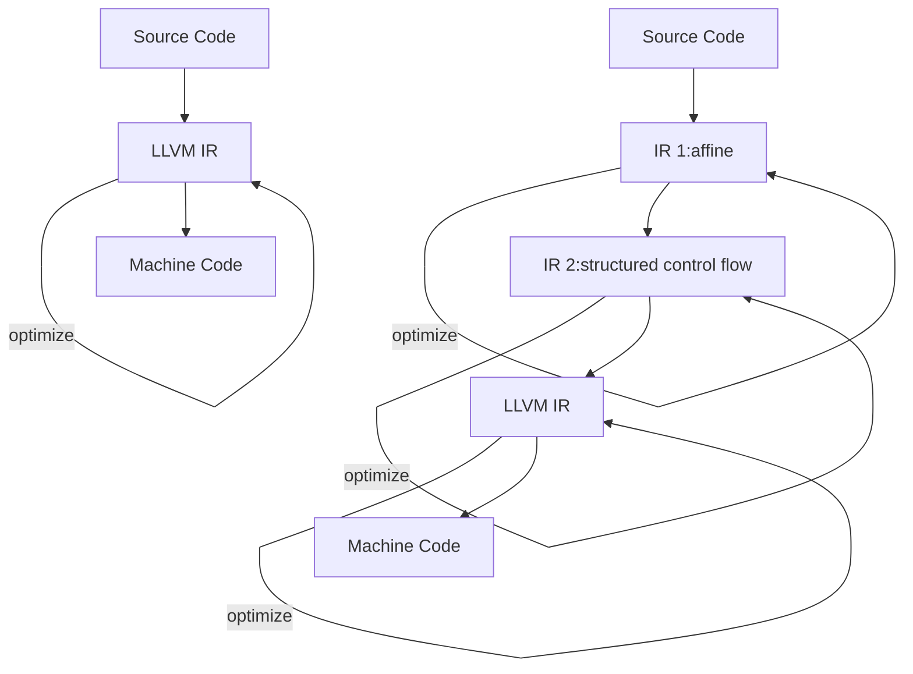

この記事は、KCS アドベントカレンダー 23 日目の記事です。

22 日目・24 日目

## GPU 上で走る自作言語のコンパイラ

こんにちは、lemolatoon です。
最近は、夏に自作 OS ゼミでセキュキャンに参加したりして、また低レイヤへの気持ちを高めたりしていました。

自作 OS も一段落ついた頃、[MLIR](https://mlir.llvm.org/)というものを知り、何やら面白そうだぞということで色々調べて手を動かしたりしていたのですが、ある程度 MLIR の利点を生かしたいい感じのものができたので紹介したいと思います。

## MLIR ってなに？

まずは、[MLIR](https://mlir.llvm.org/)がなんなのかについてここに書きたいと思います。
MLIR は、Multi-Level Intermediate Representation の略で、コンパイラを作るときに、簡単に中間表現を定義したり、中間表現間の変換や、最適化を簡単に実装することができるフレームワークのようなものです。

### LLVM との関連

これまでに、コンパイラのための基盤といえば、誰もが[LLVM](https://llvm.org/)を挙げていたし、今も挙げられると思います。LLVM は、LLVM IR という唯一の中間表現を定義することで、コンパイラ作成時の負荷を軽減するようなものでした。
例えば、新たなプログラミング言語を使いたいときには、その言語のソースコードから LLVM IR までの変換さえ実装すれば、LLVM IR から、x86 や risc-v などの各機械語への変換は、LLVM の既存の資産を使うことができます。
逆に、まったく新しいアーキテクチャのプロセッサーを作ったときには、LLVM IR からそのプロセッサーへの機械語への変換さえ実装すれば、LLVM IR を経由するすべての言語(C/C++や Swift、Rust など)をその新しいプロセッサーで使うことができます。

**高レベル IR**
LLVM は非常に便利なのですが、LLVM IR は機械語のレベルに近い中間表現で、型やライフタイムの解析といった LLVM IR では表現できない高いレベルの情報は、各言語が各々の中間表現を持っていることが多くなってきました。このような LLVM IR よりも高い中間表現や、その実装は各言語間で共有されることはなく、同じような内容の実装が複数の言語で、複数実装され、知見が共有されないということが起こっていました。
また、GPU などの現在使われている CPU とは大きく異なるプロセッサーでは、LLVM IR ではうまく表現できないこともあります。

そこで、LLVM IR に限らず、自由に中間表現が定義でき、中間表現同士を混在させたり、他の言語で用いた中間表現を流用したりできるようなコンパイラ基盤が MLIR です。

**最適化**
最適化に関しても、LLVM IR のレベルまで落としてからでは、元のソースコードからは、意味が失われてしまうことがあります。
例えば、行列の掛け算をする演算子がある言語に定義されているとします。それを LLVM IR まで落としてしまうと、足し算と掛け算と比較演算、ブランチ命令などの低レベルの命令まで落ちてしまいます。LLVM IR 単体でも最適化はできますが、限界があります。

MLIR ならば、複数の中間表現をたどりながら、その中間表現の意味に合わせた最適化を順次賭けていくことができます。

_行列演算を LLVM IR に落とすまでに複数の中間表現(IR)を経由する例_

## MLIR で自作言語を作る

ここまでで、MLIR では複数の中間表現を定義できてうれしいという話をしました。
MLIR では、それぞれの中間表現のことを Dialect と呼びます。また、MLIR では標準ライブラリ的な立ち位置で、いくつかの Dialect が既に定義されています。^[標準 Dialect の一覧 https://mlir.llvm.org/docs/Dialects/]
すでに定義された Dialect を行き来することで、最終的に機械語へと落としていきます。
